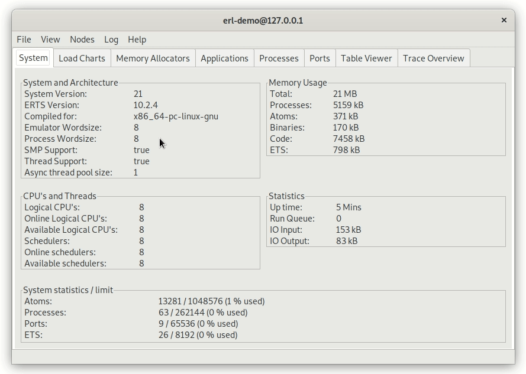

<h1><a href="https://ergo.services"></a></h1>

[](https://docs.ergo.services)
[](https://pkg.go.dev/github.com/ergo-services/ergo)
[](https://opensource.org/licenses/MIT)
[](https://github.com/ergo-services/ergo/actions/)
[](https://t.me/ErgoServices)
[](https://discord.gg/sdscxKGV62)

Technologies and design patterns of Erlang/OTP have been proven over the years. Now in Golang.
Up to x5 times faster than original Erlang/OTP in terms of network messaging.
The easiest way to create an OTP-designed application in Golang.

[https://ergo.services](https://ergo.services)

### Purpose ###

The goal of this project is to leverage Erlang/OTP experience with Golang performance. Ergo Framework implements [DIST protocol](https://erlang.org/doc/apps/erts/erl_dist_protocol.html), [ETF data format](https://erlang.org/doc/apps/erts/erl_ext_dist.html) and [OTP design patterns](https://erlang.org/doc/design_principles/des_princ.html) `gen.Server`, `gen.Supervisor`, `gen.Application` which makes you able to create distributed, high performance and reliable microservice solutions having native integration with Erlang infrastructure

### Features ###


* Support Erlang 24 (including [Alias](https://blog.erlang.org/My-OTP-24-Highlights/#eep-53-process-aliases) and [Remote Spawn](https://blog.erlang.org/OTP-23-Highlights/#distributed-spawn-and-the-new-erpc-module) features)
* Spawn Erlang-like processes
* Register/unregister processes with simple atom
* `gen.Server` behavior support (with atomic state)
* `gen.Supervisor` behavior support with all known [restart strategies](https://erlang.org/doc/design_principles/sup_princ.html#restart-strategy) support
  * One For One
  * One For All
  * Rest For One
  * Simple One For One
* `gen.Application` behavior support with all known [starting types](https://erlang.org/doc/design_principles/applications.html#application-start-types) support
  * Permanent
  * Temporary
  * Transient
* `gen.Stage` behavior support (originated from Elixir's [GenStage](https://hexdocs.pm/gen_stage/GenStage.html)). This is abstraction built on top of `gen.Server` to provide a simple way to create a distributed Producer/Consumer architecture, while automatically managing the concept of backpressure. This implementation is fully compatible with Elixir's GenStage. Example is here [examples/genstage](examples/genstage) or just run `go run ./examples/genstage` to see it in action
* `gen.Saga` behavior support. It implements Saga design pattern - a sequence of transactions that updates each service state and publishes the result (or cancels the transaction or triggers the next transaction step). `gen.Saga` also provides a feature of interim results (can be used as transaction progress or as a part of pipeline processing), time deadline (to limit transaction lifespan), two-phase commit (to make distributed transaction atomic). Here is example [examples/gensaga](examples/gensaga).
* `gen.Raft` behavior support. It implements [Raft](https://raft.github.io/raft.pdf) consensus protocol.
* Connect to (accept connection from) any Erlang/Elixir node within a cluster
* Making sync request `ServerProcess.Call`, async - `ServerProcess.Cast` or `Process.Send` in fashion of `gen_server:call`, `gen_server:cast`, `erlang:send` accordingly
* Monitor processes/nodes, local/remote
* Link processes local/remote
* RPC callbacks support
* [embedded EPMD](#epmd) (in order to get rid of erlang' dependencies)
* Unmarshalling terms into the struct using `etf.TermIntoStruct`, `etf.TermProplistIntoStruct` or to the string using `etf.TermToString`
* Custom marshaling/unmarshaling via `Marshal` and `Unmarshal` interfaces
* Encryption (TLS 1.3) support (including autogenerating self-signed certificates)
* Compression support (with customization of compression level and threshold). It can be configured for the node or a particular process.
* Proxy support (end-to-end encryption, and linking/monitoring features)
* Tested and confirmed support Windows, Darwin (MacOS), Linux, FreeBSD.
* Zero dependency

### Requirements ###

* Go 1.17.x and above

### Versioning ###

Golang introduced [v2 rule](https://go.dev/blog/v2-go-modules) a while ago to solve complicated dependency issues. We found this solution very controversial and there is still a lot of discussion around it. So, we decided to keep the old way for the versioning, but have to use the git tag with v1 as a major version (due to "v2 rule" restrictions). Since now we use git tag pattern 1.999.XYZZ where X - major number, Y - minor, ZZ - patch version.

### Changelog ###

Here are the changes of latest release. For more details see the [ChangeLog](ChangeLog.md)

#### [v2.1.0](https://github.com/ergo-services/ergo/releases/tag/v1.999.2100) 2022-03-12 [tag version v1.999.2100] ####

* Introduced compression feature support
* Introduced proxy feature support. Here is example [examples/proxy](examples/proxy). `gen.MessageProxyDown` .. `noproxy`.
* Introduced new methods
  - `node.AddProxyRoute`/`node.RemoveProxyRoute`
  - `node.ProxyRoute`/`node.ProxyRoutes`
  - `node.NodesIndirect`
  - `gen.Process.SetCompression`/`gen.Process.Compression`
  - `gen.Process.SetCompressionLevel`/`gen.Process.CompressionLevel`
  - `gen.Process.SetCompressionThreshold`/`gen.Process.CompressionThreshold`
  - `gen.Process.NodeUptime`/`gen.Process.NodeName`/`gen.Process.NodeStop`
  - `gen.ServerProcess.MessageCounter`
* **Important** `node.Options` has changed. Make sure to adjust your code.
* Introduced `node.Proxy` in `node.Options` to configure proxy settings for the node.
* Intfoduced `node.ProxyFlags` to enable/disable features of linking, monitoring, remote spawning for the peer connected through the proxy link.
* Introduced `node.Compression` in `node.Options` to configure compression settings for the spawned processes on this node.
* Introduced new interfaces
  - `Resolver`
  - `Handshake`
  - `Proto`/`Connection`
* Introduced `gen.ProcessFallback` option in `gen.ProcessOptions`. This feature allows forward messages to the fallback process if the mailbox is full. Forwarded messages are wrapping into `gen.MessageFallback` struct.
* Added `gen.ProcessOptions` to `gen.SupervisorChildSpec` and `gen.ApplicationChildSpec` in order customize options for the spawning child processes.
* Improved handling messages. Send/Cast/Call return ErrProcessIncarnation if message is addressed to the process of previous incarnation (node restarted).
* `gen.EnvKey`
* default process env `node.EnvKeyNode`
* Improved performance of local messaging (up to 10 times for some cases)
* Fixed issue #89 (incorrect handling Call requests)
* Fixed issues #87, #88 and #93 (closing network socket)
* Fixed issue #96 (silently drops message if mailbox is full)
* Updated minimal requirement of Golang version to 1.17 (go.mod)


### Benchmarks ###

Here is simple EndToEnd test demonstrates performance of messaging subsystem

Hardware: workstation with AMD Ryzen Threadripper 3970X (64) @ 3.700GHz

```
❯❯❯❯ go test -bench=NodeParallel -run=XXX -benchtime=10s
goos: linux
goarch: amd64
pkg: github.com/ergo-services/ergo/tests
cpu: AMD Ryzen Threadripper 3970X 32-Core Processor
BenchmarkNodeParallel-64                 4738918              2532 ns/op
BenchmarkNodeParallelSingleNode-64      100000000              429.8 ns/op

PASS
ok      github.com/ergo-services/ergo/tests  29.596s
```

these numbers show almost **500.000 sync requests per second** for the network messaging via localhost and **10.000.000 sync requests per second** for the local messaging (within a node).

#### Compression

This benchmark shows the performance of compression for sending 1MB message between two nodes (via a network).

```
❯❯❯❯ go test -bench=NodeCompression -run=XXX -benchtime=10s
goos: linux
goarch: amd64
pkg: github.com/ergo-services/ergo/tests
cpu: AMD Ryzen Threadripper 3970X 32-Core Processor
BenchmarkNodeCompressionDisabled1MBempty-64         2400           4957483 ns/op
BenchmarkNodeCompressionEnabled1MBempty-64          5769           2088051 ns/op
BenchmarkNodeCompressionEnabled1MBstring-64         5202           2077099 ns/op
PASS
ok      github.com/ergo-services/ergo/tests     56.708s
```

It demonstrates **more than 2 times** improvement.

#### Proxy

This benchmark demonstrates how proxy feature and e2e encryption impact a messaging performance.

```
❯❯❯❯ go test -bench=NodeProxy -run=XXX -benchtime=10s
goos: linux
goarch: amd64
pkg: github.com/ergo-services/ergo/tests
cpu: AMD Ryzen Threadripper 3970X 32-Core Processor
BenchmarkNodeProxy_NodeA_to_NodeC_direct_Message_1KB-64                     1908477       6337 ns/op
BenchmarkNodeProxy_NodeA_to_NodeC_via_NodeB_Message_1KB-64                  1700984       7062 ns/op
BenchmarkNodeProxy_NodeA_to_NodeC_via_NodeB_Message_1KB_Encrypted-64        1271125       9410 ns/op
PASS
ok      github.com/ergo-services/ergo/tests     45.649s

```


#### Ergo Framework vs original Erlang/OTP

Hardware: laptop with Intel(R) Core(TM) i5-8265U (4 cores. 8 with HT)


sources of these benchmarks are [here](https://github.com/halturin/ergobenchmarks)


### EPMD ###

*Ergo Framework* has embedded EPMD implementation in order to run your node without external epmd process needs. By default, it works as a client with erlang' epmd daemon or others ergo's nodes either.

The one thing that makes embedded EPMD different is the behavior of handling connection hangs - if ergo' node is running as an EPMD client and lost connection, it tries either to run its own embedded EPMD service or to restore the lost connection.

### Observer ###

It's a standard Erlang tool. Observer is a graphical tool for observing the characteristics of Erlang systems. The tool Observer displays system information, application supervisor trees, process information.

Here you can see this feature in action using one of the [examples](examples/):



### Examples ###

Code below is a simple implementation of gen.Server pattern [examples/simple](examples/simple)

```golang
package main

import (
	"fmt"
	"time"

	"github.com/ergo-services/ergo"
	"github.com/ergo-services/ergo/etf"
	"github.com/ergo-services/ergo/gen"
	"github.com/ergo-services/ergo/node"
)

// simple implementation of Server
type simple struct {
	gen.Server
}

func (s *simple) HandleInfo(process *gen.ServerProcess, message etf.Term) gen.ServerStatus {
	value := message.(int)
	fmt.Printf("HandleInfo: %#v \n", message)
	if value > 104 {
		return gen.ServerStatusStop
	}
	// sending message with delay
	process.SendAfter(process.Self(), value+1, time.Duration(1*time.Second))
	return gen.ServerStatusOK
}

func main() {
	// create a new node
	node, _ := ergo.StartNode("node@localhost", "cookies", node.Options{})

	// spawn a new process of gen.Server
	process, _ := node.Spawn("gs1", gen.ProcessOptions{}, &simple{})

	// send a message to itself
	process.Send(process.Self(), 100)

	// wait for the process termination.
	process.Wait()
	fmt.Println("exited")
	node.Stop()
}

```

here is output of this code

```shell
$ go run ./examples/simple
HandleInfo: 100
HandleInfo: 101
HandleInfo: 102
HandleInfo: 103
HandleInfo: 104
HandleInfo: 105
exited
```

See `examples/` for more details

* [gen.Application](examples/application)
* [gen.Supervisor](examples/supervisor)
* [gen.Server](examples/genserver)
* [gen.Stage](examples/genstage)
* [gen.Saga](examples/gensaga)
* [gen.Demo](examples/gendemo)
* [Node with TLS](examples/nodetls)
* [Node with HTTP server](examples/http)

### Elixir Phoenix Users ###

Users of the Elixir Phoenix framework might encounter timeouts when trying to connect a Phoenix node
to an ergo node. The reason is that, in addition to global_name_server and net_kernel,
Phoenix attempts to broadcast messages to the [pg2 PubSub handler](https://hexdocs.pm/phoenix/1.1.0/Phoenix.PubSub.PG2.html)

To work with Phoenix nodes, you must create and register a dedicated pg2 GenServer, and
spawn it inside your node. The spawning process must have "pg2" as a process name:

```golang
type Pg2GenServer struct {
    gen.Server
}

func main() {
    // ...
    pg2 := &Pg2GenServer{}
    node1, _ := ergo.StartNode("node1@localhost", "cookies", node.Options{})
    process, _ := node1.Spawn("pg2", gen.ProcessOptions{}, pg2, nil)
    // ...
}
```

### Development and debugging ###

There are options already defined that you might want to use

* `-ergo.trace` - enable extended debug info
* `-ergo.norecover` - disable panic catching

To enable Golang profiler just add `--tags debug` in your `go run` or `go build` like this:

```
go run --tags debug ./examples/genserver/demoGenServer.go
```

Now golang' profiler is available at `http://localhost:9009/debug/pprof`

To check test coverage:

```
go test -coverprofile=cover.out ./...
go tool cover -html=cover.out -o coverage.html
```

To run tests with cleaned test cache:

```
go vet
go clean -testcache
go test -v ./...
```

To run benchmarks:

```
go test -bench=Node -run=X -benchmem
```

### Companies are using Ergo Framework ###

[](https://kaspersky.com)
[](https://www.ringcentral.com)
[](https://lilithgames.com)

is your company using Ergo? add your company logo/name here

### Commercial support

please, visit https://ergo.services for more information
