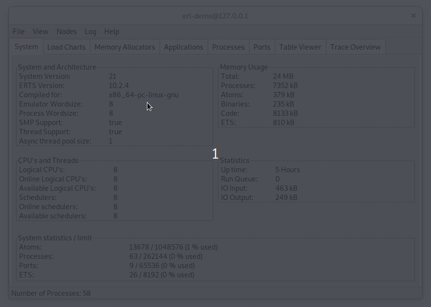

# Ergo Framework #

[](https://github.com/halturin/ergo/releases/latest)
[](https://goreportcard.com/report/github.com/halturin/ergo)
[](https://godoc.org/github.com/halturin/ergo)
[](https://opensource.org/licenses/MIT)
[](https://codecov.io/gh/halturin/ergo)
[](https://travis-ci.org/halturin/ergo)

Implementation of Erlang/OTP in Golang. Up to x5 times faster than original Erlang/OTP. The easiest drop-in replacement for your hot nodes in the cluster. 

### Purpose ###

The goal of this project is to leverage Erlang/OTP experience with Golang performance. *Ergo Framework* implements OTP design patterns such as `GenServer`/`Supervisor`/`Application` and makes you able to create high performance and reliable application having native integration with Erlang infrastructure

### Features ###

* Erlang node (run single/[multinode](#multinode))
* [embedded EPMD](#epmd) (in order to get rid of erlang' dependencies)
* Spawn Erlang-like processes
* Register/unregister processes with simple atom
* `GenServer` behavior support (with atomic state)
* `Supervisor` behavior support (with all known restart strategies support)
* `Application` behavior support
* Connect to (accept connection from) any Erlang node within a cluster (or clusters, if running as multinode)
* Making sync/async request in fashion of `gen_server:call` or `gen_server:cast`
* Monitor processes/nodes
  * local -> local
  * local -> remote
  * remote -> local
* Link processes
  * local <-> local
  * local <-> remote
  * remote <-> local
* RPC callbacks support
* Experimental [observer support](#observer)
* Unmarshalling terms into the struct using etf.TermIntoStruct
* Support Erlang 22. (with [fragmentation](http://blog.erlang.org/OTP-22-Highlights/))

### Requirements ###

* Go 1.10 and above
* Highly recommend using 1.14.2 and above since it has significant performance improvements

### Benchmarks ###

Here is simple EndToEnd test demonstrates performance of messaging subsystem

Hardware: laptop with Intel(R) Core(TM) i5-8265U (4 cores. 8 with HT)

#### Sequential GenServer.Call using two processes running on single and two nodes

```
❯❯❯❯ go test -bench=NodeSequential -run=XXX -benchtime=10s
goos: linux
goarch: amd64
pkg: github.com/halturin/ergo
BenchmarkNodeSequential/number-8 	  256108	     48578 ns/op
BenchmarkNodeSequential/string-8 	  266906	     51531 ns/op
BenchmarkNodeSequential/tuple_(PID)-8         	  233700	     58192 ns/op
BenchmarkNodeSequential/binary_1MB-8          	    5617	   2092495 ns/op
BenchmarkNodeSequentialSingleNode/number-8         	 2527580	      4857 ns/op
BenchmarkNodeSequentialSingleNode/string-8         	 2519410	      4760 ns/op
BenchmarkNodeSequentialSingleNode/tuple_(PID)-8    	 2524701	      4757 ns/op
BenchmarkNodeSequentialSingleNode/binary_1MB-8     	 2521370	      4758 ns/op
PASS
ok  	github.com/halturin/ergo	120.720s
```

it means Ergo Framework provides around 25000 sync rps via localhost for simple data and around 4Gbit/sec for 1MB messages

#### Parallel GenServer.Call using 120 pairs of processes running on a single and two nodes

```
❯❯❯❯ go test -bench=NodeParallel -run=XXX -benchtime=10s
goos: linux
goarch: amd64
pkg: github.com/halturin/ergo
BenchmarkNodeParallel-8        	         2652494	      5246 ns/op
BenchmarkNodeParallelSingleNode-8   	 6100352	      2226 ns/op
PASS
ok  	github.com/halturin/ergo	34.145s
```

these numbers shows around 260000 sync rps via localhost using simple data for messaging

#### vs original Erlang/OTP


sources of these benchmarks are [here](https://github.com/halturin/ergobenchmarks)


### EPMD ###

*Ergo Framework* has embedded EPMD implementation in order to run your node without external epmd process needs. By default it works as a client with erlang' epmd daemon or others ergo's nodes either.

The one thing that makes embedded EPMD different is the behavior of handling connection hangs - if ergo' node is running as an EPMD client and lost connection it tries either to run its own embedded EPMD service or to restore the lost connection.

As an extra option, we provide EPMD service as a standalone application. There is a simple drop-in replacement of the original Erlang' epmd daemon.

`go get -u github.com/halturin/ergo/cmd/epmd`

### Multinode ###

 This feature allows create two or more nodes within a single running instance. The only needs is specify the different set of options for creating nodes (such as: node name, empd port number, secret cookie). You may also want to use this feature to create 'proxy'-node between some clusters.
 See [Examples](#examples) for more details

### Observer ###

 It allows you to see the most metrics/information using standard tool of Erlang distribution. The example below shows this feature in action using one of the [examples](examples/):



### Changelog ###

Here are the changes of latest release. For more details see the [ChangeLog](ChangeLog)

#### [1.0.0](https://github.com/halturin/ergo/releases/tag/1.0.0) - 2020-03-03 ####

 There is a bunch of changes we deliver with this release

* We have changed the name - Ergo (or Ergo Framework). GitHub's repo has been renamed as well. We also have created cloned repo `ergonode` to support users of the old version of this project. So, its still available at [https://github.com/halturin/ergonode](https://github.com/halturin/ergonode). But it's strongly recommend to use the new one.
* Completely reworked (almost from scratch) architecture whole project
* Implemented linking process feature (in order to support Application/Supervisor behaviors)
* Reworked Monitor-feature. Now it has full-featured support with remote process/nodes
* Added multinode support
* Added experimental observer support
* Fixed incorrect ETF string encoding (it was encoded as binary instead of string)
* Improved ETF TermIntoStruct decoder
* Improved code structure and readability

### Examples ###

Code below is a simple implementation of GenServer pattern `examples/simple/GenServer.go`

```golang
package main

import (
    "fmt"
    "time"

    "github.com/halturin/ergo"
    "github.com/halturin/ergo/etf"
)

type ExampleGenServer struct {
    ergo.GenServer
    process ergo.Process
}

type State struct {
    value int
}

func (egs *ExampleGenServer) Init(p ergo.Process, args ...interface{}) (state interface{}) {
    fmt.Printf("Init: args %v \n", args)
    egs.process = p
    InitialState := &State{
        value: args[0].(int), // 100
    }
    return InitialState
}

func (egs *ExampleGenServer) HandleCast(message etf.Term, state interface{}) (string, interface{}) {
    fmt.Printf("HandleCast: %#v (state value %d) \n", message, state.(*State).value)
    time.Sleep(1 * time.Second)
    state.(*State).value++

    if state.(*State).value > 103 {
        egs.process.Send(egs.process.Self(), "hello")
    } else {
        egs.process.Cast(egs.process.Self(), "hi")
    }

    return "noreply", state
}

func (egs *ExampleGenServer) HandleCall(from etf.Tuple, message etf.Term, state interface{}) (string, etf.Term, interface{}) {
    fmt.Printf("HandleCall: %#v, From: %#v\n", message, from)
    return "reply", message, state
}

func (egs *ExampleGenServer) HandleInfo(message etf.Term, state interface{}) (string, interface{}) {
    fmt.Printf("HandleInfo: %#v (state value %d) \n", message, state.(*State).value)
    time.Sleep(1 * time.Second)
    state.(*State).value++
    if state.(*State).value > 106 {
        return "stop", "normal"
    } else {
        egs.process.Send(egs.process.Self(), "hello")
    }
    return "noreply", state
}
func (egs *ExampleGenServer) Terminate(reason string, state interface{}) {
    fmt.Printf("Terminate: %#v \n", reason)
}

func main() {
    node := ergo.CreateNode("node@localhost", "cookies", ergo.NodeOptions{})
    gs1 := &ExampleGenServer{}
    process, _ := node.Spawn("gs1", ergo.ProcessOptions{}, gs1, 100)

    process.Cast(process.Self(), "hey")

    select {
    case <-process.Context.Done():
        fmt.Println("exited")
    }
}

```

here is output of this code

```shell
$ go run ./examples/simple/GenServer.go
Init: args [100]
HandleCast: "hey" (state value 100)
HandleCast: "hi" (state value 101)
HandleCast: "hi" (state value 102)
HandleCast: "hi" (state value 103)
HandleInfo: "hello" (state value 104)
HandleInfo: "hello" (state value 105)
HandleInfo: "hello" (state value 106)
Terminate: "normal"
exited
```

See `examples/` for more details

* [demoGenServer](examples/genserver)
* [demoSupervisor](examples/supervisor)
* [demoApplication](examples/application)
* [demoMultinode](examples/multinode)

### Elixir Phoenix Users ###

Users of the Elixir Phoenix framework might encounter timeouts when trying to connect a Phoenix node
to an ergo node. The reason is that, in addition to global_name_server and net_kernel,
Phoenix attempts to broadcast messages to the [pg2 PubSub handler](https://hexdocs.pm/phoenix/1.1.0/Phoenix.PubSub.PG2.html)

To work with Phoenix nodes, you must create and register a dedicated pg2 GenServer, and
spawn it inside your node. Take inspiration from the global_name_server.go for the rest of
the GenServer methods, but the Spawn must have "pg2" as a process name:

```golang
type Pg2GenServer struct {
    ergo.GenServer
}

func main() {
    // ...
    pg2 := &Pg2GenServer{}
    node1 := ergo.CreateNode("node1@localhost", "cookies", ergo.NodeOptions{})
    process, _ := node1.Spawn("pg2", ergo.ProcessOptions{}, pg2, nil)
    // ...
}

```

### Development and debugging ###

There is a couple of options are already defined that you might want to use

* -trace.node
* -trace.dist

To enable Golang profiler just add `--tags debug` in your `go run` or `go build` like this:

`go run --tags debug ./examples/genserver/demoGenServer.go`

Now golang' profiler is available at `http://localhost:9009/debug/pprof`

### Companies are using Ergo Framework ###

[](https://kaspersky.com)
[](https://www.ringcentral.com)

is your company using Ergo? add your company logo/name here

### Commercial support

if you are looking for commercial support feel free to contact me via email (halturin at gmail dot com)
