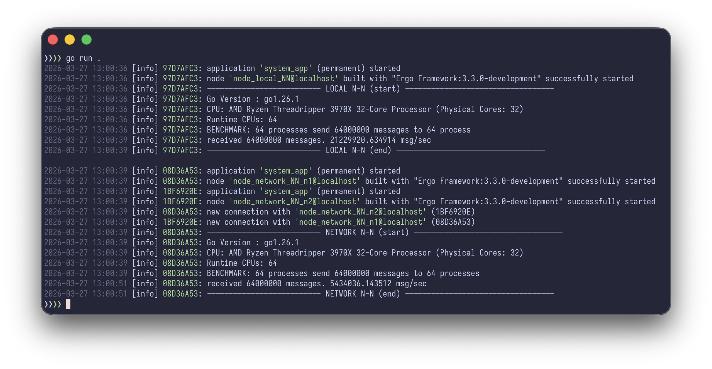

<h1><a href="https://ergo.services"></a></h1>

[](https://docs.ergo.services)
[](https://opensource.org/licenses/MIT)
[](https://t.me/ergo_services)
[](https://reddit.com/r/ergo_services)

**Actor model for Go. Build distributed systems without the distributed systems headache.**

Goroutines and channels work great until your system grows. Then come the mutexes, the race conditions, the service discovery configs, the retry logic, the connection pool management. Ergo replaces all of that with one model: isolated processes that communicate through messages, supervised automatically, addressable across any cluster.

Inspired by Erlang/OTP. Zero external dependencies. Pure Go.

### The core idea in 30 seconds ###

```go
type Counter struct {
    act.Actor
    count int
}

type MessageInc struct{}

func (c *Counter) HandleMessage(from gen.PID, msg any) error {
    switch msg.(type) {
    case MessageInc:
        // safe without locks even with thousands of concurrent senders:
        // messages are processed one at a time
        c.count++
        c.Log().Info("count: %d", c.count)
    }
    return nil
}

func factory_Counter() gen.ProcessBehavior { return &Counter{} }

// Start a node and spawn the actor
node, _ := ergo.StartNode("mynode@localhost", gen.NodeOptions{})
pid, _ := node.Spawn(factory_Counter, gen.ProcessOptions{})

// Same API whether local or on another continent
node.Send(pid, MessageInc{})
node.Send(pid, MessageInc{})
```

No locks. No race conditions. Sequential message handling is the guarantee.

### Why not just goroutines + channels? ###

| | Goroutines + channels | Ergo |
|---|---|---|
| Shared state | You manage with mutexes | No shared state by design |
| Failure recovery | Manual | Supervision trees restart automatically |
| Cross-node messaging | Build it yourself | Same API, transparent |
| Service discovery | External tool needed | Built in |
| Race conditions | Possible | Impossible within a process |

### What you can build ###

**Real-time backends.** Each WebSocket connection becomes an addressable actor. Any node in your cluster can push to any specific client. No pub/sub intermediaries.

**IoT platforms.** One actor per device. Thousands of devices per node. Supervisors restart failed device actors automatically.

**Multi-agent AI systems.** Each agent is an isolated actor with a mailbox. Crash isolation, supervision, distributed addressability, and an [MCP endpoint](https://docs.ergo.services/advanced/mcp) served by [Observer](https://docs.ergo.services/extra-library/applications/observer) that opens the running cluster to any AI assistant (Claude Code, Cursor, and other MCP-compatible clients). See [AI Agents](https://docs.ergo.services/ai-agents) for patterns and diagnostics.

**Financial and event-driven systems.** Four priority queues per mailbox, guaranteed delivery, no dropped messages.

**Distributed Pub/Sub across the cluster.** Producer registers an event once; any process on any node subscribes. The framework delivers one network message per node, not per subscriber. 1M subscribers across 10 nodes cost 10 network messages, not 1M.

```go
// Producer on any node
token, _ := producer.RegisterEvent("prices", gen.EventOptions{})
producer.SendEvent("prices", token, PriceUpdate{Asset: "BTC", Price: 95000})

// Subscriber on any other node, identical API
process.MonitorEvent(gen.Event{Name: "prices", Node: "producer@host"})

func (s *Sub) HandleEvent(event gen.MessageEvent) error {
    fmt.Println(event.Message.(PriceUpdate))
    return nil
}
```

### Performance ###

On a 64-core processor:

* **21M+ messages/second** locally
* **~5.5M messages/second** over the network
* **Distributed Pub/Sub**: 2.9M msg/sec delivery to 1,000,000 subscribers across 10 nodes

Lock-free queues. Processes sleep when idle. No CPU wasted.



Full benchmarks: [benchmarks repository](https://github.com/ergo-services/benchmarks).

### Observer ###

Observer is a real-time web UI for monitoring and inspecting Ergo nodes. It provides live visibility into every layer of the system:

- **Processes** - full process list with state, mailbox depth, latency, running time, wakeups, and uptime. Click any process to inspect its supervision tree, links, monitors, aliases, environment, and internal actor state
- **Applications** - running applications with their process trees, modes, and uptime
- **Network** - cluster topology, per-node connection details, traffic counters, and protocol info
- **Events** - registered events with producer, subscriber counts, and publication statistics
- **Logs** - live log stream with level filtering across the cluster
- **Profiler** - goroutine dump with grouping and stack traces, heap profile with allocation breakdown, and GC pressure charts


Add Observer to your node as an application:

```go
import "ergo.services/application/observer"

options.Applications = []gen.ApplicationBehavior{
    observer.CreateApp(observer.Options{}),
}
```

To see it in action with a fully loaded cluster, see the [observability example](https://github.com/ergo-services/examples/tree/master/observability). For more information, visit the [Observer documentation](https://docs.ergo.services/extra-library/applications/observer).

### Features ###

1. **Actor Model:** isolated processes communicate through message passing, handling messages sequentially with four priority queues. Supports asynchronous messaging and synchronous request-response, with per-process [mailbox latency measurement](https://docs.ergo.services/advanced/debugging#mailbox-latency) (`-tags=latency`) for production diagnostics.

2. **Network Transparency:** actors interact the same way whether local or remote. Uses EDF (Ergo Data Format), a custom binary serialization with type caching, pointer support, and [message versioning](https://docs.ergo.services/advanced/message-versioning) for seamless upgrades. Includes connection pooling, compression, [message fragmentation](https://docs.ergo.services/networking/network-stack#message-fragmentation), and [application-level keepalive](https://docs.ergo.services/networking/network-stack#software-keepalive) for silent failure detection.

3. **Supervision Trees:** hierarchical fault recovery where supervisors monitor child processes and apply configurable restart strategies. Supports One For One, All For One, Rest For One, and Simple One For One supervision types with Transient, Temporary, and Permanent restart policies.

4. **Meta Processes:** bridge blocking I/O with the actor model through dedicated meta processes handling [TCP](https://docs.ergo.services/meta-processes/tcp), [UDP](https://docs.ergo.services/meta-processes/udp), [Port](https://docs.ergo.services/meta-processes/port), [Web](https://docs.ergo.services/meta-processes/web), [WebSocket](https://docs.ergo.services/extra-library/meta-processes/websocket), and [SSE](https://docs.ergo.services/extra-library/meta-processes/sse) protocols without affecting regular actor message processing.

5. **Distributed Systems:** service discovery via embedded or external registrars ([etcd](https://docs.ergo.services/extra-library/registrars/etcd-client), [Saturn](https://docs.ergo.services/extra-library/registrars/saturn-client)), distributed [publish/subscribe events](https://docs.ergo.services/basics/events) with token-based authorization and buffering, [remote process spawning](https://docs.ergo.services/networking/remote-spawn-process) with factory-based permissions, [remote application orchestration](https://docs.ergo.services/networking/remote-start-application) across nodes, and Raft-style [leader election](https://docs.ergo.services/extra-library/actors/leader) - terms, votes and heartbeats, with no replicated log - without external dependencies for coordinating exclusive work across cluster replicas.

6. **Observability:** real-time cluster inspection via the [Observer](https://docs.ergo.services/extra-library/applications/observer) web UI, native [distributed tracing](https://docs.ergo.services/advanced/distributed-tracing) that follows message chains across nodes with automatic propagation (exportable to OTLP backends like Grafana Tempo or Jaeger via [Pulse](https://docs.ergo.services/extra-library/applications/pulse)), and production metrics via [Radar](https://docs.ergo.services/extra-library/applications/radar) with a ready-to-use Grafana dashboard covering process lifecycle, mailbox pressure, network traffic, and event fanout. The extensible [Metrics](https://docs.ergo.services/extra-library/actors/metrics) actor adds custom Prometheus collectors alongside built-in node telemetry.

7. **AI-Native:** [Observer](https://docs.ergo.services/extra-library/applications/observer) serves an [MCP endpoint](https://docs.ergo.services/advanced/mcp) beside its web UI, opening the full cluster to AI agents (Claude, Cursor, and any MCP-compatible client). Inspect processes, query events, capture goroutine dumps, stream logs, and run real-time samplers through natural language, turning any AI assistant into an interactive SRE for your Ergo cluster.

8. **Cloud Native:** built-in Kubernetes health probes (liveness, readiness, startup) via the [Health](https://docs.ergo.services/extra-library/actors/health) actor, [Prometheus](https://docs.ergo.services/extra-library/actors/metrics) metrics endpoint, and [mTLS](https://docs.ergo.services/networking/mutual-tls) support for zero-trust deployments.

9. **Ready-to-use Components:** core framework includes Actor, Supervisor, Pool, Router, and WebWorker actors plus TCP, UDP, Port, and Web meta processes. Extra library provides [Leader](https://docs.ergo.services/extra-library/actors/leader), [Metrics](https://docs.ergo.services/extra-library/actors/metrics), and [Health](https://docs.ergo.services/extra-library/actors/health) actors, [Observer](https://docs.ergo.services/extra-library/applications/observer), [Radar](https://docs.ergo.services/extra-library/applications/radar), [Pulse](https://docs.ergo.services/extra-library/applications/pulse), and [Grid](https://docs.ergo.services/extra-library/applications/grid) applications, [WebSocket](https://docs.ergo.services/extra-library/meta-processes/websocket) and [SSE](https://docs.ergo.services/extra-library/meta-processes/sse) meta processes, and [Colored](https://docs.ergo.services/extra-library/loggers/colored), [Rotate](https://docs.ergo.services/extra-library/loggers/rotate), and [Sentry](https://docs.ergo.services/extra-library/loggers/sentry) loggers.

10. **Erlang Interoperability:** native support for the [Erlang distribution protocol](https://docs.ergo.services/extra-library/network-protocols/erlang) enables heterogeneous clusters where Ergo (Go) and Erlang/Elixir nodes participate as equal peers. Send messages, spawn processes, and set up links and monitors across language boundaries without any proxies or bridges.

11. **Flexibility:** customize network stack, certificate management ([mTLS](https://docs.ergo.services/networking/mutual-tls), [NAT traversal](https://docs.ergo.services/networking/behind-the-nat)), compression and message priorities, [Cron-based scheduling](https://docs.ergo.services/basics/cron), [important delivery](https://docs.ergo.services/advanced/important-delivery) for guaranteed messaging, and logging. The [`ergo`](https://docs.ergo.services/tools/ergo) CLI tool generates project scaffolding, actors, supervisors, and message types from the command line, and [`argus`](https://docs.ergo.services/tools/argus) is a vet tool that checks the actor model invariants the compiler cannot.

Examples demonstrating the framework's capabilities are available in the [examples repository](https://github.com/ergo-services/examples).

Questions and answers: [FAQ](https://docs.ergo.services/faq).

### Quick start ###

The [`ergo`](https://docs.ergo.services/tools/ergo) CLI generates project scaffolding for you: applications, actors, supervisors, message types. The output is a complete, runnable project structure. Add components incrementally as your service grows.

To install use the following command:

```
$ go install ergo.tools/ergo@latest
```

Create a project and start adding components:

```
$ ergo init MyNode github.com/myorg/mynode
$ cd mynode
$ ergo add supervisor MyNodeApp:MySup
$ ergo add actor MySup:MyActor
$ go run ./cmd
```

The generated project is ready to run immediately. Add more components as your service grows:

```
$ ergo add actor --pool MySup:MyPool
$ ergo add app BackgroundApp
$ ergo add message MessageConnect --field ID:gen.Alias --field Addr:string
```

For the full command reference, see the [ergo tool documentation](https://docs.ergo.services/tools/ergo).

### Claude Code integration ###

Pre-built agents and skills for [Claude Code](https://claude.com/claude-code) turn any Claude session into an Ergo-aware collaborator. Two paired toolkits shipped in the [ergo-services/claude](https://github.com/ergo-services/claude) repository:

- **framework** - designing and implementing actor systems. An architect agent (DDD bounded contexts, supervision trees, cluster topology, load analysis) plus a skill with progressive-disclosure references covering actors, supervision, messages, applications, pool and routing, meta processes, node configuration, EDF, cluster, tracing, logging, cron, errors, testing, the Erlang protocol, and every extension library.

- **devops** - diagnosing running clusters over the [observer's MCP endpoint](https://docs.ergo.services/advanced/mcp). An SRE agent that runs hypothesis-driven investigations (observe, hypothesize, test, confirm) plus a skill with the full catalog of 13 resource lenses and 38 tools, counters reference, 11 diagnostic playbooks, active/passive sampler recipes, and build-tag awareness.

The plugin is published in the Claude Code marketplace, so installing it takes one command:

```
/plugin
```

Search the list that opens for `ergo` and install it. Nothing else to set up.

To take it from this repository instead - to follow the source, or to install without the marketplace:

```
/plugin marketplace add ergo-services/claude
/plugin install ergo@ergo-services
```

After install, invoke the skills as `/ergo:framework` or `/ergo:devops`. Agents pick themselves up from trigger phrases ("design ergo application", "why is it slow", "check cluster health", etc.).

### Requirements ###

* Go 1.21.x and above

### Development and debugging ###

To enable Golang profiler just add `--tags pprof` in your `go run` or `go build` (profiler runs at
`http://localhost:9009/debug/pprof`). Use `PPROF_HOST` and `PPROF_PORT` environment variables to customize the address.

With `--tags pprof`, each actor goroutine is labeled with its PID and each meta process with its Alias for easy identification in pprof output:

```
curl -s "http://localhost:9009/debug/pprof/goroutine?debug=1" | grep -B5 'labels:.*pid'
curl -s "http://localhost:9009/debug/pprof/goroutine?debug=1" | grep -B5 'labels:.*meta'
```

Output:
```
1 @ 0x100c17fa0 ...
# labels: {"pid":"<ABC123.0.1005>"}
#   main.(*Worker).HandleMessage+0x27  /path/worker.go:45
```

This helps identify stuck processes during shutdown by matching PIDs/Aliases from the shutdown log with goroutine stack traces.

Since Go 1.27 the labels also appear in a plain goroutine dump - `?debug=2`, `runtime.Stack` and
the traceback of an unrecovered panic - in the header line of every goroutine:

```
goroutine 38669 [chan receive] {pid: "<ABC123.0.1041>"}:
goroutine 24812 [IO wait] {meta: "Alias#<ABC123.107118.6819740677833.0>", role: reader}:
```

The runtime keeps this off for a module that declares an older Go version, so a module on
`go 1.21` has to ask for it. Either put the directive in the main package:

```go
//go:debug tracebacklabels=1

package main
```

or set `GODEBUG=tracebacklabels=1` in the environment. Without it the `?debug=1` profile still
carries the labels and a plain dump does not.

To disable panic recovery use `--tags norecover`.

To enable mailbox latency measurement use `--tags latency`. This adds a monotonic timestamp to every message pushed into the MPSC queue, allowing `QueueMPSC.Latency()` and `ProcessMailbox.Latency()` to report the age of the oldest unprocessed message. Overhead is approximately 10-25% on micro-benchmarks (LOCAL 1-1 scenario). Without the tag, `Latency()` returns -1 and there is zero overhead.

To enable per-type encode/decode statistics use `--tags typestats`. This tracks the count of root-level encode/decode operations and decompressed wire-byte volume per registered EDF type, exposed via `Network().RegisteredTypes()` and visible in the Observer Types panel. Helps identify which message types dominate network traffic and which processes would benefit from compression. Overhead is approximately 2-3% on encode/decode throughput. Without the tag, counters remain zero and there is zero overhead.

To enable trace logging level for the internals (node, network,...) use `--tags verbose` and set the log level `gen.LogLevelTrace` for your node.

For detailed debugging techniques, troubleshooting scenarios, and best practices, see the [Debugging](https://docs.ergo.services/advanced/debugging) documentation.

To run tests with cleaned test cache:

```
go vet
go clean -testcache
go test -v ./testing/tests/...
```

### Commercial support

please, contact support@ergo.services for more information
