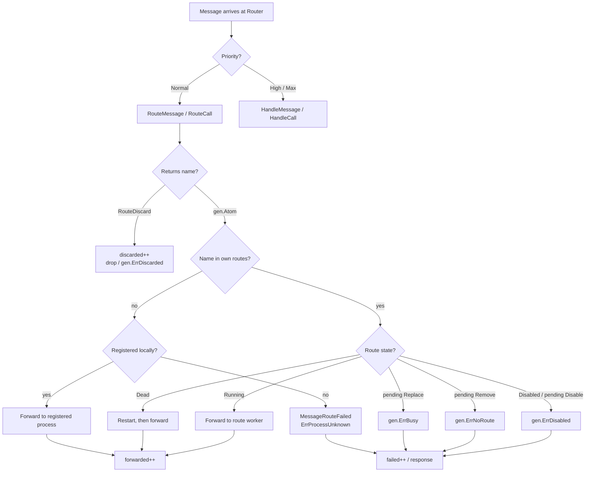
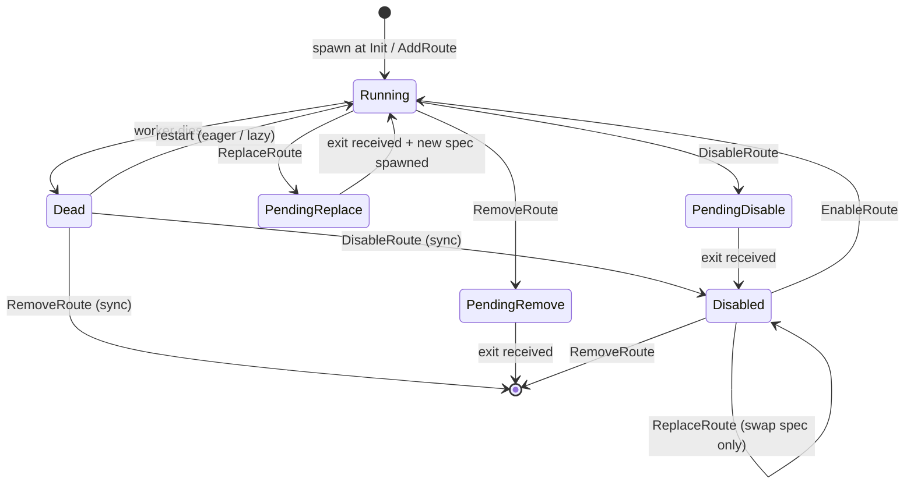
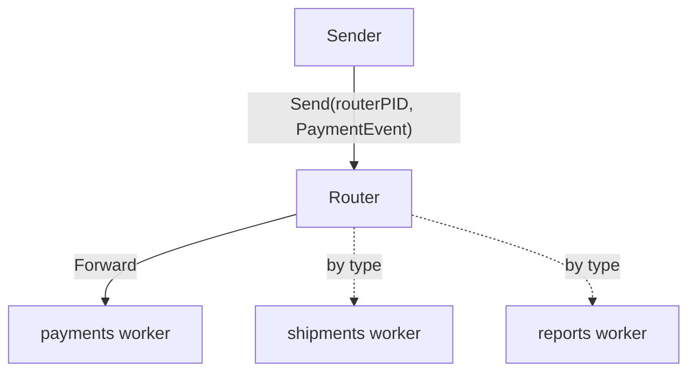
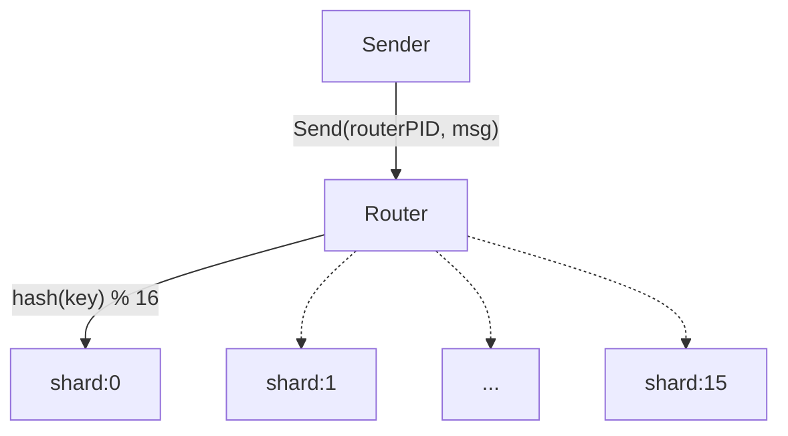
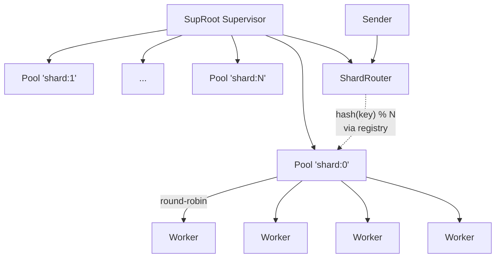
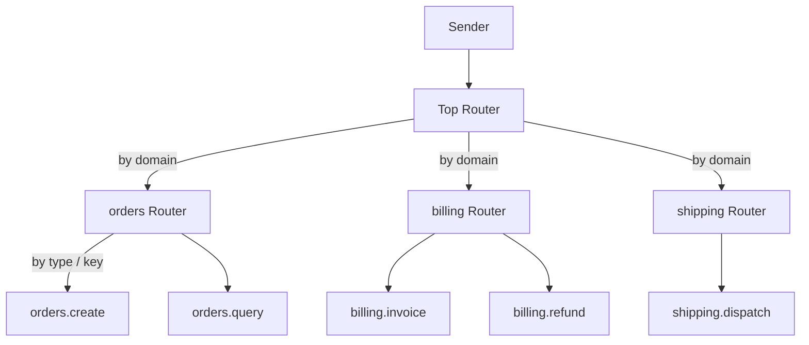

# Router

Sometimes the right worker for a message depends on the message: payments to the payments service, shipments to the shipments service, per-user requests to the shard that owns the user's state. A pool of identical workers picks the next worker in order without looking at what arrived, so this decision has to live somewhere else.

`act.Router` is that somewhere. It owns a set of named routes (or none) and asks your code which route should handle each incoming message. Async sends go through `RouteMessage`, sync calls through `RouteCall`. The Router resolves the returned name to a local PID (own routes first, then the node's process registry) and forwards the message. The original sender is preserved, so the destination worker responds directly to whoever asked. Routes are stable through worker restarts, so hash-based affinity and content-based dispatch stay coherent across failures.

## Creating a Router

Embed `act.Router` in your struct and implement the `act.RouterBehavior` interface:

```go
type RouterBehavior interface {
    gen.ProcessBehavior

    Init(args ...any) (RouterOptions, error)
    Terminate(reason error)

    RouteMessage(from gen.PID, message any) gen.Atom
    RouteCall(from gen.PID, ref gen.Ref, request any) gen.Atom

    HandleMessage(from gen.PID, message any) error
    HandleCall(from gen.PID, ref gen.Ref, request any) (any, error)

    HandleEvent(message gen.MessageEvent) error
    HandleInspect(from gen.PID, item ...string) map[string]string
}
```

`Init`, `RouteMessage`, and `RouteCall` are mandatory. `act.Router` deliberately does not provide default implementations for the two routing callbacks: a router that doesn't route is useless, so the compiler refuses to build one. If you only handle one direction (commands but not queries, or queries but not commands), implement the other in a single line returning `act.RouteDiscard`.

The remaining callbacks have defaults: `HandleMessage`, `HandleCall`, and `HandleEvent` log a warning and return nil; `HandleInspect` returns the built-in routing statistics; `Terminate` is a no-op.

A minimal router:

```go
type EventRouter struct {
    act.Router
}

func (r *EventRouter) Init(args ...any) (act.RouterOptions, error) {
    return act.RouterOptions{
        Routes: []act.Route{
            {Name: "payments",  Factory: factory_PaymentsWorker},
            {Name: "shipments", Factory: factory_ShipmentsWorker},
            {Name: "reports",   Factory: factory_ReportsWorker},
        },
    }, nil
}

func (r *EventRouter) RouteMessage(from gen.PID, msg any) gen.Atom {
    switch msg.(type) {
    case PaymentEvent:
        return "payments"
    case ShipmentEvent:
        return "shipments"
    case ReportEvent:
        return "reports"
    }
    return act.RouteDiscard
}

func (r *EventRouter) RouteCall(from gen.PID, ref gen.Ref, req any) gen.Atom {
    return act.RouteDiscard // no sync routing in this example
}

func factory_EventRouter() gen.ProcessBehavior {
    return &EventRouter{}
}

// Spawn
routerPID, err := node.Spawn(factory_EventRouter, gen.ProcessOptions{})
```

The router spawns every owned route during initialization. Initialization is atomic: if any route can't start, the router doesn't start at all. There is no partial-state condition the operator has to clean up.

A route's factory can return anything: a regular actor, a pool, a supervisor, another router. Composition is the main reason `act.Router` is small. Restart policy, mailbox preservation, pool fan-out belong to the primitives that already do them well; the router just owns named slots and forwards.

## Routing Decisions

For each incoming message the router calls a routing callback, takes the returned name, and finds the actor it refers to:

1. **Owned routes first.** If the name matches a route declared in `Init` or added later via `AddRoute`, the router forwards to that route's worker.
2. **Local registry fallback.** Otherwise the router looks up the name in the node's process registry. A locally registered process with that name receives the message.
3. **Otherwise** the message becomes a `MessageRouteFailed{Name, From, Message, Reason}` and lands in `HandleMessage`. The sender of the original message is not notified.

Returning `act.RouteDiscard` (the empty atom) skips the resolution path entirely. The router increments its `discarded` counter; the sender receives nothing. For synchronous calls, `gen.ErrDiscarded` is returned to the caller.



Forwarding preserves the original `From` and `Ref`. The worker sees the message as if the sender had targeted it directly:

```go
// Sender
process.Send(routerPID, PaymentEvent{...})

// Worker
func (w *PaymentsWorker) HandleMessage(from gen.PID, msg any) error {
    // 'from' is the original sender, not routerPID
    w.Send(from, PaymentReceipt{...})
    return nil
}
```

The same applies to calls: the worker's `HandleCall` sees the original caller's PID and ref. `SendResponse` goes directly to the caller; the router is not in the response path.

### Commands and Queries

`RouteMessage` and `RouteCall` are separate callbacks because async sends and sync calls usually need different routing. In CQRS terms:

- `RouteMessage` routes **commands** (state-mutating writes). Typically dispatched to write-side aggregates sharded by aggregate ID. Order matters per shard; the router's stable name-to-worker mapping keeps the shard owner consistent across restarts.
- `RouteCall` routes **queries** (reads). Typically dispatched to read-model projections or replicated query workers. Affinity matters less here; you can load-balance across replicas with the same router or send everything to a single read-side process.

A CQRS router can route commands by `aggregate_id % N` and queries by view type, with completely separate logic for the two directions:

```go
func (r *OrdersRouter) RouteMessage(from gen.PID, msg any) gen.Atom {
    cmd, ok := msg.(OrderCommand)
    if ok == false {
        return act.RouteDiscard
    }
    return r.writeShards[cmd.OrderID()%uint64(len(r.writeShards))]
}

func (r *OrdersRouter) RouteCall(from gen.PID, ref gen.Ref, req any) gen.Atom {
    switch req.(type) {
    case OrderByIDQuery:    return "orders.view"
    case OrdersByUserQuery: return "user_orders.view"
    case OrderStatsQuery:   return "stats.view"
    }
    return act.RouteDiscard
}
```

## Owned and Free Routing

A router can own its workers, route only to externally registered processes, or mix both.

**Owned routes.** Routes declared in `Init` (or added later via `AddRoute`) are owned by the router. The router spawns them and brings them back if they die. They appear in `Routes()`.

**Free router.** Return `RouterOptions{}` from `Init` with no `Routes` field. The router starts with zero workers. Every name returned by `RouteMessage` / `RouteCall` resolves through the local registry. This is the gateway pattern: the router dispatches, but the actors it dispatches to are supervised elsewhere in the system.

**Mixed.** Owned routes and registry fallback coexist. The router checks its own routes first; anything not found there goes through the registry. You can start a free router and add owned routes later, or start with owned routes and let `RouteMessage` occasionally return registered external names.

## Worker Lifecycle

Owned routes are kept alive automatically. When a route's worker terminates, the router spawns a replacement from the same spec. The replacement takes the same slot, keeping the route's name stable. The sender's next message reaches the new worker through the same name. The `restarts` counter increments.

If the replacement itself fails to spawn, the router logs the error and leaves the slot empty rather than crashing. The next message routed to that slot retries the spawn. If retries keep failing, the router accumulates `failed` counts; senders see `MessageRouteFailed` events on the admin path.

Restart policy is intentionally minimal: the router keeps trying. There is no intensity limit, no period, no escalation. If you need a strict restart contract (rate limits, mailbox preservation across restarts, controlled escalation when limits are exceeded), the worker has to live under its own Supervisor **outside** the router. Don't put a Supervisor directly in a router route. The router would forward messages to the Supervisor process, which has nothing useful to do with them; the actual worker is the Supervisor's child and is addressable only through the node registry. Instead, supervise the worker (or a pool of workers per shard) separately, let the supervisor register the target under a known name, and let the router resolve that name through the registry. The Sharded workers with capacity pattern below shows the canonical layout.

## Pending Operations

`DisableRoute`, `ReplaceRoute`, and `RemoveRoute` all terminate the current worker before completing. Termination is asynchronous: the router records the intended action and waits for the worker's exit before finalizing the change. During that wait the route is in a **pending** state.

```go
const (
    RoutePendingNone    RoutePending = 0
    RoutePendingDisable RoutePending = 1
    RoutePendingReplace RoutePending = 2
    RoutePendingRemove  RoutePending = 3
)
```



While a route is pending, every management call on that route returns `gen.ErrBusy`. Forwarding behavior also adjusts:

- `pending == Disable` causes forwarding to fail with `gen.ErrDisabled`.
- `pending == Remove` causes forwarding to fail with `gen.ErrNoRoute`.
- `pending == Replace` keeps forwarding to the current worker as long as it's still alive (best effort). Once the old worker dies and the new spec is up, subsequent messages reach the new worker.

If a route is already dead when you call `DisableRoute`, `ReplaceRoute`, or `RemoveRoute`, the operation completes synchronously and never enters pending state.

## Management Methods

A router exposes management methods on the embedded `*act.Router` type. Callable from inside the router's callbacks or from outside, while the router is running.

```go
func (r *Router) Routes() []RouterRouteInfo
func (r *Router) Route(name gen.Atom) (RouterRouteInfo, bool)
func (r *Router) AddRoute(route Route) error
func (r *Router) RemoveRoute(name gen.Atom) error
func (r *Router) DisableRoute(name gen.Atom) error
func (r *Router) EnableRoute(name gen.Atom) error
func (r *Router) ReplaceRoute(name gen.Atom, route Route) error
func (r *Router) RespawnRoute(name gen.Atom) error
```

`Routes()` and `Route(name)` return immutable snapshots of the routing table. Each `RouterRouteInfo` carries the route name, the current PID (empty if not running), the `Disabled` flag, and the `Pending` state.

`AddRoute` appends a new owned route and spawns it. Returns `act.ErrRouteDuplicate` if the name is already registered with the router. Empty name or nil factory return descriptive errors. If the spawn fails, the entry is **not** added.

`RemoveRoute` tears down an owned route. The worker is asked to shut down gracefully; once it exits, the entry is dropped. Removing an unknown name is a no-op (returns nil), so callers can be idempotent.

`DisableRoute` takes a route offline. The worker terminates, the route is marked disabled, the slot is preserved. Subsequent messages routed to this name fail with `gen.ErrDisabled`. `EnableRoute` reverses this: clears the flag and spawns a fresh worker from the stored spec.

`ReplaceRoute` swaps the factory and args of an existing route. If the route is running, the current worker is terminated; the new spec is spawned after the exit. If the route is dead, the swap and spawn happen synchronously. If the route is disabled, the spec is swapped but no worker is spawned; the new spec takes effect on the next `EnableRoute`.

`RespawnRoute` is for manually waking a dead route after a transient spawn failure has been fixed. It returns `act.ErrRouteRunning` if the worker is already alive, `gen.ErrDisabled` if the route is admin-disabled, or `gen.ErrBusy` if a pending operation is in flight.

All mutating methods return `gen.ErrNotAllowed` if the router itself isn't running (terminated, killed). Read methods (`Routes`, `Route`) work in any state.

Mutating operations (`AddRoute`, `RemoveRoute`, `DisableRoute`, `EnableRoute`, `ReplaceRoute`, `RespawnRoute`) return a non-nil error if the change could not be applied. On error the route's state is unchanged and the call can be retried.

## Admin Path Through Priority

Routing callbacks fire for messages arriving with normal priority. Messages with high or maximum priority skip routing and reach `HandleMessage` / `HandleCall` on the router itself:

```go
// Routed to a worker
process.Send(routerPID, PaymentEvent{...})

// Handled by the router
process.SendWithPriority(routerPID, AddShardCommand{...}, gen.MessagePriorityHigh)
```

The priority queue is the admin channel. Use it for runtime management (scaling routes, reconfiguration, statistics queries) that the router itself should answer rather than forward to a worker.

`HandleMessage` also receives `MessageRouteFailed` for asynchronous routing failures. The router delivers it synchronously from its own routing path. Return non-nil from `HandleMessage` to terminate the router on the failure; return nil to keep running:

```go
func (r *EventRouter) HandleMessage(from gen.PID, msg any) error {
    switch m := msg.(type) {
    case act.MessageRouteFailed:
        if errors.Is(m.Reason, gen.ErrDisabled) {
            r.persistToDLQ(m.Name, m.Message)
            return nil
        }
        r.Log().Warning("route %s failed: %s", m.Name, m.Reason)

    case AddShardCommand:
        if err := r.AddRoute(act.Route{Name: m.Name, Factory: m.Factory}); err != nil {
            r.Log().Error("add shard: %s", err)
        }
    }
    return nil
}
```

`HandleCall` on the admin path follows the same convention. Return a non-nil result to respond synchronously, return nil to defer the response via `SendResponse` from elsewhere, or return a non-nil reason to terminate the router.

## Routing Failures

`MessageRouteFailed` carries the routing decision that could not be fulfilled:

```go
type MessageRouteFailed struct {
    Name    gen.Atom  // target name returned by RouteMessage
    From    gen.PID   // original sender
    Message any       // the message that could not be delivered
    Reason  error     // why
}
```

Common reasons:

- `gen.ErrProcessUnknown`: the name resolved to nothing (no route, no registry entry, or the resolved process died between lookup and forward).
- `gen.ErrProcessMailboxFull`: the target's mailbox is full and not accepting more.
- `gen.ErrDisabled`: the target route is owned by this router and currently disabled or mid-disable.
- `gen.ErrNoRoute`: the target route is in the process of being removed.
- `gen.ErrBusy`: the target route is mid-replace and the old worker has already terminated; the new worker has not yet been spawned (narrow window).

For synchronous calls there is no `MessageRouteFailed`. The same reason is returned to the caller directly as the call's error.

## Inspection

Default `HandleInspect` returns a flat key-value map with router-level counters and per-route entries:

```go
stats, err := node.Inspect(routerPID)
// stats contains:
// - "ergo:type": "Router"
// - "ergo:routes_total": N
// - "ergo:routes_active": number of routes with non-empty PID
// - "ergo:routes_disabled": count of routes with Disabled=true
// - "ergo:routes_pending": count of routes with pending != None
// - "ergo:mailbox_size": router's MailboxSize from Init
// - "ergo:forwarded": total successful forwards
// - "ergo:discarded": total RouteDiscard returns
// - "ergo:failed": total forward failures (including registry misses)
// - "ergo:restarts": total worker restarts

// - "ergo:route:NAME:pid": pid of the route (empty string if not running)
// - "ergo:route:NAME:disabled": "true" or "false"
// - "ergo:route:NAME:pending": "disable" / "replace" / "remove" if pending
```

All of these keys use the reserved `ergo:` prefix. A `HandleInspect` you implement is merged on top of them, so your fields are added beside these rather than replacing the set - and one of these is overridden only if you name it with the prefix.

Override `HandleInspect` to add fields specific to your routing logic.

## Use Cases

The router's flexibility comes from composition. A slot's factory is typically a regular actor or another router; pool-per-shard and supervised workers live as siblings of the router, addressed through the node registry rather than nested under the router. The following patterns cover the common production layouts.

### Content-based dispatch

The simplest case. Slots host different worker types; `RouteMessage` switches by message type.



```go
type EventRouter struct {
    act.Router
}

func (r *EventRouter) Init(args ...any) (act.RouterOptions, error) {
    return act.RouterOptions{
        Routes: []act.Route{
            {Name: "payments",  Factory: factory_PaymentsWorker},
            {Name: "shipments", Factory: factory_ShipmentsWorker},
            {Name: "reports",   Factory: factory_ReportsWorker},
        },
    }, nil
}

func (r *EventRouter) RouteMessage(from gen.PID, msg any) gen.Atom {
    switch msg.(type) {
    case PaymentEvent:
        return "payments"
    case ShipmentEvent:
        return "shipments"
    case ReportRequest:
        return "reports"
    }
    return act.RouteDiscard
}
```

Senders address the router, the router dispatches by content. Use this when entry-point cardinality matters (one named PID for the dispatcher) and workers are heterogeneous.

### Sharded stateful workers (key affinity)

When state is partitioned by key, every request for a key must reach the same worker. Use a fixed-size route table and hash-based routing.



```go
const ShardCount = 16

type ShardRouter struct {
    act.Router
    shards []gen.Atom
}

type ShardedMessage interface {
    ShardKey() uint64
}

func (r *ShardRouter) Init(args ...any) (act.RouterOptions, error) {
    routes := make([]act.Route, ShardCount)
    r.shards = make([]gen.Atom, ShardCount)
    for i := range routes {
        name := gen.Atom(fmt.Sprintf("shard:%d", i))
        r.shards[i] = name
        routes[i] = act.Route{Name: name, Factory: factory_ShardWorker, Args: []any{name}}
    }
    return act.RouterOptions{Routes: routes}, nil
}

func (r *ShardRouter) RouteMessage(from gen.PID, msg any) gen.Atom {
    keyed, ok := msg.(ShardedMessage)
    if ok == false {
        return act.RouteDiscard
    }
    return r.shards[keyed.ShardKey()%uint64(len(r.shards))]
}

func (r *ShardRouter) RouteCall(from gen.PID, ref gen.Ref, req any) gen.Atom {
    return act.RouteDiscard
}
```

The same key always lands on the same worker. Routes are stable: the worker behind `shard:7` can die and respawn, but `shard:7` continues to be the address for that shard's traffic.

Workers in this pattern are owned by the Router directly: they aren't registered in the node registry, so only the Router can address them. The Router replaces a dead worker eagerly (or lazily on next forward), but the in-flight mailbox of the dying worker is lost. For real shards with capacity per shard and pool-managed worker lifecycle, see the next pattern.

### Sharded workers with capacity (Router + Pool per shard)

For real shards with multiple workers per shard, make each shard an `act.Pool` registered under the shard's name. The Router stays out of the supervision tree: a single top-level supervisor owns all the pools and the router as siblings. Senders address only the router; the router resolves the shard name through the node registry to the pool; the pool round-robins to one of its workers.



```go
const ShardCount = 16

// SupRoot supervises N pools (each registered under its shard name)
// and the router itself. One supervisor for the whole shard layer.
type SupRoot struct {
    act.Supervisor
}

func (s *SupRoot) Init(args ...any) (act.SupervisorSpec, error) {
    children := make([]act.SupervisorChildSpec, 0, ShardCount+1)
    for i := 0; i < ShardCount; i++ {
        children = append(children, act.SupervisorChildSpec{
            Name:    gen.Atom(fmt.Sprintf("shard:%d", i)),
            Factory: factory_ShardPool,
        })
    }
    children = append(children, act.SupervisorChildSpec{
        Name:    "shard_router",
        Factory: factory_ShardRouter,
    })
    return act.SupervisorSpec{
        Type:     act.SupervisorTypeOneForOne,
        Children: children,
        Restart: act.SupervisorRestart{
            Strategy: act.SupervisorStrategyTransient,
        },
    }, nil
}

// Each shard is a Pool of workers. The Pool itself handles worker
// distribution and lazy restart inside the shard.
type ShardPool struct {
    act.Pool
}

func (p *ShardPool) Init(args ...any) (act.PoolOptions, error) {
    return act.PoolOptions{
        WorkerFactory: factory_ShardWorker,
        PoolSize:      4,
    }, nil
}

// The router is free (no owned routes). It resolves shard names through
// the node registry, which finds the pools registered by SupRoot.
type ShardRouter struct {
    act.Router
    shards []gen.Atom
}

type ShardedMessage interface {
    ShardKey() uint64
}

func (r *ShardRouter) Init(args ...any) (act.RouterOptions, error) {
    r.shards = make([]gen.Atom, ShardCount)
    for i := range r.shards {
        r.shards[i] = gen.Atom(fmt.Sprintf("shard:%d", i))
    }
    return act.RouterOptions{}, nil
}

func (r *ShardRouter) RouteMessage(from gen.PID, msg any) gen.Atom {
    keyed, ok := msg.(ShardedMessage)
    if ok == false {
        return act.RouteDiscard
    }
    return r.shards[keyed.ShardKey()%uint64(len(r.shards))]
}

func (r *ShardRouter) RouteCall(from gen.PID, ref gen.Ref, req any) gen.Atom {
    return act.RouteDiscard
}
```

Message flow on a `Send(routerPID, msg)`:

1. Router's `RouteMessage` returns `"shard:N"` (hash of the message's key).
2. Router's resolver doesn't find `"shard:N"` in its own routes (the router is free) and falls back to the node registry. The registry has `"shard:N"` registered by `SupRoot`, pointing at the pool.
3. Router forwards the message to the pool, preserving the original sender.
4. The pool's own forwarding logic picks the next worker round-robin and forwards again, also preserving the original sender.

The worker sees the original sender and responds directly to them. Each hop is a `Forward`, not a `Send`, so the chain doesn't accumulate latency through extra request/response round-trips.

What happens on failure:

- **A worker dies.** The pool replaces it lazily on the next forward attempt to that worker. The shard never goes fully offline; capacity dips by one until the replacement is up. In-flight messages in the dead worker's mailbox are lost.
- **A pool dies.** SupRoot's OFO supervisor restarts it. The shard name in the registry is rebound to the new pool. The router's next forward resolves to the new pool. Workers inside the pool start fresh; their state and mailboxes are gone.
- **The router dies.** SupRoot restarts it. Senders that were mid-call see a transient failure; senders using fire-and-forget `Send` see no error directly (the message landed in the router's mailbox before it crashed).

This pattern doesn't preserve per-worker mailboxes across worker crashes. If you have stateful workers whose in-flight queue is critical state, fronting them with a Pool is the wrong choice; use a dedicated single-worker shard with a Supervisor configured for `PreserveMailbox`. That pattern is rare in practice; most sharded systems tolerate at-least-once retries from senders rather than design around mailbox preservation.

### CQRS (commands and queries)

Separate write-side and read-side routing in the same router. Commands shard by aggregate ID and reach write-side workers that own the aggregate's state. Queries route by view type to dedicated projections, optionally load-balanced across replicas.

```go
type OrdersRouter struct {
    act.Router
    writeShards []gen.Atom
}

func (r *OrdersRouter) Init(args ...any) (act.RouterOptions, error) {
    r.writeShards = make([]gen.Atom, 16)
    routes := make([]act.Route, 0, 16+3)
    for i := range r.writeShards {
        name := gen.Atom(fmt.Sprintf("orders.write:%d", i))
        r.writeShards[i] = name
        routes = append(routes, act.Route{
            Name:    name,
            Factory: factory_OrderAggregate,
            Args:    []any{name},
        })
    }
    routes = append(routes,
        act.Route{Name: "orders.view",      Factory: factory_OrdersView},
        act.Route{Name: "user_orders.view", Factory: factory_UserOrdersView},
        act.Route{Name: "stats.view",       Factory: factory_StatsView},
    )
    return act.RouterOptions{Routes: routes}, nil
}

type OrderCommand interface {
    AggregateID() uint64
}

func (r *OrdersRouter) RouteMessage(from gen.PID, msg any) gen.Atom {
    cmd, ok := msg.(OrderCommand)
    if ok == false {
        return act.RouteDiscard
    }
    return r.writeShards[cmd.AggregateID()%uint64(len(r.writeShards))]
}

func (r *OrdersRouter) RouteCall(from gen.PID, ref gen.Ref, req any) gen.Atom {
    switch req.(type) {
    case OrderByIDQuery:
        return "orders.view"
    case OrdersByUserQuery:
        return "user_orders.view"
    case OrderStatsQuery:
        return "stats.view"
    }
    return act.RouteDiscard
}
```

Commands and queries flow through the same actor but never through the same logic. Senders don't care which projection answers their query, and they don't have to know which shard owns their aggregate.

### Hierarchical dispatch (Router of Routers)

When the domain layout is large, split routing into tiers. The top router dispatches by domain; each domain router does content-based or hash-based routing within its area.



Each owned slot is itself a Router. Two hops, but each level deals with a much simpler routing decision.

### Maintenance and circuit breaker

`DisableRoute` and `EnableRoute` take a slot offline without restarting the router. Useful for planned maintenance or as a manual circuit breaker when a downstream is misbehaving.

```go
// Take payments offline
err := router.DisableRoute("payments")
// Subsequent forwards return MessageRouteFailed{Reason: gen.ErrDisabled}.

// Bring it back
err = router.EnableRoute("payments")
// Router spawns a fresh worker from the stored spec.
```

For automatic circuit breaking, watch for `MessageRouteFailed` in `HandleMessage`, call `DisableRoute` after a failure threshold, and re-enable after a cooldown or a probe sent through the admin path.

### Hot deploy via ReplaceRoute

Swap a worker's factory at runtime to deploy new code without restarting the router:

```go
err := router.ReplaceRoute("payments", act.Route{
    Factory: factory_PaymentsWorkerV2,
})
// Current worker terminates, new spec is installed, new worker spawns.
// Messages in flight continue to the old worker until it dies;
// new messages reach the new worker.
```

If strict draining is required, combine with `DisableRoute`, wait, `ReplaceRoute`, then `EnableRoute`.

### Mixed mode (incremental migration)

Start with services registered as standalone supervised processes outside the router. The router routes to them through the registry fallback. Later, promote a high-traffic service into a router-owned slot without changing senders or `RouteMessage`:

```go
// Before: free router, "payments" lives elsewhere
return act.RouterOptions{}, nil

// After: payments is owned, others stay external
return act.RouterOptions{
    Routes: []act.Route{
        {Name: "payments", Factory: factory_PaymentsWorker},
    },
}, nil
```

`RouteMessage` returns `"payments"` in both cases. The router's resolution silently transitions from registry lookup to owned-slot forwarding. Existing senders see no change.

## When to Use Routers

**Use a router when:**

- Routing decisions depend on message content (event type, sender, hash of a key).
- You need key affinity (same key always to the same worker) for stateful workloads.
- You want named routes that survive worker restarts so other parts of the system can reason about them.
- You want a single entry point that dispatches to processes owned elsewhere.
- Async commands and sync queries should route differently (CQRS).
- You want to operate routes at runtime: add, remove, disable, replace without restarting the dispatcher.

**Don't use a router when:**

- You need pure round-robin distribution across identical workers. `act.Pool` is simpler and faster.
- You need supervision policy (intensity limits, restart strategies, mailbox preservation). Supervise the worker externally and let the router resolve its registered name through the registry; don't put `act.Supervisor` in a router slot.
- The senders can address workers directly by registered name and you don't need a dispatcher between them.

Router and Pool are complementary, not competing. A router that needs capacity per shard routes to a pool registered under each shard's name; the pool and the router live as siblings under a common supervisor. A pool that needs content-based dispatch uses a router in front of it. The two primitives compose by name through the registry, not by nesting.

## Patterns and Pitfalls

**Stable indices for sharding.** When routing by hash, derive the name from a fixed table of N route names. Adding or removing routes at runtime changes N and breaks affinity. If you need elastic shard counts, you need an explicit reshard protocol; the router itself doesn't provide one.

**Owned vs registry routes look the same to RouteMessage.** The callback just returns a name. The router decides whether it's owned or external. This decoupling lets you migrate a route in or out of router ownership without touching the routing callback. Use `Route(name)` to check ownership when you need to.

**MessageRouteFailed is the only feedback for async failures.** If `HandleMessage` ignores it, async messages routed to nonexistent names disappear silently. At minimum log them; better, persist to a dead-letter queue so they can be replayed.

**Pending operations are observable.** `DisableRoute` returns immediately, but the worker is still alive for a brief window. If you call `Route(name)` right after, you see `Pending: RoutePendingDisable`, not `Disabled: true`. Wait for the transition or check `Pending` explicitly when sequencing operations.

**Routers do not preserve mailboxes across restarts.** If a worker dies with messages in its mailbox, those messages are lost. For stateful workers that must retain in-flight messages, supervise them externally with `PreserveMailbox: true` on the child spec and let the router route to them by registered name; don't put the supervisor in a router slot.

**Remote routing is not in scope.** `RouteMessage` returns `gen.Atom`, which addresses local names. To forward to a remote node, do it explicitly from `HandleMessage` on the admin path (sender uses high priority) or send directly from wherever knows the remote topology. Keeping remote out of the router avoids dragging network failure modes, retries, and important-delivery decisions into the routing primitive.

**Pending operations are exclusive per route.** While a route is mid-disable, you cannot start a replace or a remove on it. Each pending operation is a short window (one mailbox round-trip); retry after the previous one resolves, or check `Route(name).Pending` first. Concurrent pending operations on different routes are fine; the lock is per route, not router-wide.
