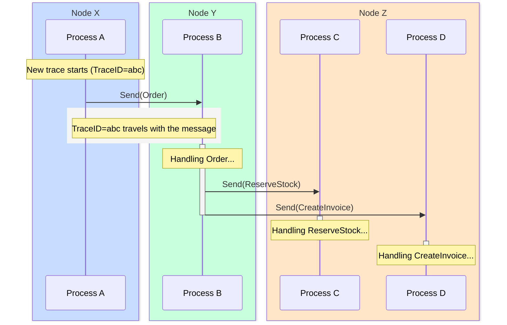
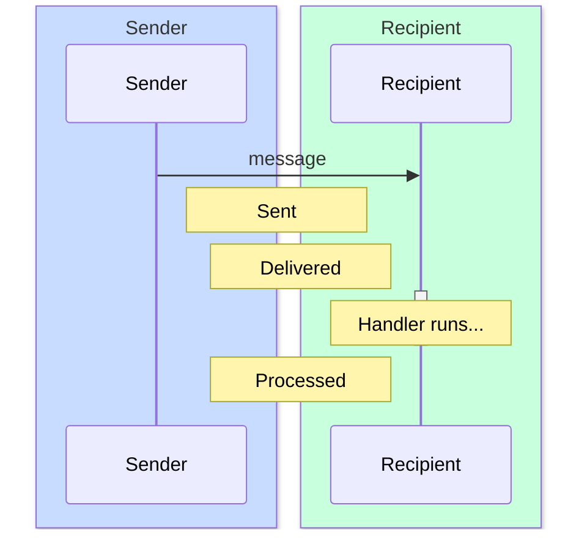
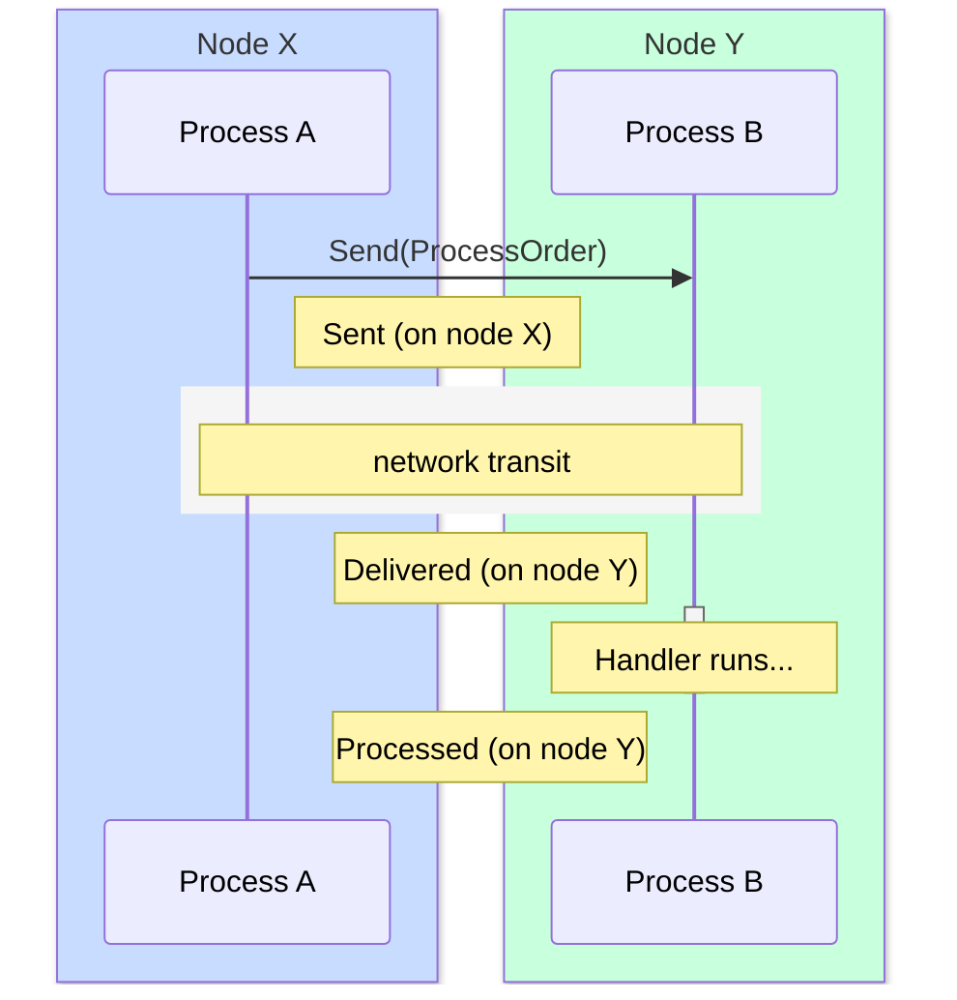
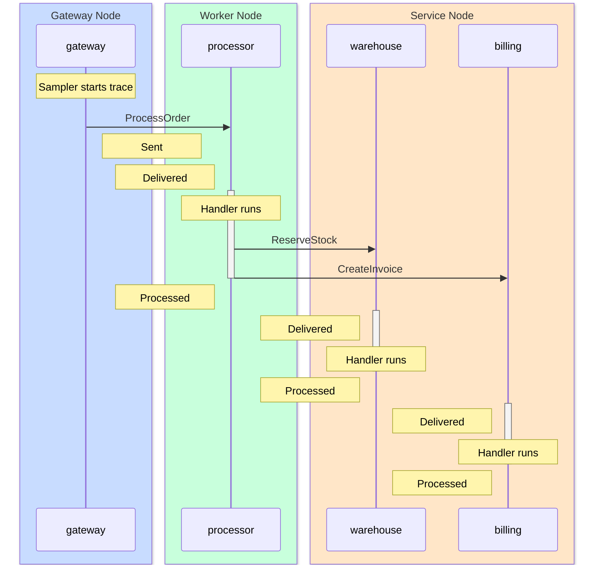
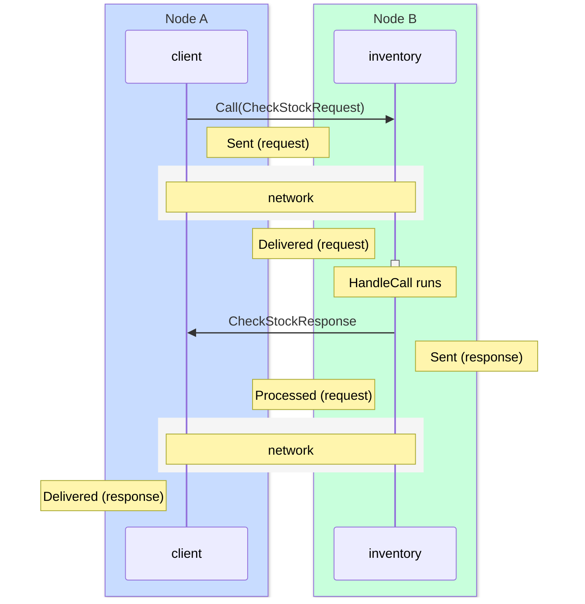
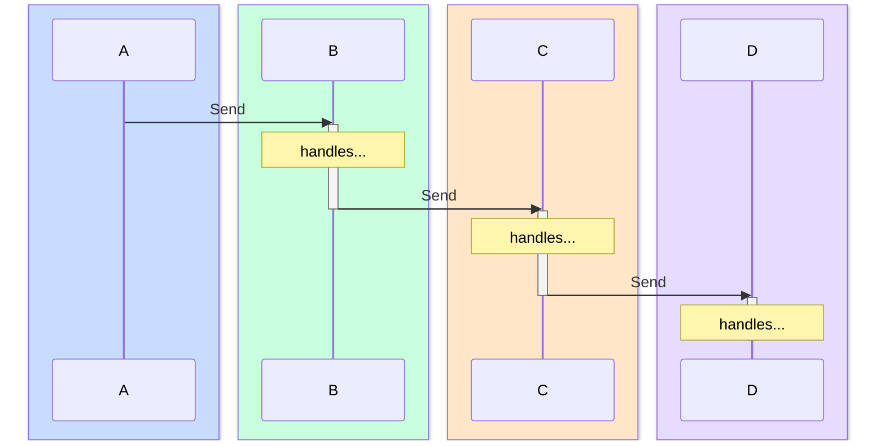
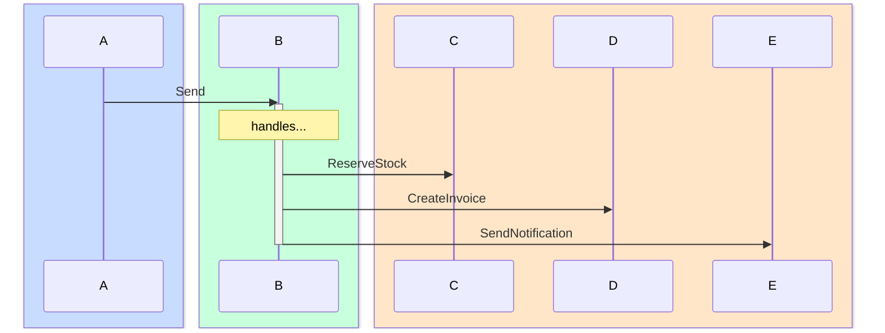
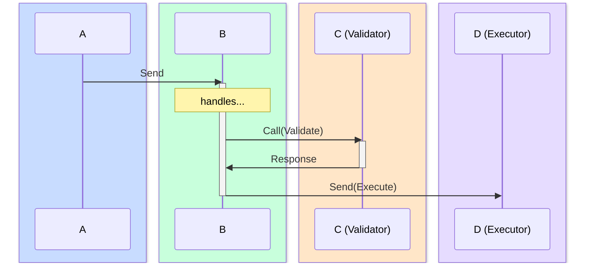
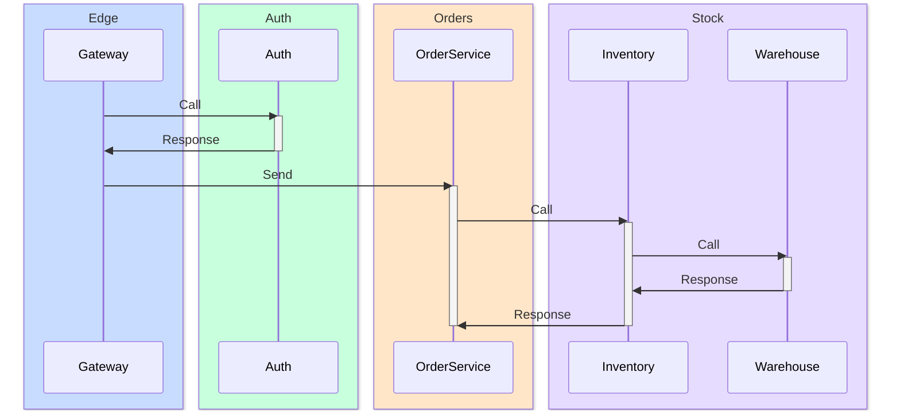

# Distributed Tracing

In a distributed actor system, a single user request can touch dozens of processes across multiple nodes. Messages hop from actor to actor, crossing network boundaries invisibly. When something goes wrong (latency spikes, a message seems to disappear, an error surfaces three hops away from its cause) you need to follow the message trail across the entire cluster.

Traditional logging shows you individual perspectives. Process A logged a send at 10:00:00.001, process B logged a receive at 10:00:00.003. Connecting these fragments manually, with hundreds of messages per second, is impractical. Tracing solves this by giving the framework itself the job of tracking messages end-to-end.

## What Is a Trace

A trace is an identity that follows a chain of causally related messages. When a process sends a message and the framework decides to track it, a 128-bit trace ID is generated and attached to that message. From that moment, the trace identity travels with every message in the chain. When the recipient handles the message and sends new messages of its own, those messages carry the same trace ID. When those recipients send further messages, the identity continues. The trace follows the causal chain across processes and nodes until the chain ends.

This is fundamentally different from HTTP tracing. In HTTP, a request enters a service, the service calls other services, and eventually a response comes back. The trace follows a request-response tree with clear boundaries. In an actor system, there are no such boundaries. A message arrives, the handler sends three async messages to different processes, each of those handlers sends more messages, and the chain branches and spreads across the cluster. There's no single "response" that marks the end. The trace ends when the last handler in the chain finishes without sending more traced messages.




Process B never opted into tracing. Neither did C or D. The trace reached them because the message carried it. This is the key property: you configure tracing on entry-point processes, and the trace propagates through the entire downstream chain automatically.

### The Lifecycle of a Trace

A trace goes through three phases:

**Birth.** A process handles a message and calls `Send`, `Call`, or `SendResponse`. The framework checks: is there an active trace from the incoming message being handled? If yes, the outgoing message inherits it. If no, the framework asks the process's sampler: "should we start a new trace?" If the sampler says yes, a new trace ID is generated. If it says no, the message goes out untraced. The sampler is covered in the Enabling Tracing section below.

**Propagation.** The trace identity travels with the message. When the recipient's handler runs, the framework stores the trace as the "propagating context" for the duration of that handler. Every `Send`, `Call`, or `SendResponse` during the handler inherits the trace identity. When the handler returns, the context is restored. If the handler sends messages to five different processes, all five messages carry the same trace identity. Each recipient propagates it further in the same way.

**End.** A trace has no explicit end and no timeout. It ends naturally when the last handler in the chain finishes processing and sends no further messages. A trace that spans a 30-second `Call` timeout will simply have a 30-second gap between observations. The trace identity is a value in the message, not a timer.

### Observation Points

As a trace flows through the system, the framework records observations at three points for each message:

**Sent.** Recorded when the message leaves the sender. This is the sender's perspective: who sent what, to whom, and when.

**Delivered.** Recorded when the message enters the recipient's mailbox. The recipient hasn't started processing yet, the message is queued.

**Processed.** Recorded when the recipient's handler returns. If the handler returned an error, the observation captures it.



These three points are not the trace itself. They are what gets recorded as the trace passes through. One message produces up to three observations. A trace spanning five messages across three nodes produces up to fifteen observations. Together, these observations reconstruct the complete message flow.

The timing gaps between observations tell you where time is spent:

| Gap | What It Tells You |
|-----|-------------------|
| Sent to Delivered | Network latency (remote) or scheduling delay (local) |
| Delivered to Processed | Mailbox wait time + handler execution time |
| Sent to Processed | Total end-to-end latency for this message |

For local messages, Sent and Delivered happen nearly simultaneously. For remote messages, the gap is the network transit time. This makes tracing particularly valuable in distributed systems: you can see exactly how much time is spent in transit versus in processing.

Each observation carries context: which node emitted it, the sender and recipient identities, the message type name, the actor behavior type, a timestamp, and any custom attributes. Together, the observations for a single trace form a tree that you can visualize as a waterfall in tools like Grafana Tempo or the Observer UI.

### Why Three Points, Not Two

HTTP tracing typically records two points per span: the start and end of a service call. Actor tracing needs three because messages go through a mailbox. In HTTP, when service A calls service B, B starts processing immediately. In an actor system, when A sends to B, the message enters B's mailbox and waits. B might be busy handling a previous message. The wait time can be significant under load.

Without the Delivered point, you'd see Sent at time T and Processed at T+50ms, but you wouldn't know whether the 50ms was network latency, mailbox wait, or handler execution. With Delivered, you know: Sent to Delivered was 2ms (network), Delivered to Processed was 48ms (the message sat in the mailbox for 40ms and the handler took 8ms). This distinction is critical for diagnosing performance issues.

### What Gets Traced

All message kinds that go through the framework's routing:

| Kind | Description | Observations |
|------|-------------|--------------|
| Send | Asynchronous message (`Send`) | Sent, Delivered, Processed |
| Request | Synchronous call (`Call`) | Sent, Delivered, Processed |
| Response | Return value from `HandleCall` | Sent, Delivered |
| Spawn | Process creation | Sent, Processed |
| Terminate | Process termination | Processed |

Response has no Processed because the response delivery completes the Call. There's no separate handler on the caller side. Spawn has no Delivered because it's not a mailbox delivery. Terminate has only Processed because it's an internal lifecycle event, not a message between two processes.

### What Doesn't Get Traced

Exit signals (`SendExit`) do not carry trace context. These are control-plane operations outside of message chains.

Events (`SendEvent`) also do not carry trace context. An event with a thousand subscribers would generate thousands of trace observations from a single publish, creating a storm that overwhelms exporters and backends. If you need to trace event-driven flows, trace the messages that your event handlers send in response to receiving events.

Delayed messages (`SendAfter`) do not carry trace context. A delayed message is a scheduled future action, not a continuation of the current processing chain. By the time it fires, the original handler has long finished. This prevents periodic self-tick patterns from creating infinite traces. Each tick is an independent starting point for the sampler. See the Delayed Messages section for details.

## Enabling Tracing

By default, no processes create traces. You enable tracing by setting a sampler that decides whether to start a new trace for each outgoing message.

```go
func (a *OrderProcessor) Init(args ...any) error {
    a.SetTracingSampler(gen.TracingSamplerAlways)
    return nil
}
```

Four sampler types are available:

```go
gen.TracingSamplerDisable        // never start traces (default)
gen.TracingSamplerAlways         // trace every outgoing message
gen.TracingSamplerRatio(0.01)    // trace 1% of messages
gen.TracingSamplerRateLimit(100) // at most 100 new traces per second
```

The sampler is only consulted when there is no active trace. If a process is already handling a traced message, every outgoing message inherits the trace regardless of the sampler. This means you can set a sampler on a single entry-point process and the trace will follow the entire message chain automatically.

`TracingSamplerRatio(0.1)` traces approximately 10% of messages. `TracingSamplerRateLimit(100)` allows at most 100 new traces per second. During traffic spikes the effective sampling rate drops, during quiet periods more messages are traced.

The sampler is set during `Init()` but only starts working when the process begins handling messages. Messages sent during `Init()` itself, including periodic ticks set up with `SendAfter`, are not traced. This is because `Init()` is a setup phase, not message processing. The sampler becomes active starting from the first `HandleMessage` or `HandleCall` invocation.

### Setting Samplers at Runtime

You can change a process's sampler without restarting it:

```go
node.SetProcessTracingSampler(pid, gen.TracingSamplerAlways)
```

The node itself has a sampler for messages sent via `node.Send()` and `node.Call()`:

```go
node.SetTracingSampler(gen.TracingSamplerRatio(0.01))
```

Process samplers and the node sampler are independent.

### Custom Samplers

If the built-in samplers don't fit your needs, implement the `gen.TracingSampler` interface:

```go
type TracingSampler interface {
    Sample() bool
    String() string
}
```

`Sample()` is called for each outgoing message that doesn't already carry a trace. Return `true` to start a new trace. `String()` provides a human-readable description shown in Observer and inspection APIs.

## Tracing in Practice: Send

The simplest traced scenario: process A handles a message and sends to process B on the same node.

```go
func (a *gateway) Init(args ...any) error {
    a.SetTracingSampler(gen.TracingSamplerAlways)
    a.SetTracingAttribute("service", "gateway")
    return nil
}

func (a *gateway) HandleMessage(from gen.PID, message any) error {
    req := message.(IncomingRequest)
    a.Send(processorPID, ProcessOrder{ID: req.OrderID})
    return nil
}
```

When `a.Send()` executes, the sampler decides to start a new trace. The framework generates a trace identity shared by all observations for this message. Three observations are recorded:

1. **Sent** on the sender's node, capturing: sender PID, receiver PID, message type `main.ProcessOrder`, behavior `gateway`, the custom attribute `service=gateway`.

2. **Delivered** on the same node (it's local), capturing: the same message identity, the receiver's behavior name, the receiver's permanent attributes.

3. **Processed** after the receiver's `HandleMessage` returns, capturing: whether the handler succeeded or returned an error, plus any one-shot attributes the receiver set during handling.

The receiver didn't set a sampler. It didn't need to. The trace arrived with the message and the observations were recorded automatically.

### Remote Send

When process A on node X sends to process B on node Y, the trace crosses the network:



Sent is recorded on node X, but Delivered and Processed are recorded on node Y. The framework preserves the message's identity across the network, so all three observations can be correlated even though they were emitted on different nodes.

The gap between Sent and Delivered now represents real network latency. If you see a 50ms gap, that's 50ms of network transit.

## Tracing in Practice: Message Chains

The real power of tracing appears when messages form chains. Process A sends to B, and B sends to C and D while handling A's message. All hops share the same trace.

```go
func (p *processor) HandleMessage(from gen.PID, message any) error {
    order := message.(ProcessOrder)
    p.SetTracingSpanAttribute("order_id", order.ID)

    p.Send(warehousePID, ReserveStock{OrderID: order.ID})
    p.Send(billingPID, CreateInvoice{OrderID: order.ID})
    return nil
}
```



The gateway started the trace. The processor inherited it from the incoming message. The warehouse and billing processes also inherited it. Five messages, three nodes, one trace.

The propagation is automatic. During a handler, the framework stores the incoming message's trace context. Every `Send`, `Call`, or `SendResponse` during that handler carries the trace forward. When the handler returns, the context is restored to whatever it was before.

The trace captures causality: the processor's messages to warehouse and billing were sent **because of** the gateway's message to the processor. This creates a tree of messages that represents the complete processing flow for the original request.

## Tracing in Practice: Call and Response

Synchronous calls create two traced message flows within the same trace: the request going out and the response coming back.

```go
func (c *client) HandleMessage(from gen.PID, message any) error {
    to := gen.ProcessID{Name: "inventory", Node: "warehouse@host"}
    result, err := c.Call(to, CheckStockRequest{SKU: "WIDGET-42"})
    if err != nil {
        c.Log().Warning("stock check failed: %s", err)
        return nil
    }
    resp := result.(CheckStockResponse)
    c.Log().Info("stock level: %d", resp.Available)
    return nil
}

func (inv *inventory) HandleCall(from gen.PID, ref gen.Ref, request any) (any, error) {
    req := request.(CheckStockRequest)
    level := inv.checkWarehouse(req.SKU)
    return CheckStockResponse{Available: level}, nil
}
```



The request and the response are separate messages, each with their own observations. They share a call reference (`gen.Ref`) that links them, so tools like Tempo and Observer can pair request and response even when multiple concurrent calls are in flight.

If the inventory process sends additional messages during `HandleCall` (for example, querying a database actor), those messages are also part of the same trace, linked causally to the incoming request.

### Forward Pattern

In the actor model, a process handling a synchronous request can forward it to another process instead of responding directly. The relay wraps the original caller's identity and reference into the forwarded message, and the final recipient responds straight to the original caller:

```go
func (r *relay) HandleCall(from gen.PID, ref gen.Ref, request any) (any, error) {
    req := request.(Request)
    target := gen.ProcessID{Name: "backend", Node: "target@node"}

    r.Send(target, MessageForward{
        OriginalFrom: from,
        OriginalRef:  ref,
        Payload:      req,
    })
    return nil, nil // no direct response; backend will respond to the original caller
}

func (b *backend) HandleMessage(from gen.PID, message any) error {
    fwd := message.(MessageForward)
    result := b.process(fwd.Payload)
    // process message
    b.SendResponse(fwd.OriginalFrom, fwd.OriginalRef, result)
    return nil
}
```

The trace follows the entire chain: A's call to the relay, the relay's forward to the backend, and the backend's response to A. Three messages, potentially three nodes, one trace. The response skips the relay entirely, and the trace captures this topology accurately.

### Async Response and Trace Context

When `HandleCall` returns `nil, nil` (async response), the process stores the caller's identity and reference to respond later. Between the request handler and the eventual response, other messages may arrive. The response will happen in a different handler invocation, potentially with a different trace context.

If you need the response to be in the same trace as the original request, save the trace context alongside the caller identity:

```go
type pendingCall struct {
    From    gen.PID
    Ref     gen.Ref
    Tracing gen.Tracing
}

func (s *service) HandleCall(from gen.PID, ref gen.Ref, request any) (any, error) {
    s.pending = pendingCall{
        From:    from,
        Ref:     ref,
        Tracing: s.PropagatingTrace(),
    }
    return nil, nil
}

func (s *service) HandleMessage(from gen.PID, message any) error {
    // some event triggers the response
    saved := s.PropagatingTrace()
    s.SetPropagatingTrace(s.pending.Tracing)
    s.SendResponse(s.pending.From, s.pending.Ref, result)
    s.SetPropagatingTrace(saved)
    return nil
}
```

`PropagatingTrace()` returns the current trace context. In `HandleCall`, this is the request's trace. Saving it and restoring before `SendResponse` ensures the response carries the original request's trace, regardless of which trace context the current handler is working with.

The save-restore pattern is important: `SetPropagatingTrace` changes the trace context for all subsequent operations in the handler. If you don't restore the previous context, the modified trace will leak beyond the current handler into all subsequent handler invocations. Every message the process sends from that point on will carry the leaked trace until another traced message arrives and resets it. Always save before, always restore after.

## Custom Attributes

Traces show message flow. Custom attributes add business context that makes traces searchable and meaningful.

Attributes describe the place where a message was sent, delivered, or processed. They are part of the observation record, not part of the trace context. Over the network, only the trace ID and span ID travel with the message, just enough to link observations into a chain. Attributes stay local to the node that emitted the observation. This keeps the network overhead minimal and lets each process describe its own context independently.

### Permanent Attributes

Set on a process, attached to every observation from that process for its entire lifetime:

```go
func (a *PaymentService) Init(args ...any) error {
    a.SetTracingSampler(gen.TracingSamplerRatio(0.01))
    a.SetTracingAttribute("service", "payment")
    a.SetTracingAttribute("version", "2.1")
    a.SetTracingAttribute("region", "eu-west")
    return nil
}
```

When a message passes through this process, its attributes appear on every observation where the process is a participant. If another process sends a message to PaymentService, the Delivered and Processed observations carry `service=payment, version=2.1, region=eu-west`. When PaymentService sends a message to someone else, the Sent observation carries the same attributes. The attributes describe the location in the system where the observation was recorded.

Setting an attribute with a key that already exists overwrites the value. Remove with `RemoveTracingAttribute(key)`.

### Node-Level Attributes

The node has its own permanent attributes, independent from process attributes:

```go
node.SetTracingAttribute("env", "production")
node.SetTracingAttribute("cluster", "payments-eu")
```

Same mechanics as process attributes: set, overwrite, or remove at any time.

### One-Shot Span Attributes

Set during message handling, scoped to a single handler invocation:

```go
func (a *OrderProcessor) HandleMessage(from gen.PID, message any) error {
    order := message.(Order)
    a.SetTracingSpanAttribute("order_id", order.ID)
    a.SetTracingSpanAttribute("customer", order.CustomerID)
    a.SetTracingSpanAttribute("amount", fmt.Sprintf("%.2f", order.Total))

    a.Send(warehousePID, ReserveStock{OrderID: order.ID})
    a.Send(billingPID, CreateInvoice{OrderID: order.ID})
    return nil
}
```

One-shot attributes appear on the observations emitted during this handler invocation: the Processed observation for the incoming message, and the Sent observations for outgoing messages. When the handler returns, one-shot attributes are cleared automatically. The next handler invocation starts with a clean slate.

If a one-shot attribute has the same key as a permanent attribute, the one-shot value takes priority for that handler invocation. The permanent attribute is not modified.

### Where Attributes Appear

Different observations carry different attributes:

| Observation | Attributes |
|-------------|-----------|
| Sent | Sender's permanent + one-shot attributes |
| Delivered | Receiver's permanent attributes |
| Processed | Receiver's permanent + one-shot attributes |

This means: the sender decides what context to attach at send time. The receiver's permanent identity (service name, version) appears on its Delivered and Processed observations. The receiver can add handler-specific context (order ID, customer) that appears on its Processed observation and on any Sent observations during that handler.

### Searching by Attributes

In Grafana Tempo or the Observer UI, search by any attribute value. If one observation in a trace has `order_id=ORD-456`, searching for it returns the complete trace, all observations across all nodes in the chain. You don't need the same attribute on every observation.

This makes attributes a powerful debugging tool. Set `order_id` on the entry-point process, and you can find the complete processing trace for any order by searching for its ID.

The `ergo.` prefix is reserved for framework-generated attributes (`ergo.node`, `ergo.from`, `ergo.behavior`). Attempts to set attributes with this prefix are silently ignored.

## Delayed Messages

`SendAfter` does not carry trace context. This is a deliberate design choice: a delayed message is a future action, not a continuation of the current processing chain.

Consider a common pattern, a process that does periodic work via a self-tick:

```go
func (w *worker) Init(args ...any) error {
    w.SetTracingSampler(gen.TracingSamplerAlways)
    w.SendAfter(w.PID(), messageTick{}, 3*time.Second)
    return nil
}

func (w *worker) HandleMessage(from gen.PID, message any) error {
    switch message.(type) {
    case messageTick:
        w.Send(targetPID, DoWork{})
        w.SendAfter(w.PID(), messageTick{}, 3*time.Second)
    }
    return nil
}
```

Each tick arrives as an untraced message. The sampler on the worker decides independently for each `Send(targetPID, DoWork{})` whether to create a trace. The `SendAfter` at the end schedules the next tick without trace context, breaking the chain and ensuring the next tick starts fresh.

If `SendAfter` inherited the trace, the first tick that happened to be traced would create an infinite trace: tick carries trace, handler sends traced tick, next handler sends traced tick, forever. A process running for days would accumulate millions of observations in a single trace. Decoupling `SendAfter` from the trace context prevents this.

The same applies to `SendAfter` to other processes. If you need a delayed message to carry trace context, send it through a regular `Send` to an intermediary that schedules the delay, or store the trace context and restore it when the delayed action triggers (the same pattern as Async Response above).

### Self-Send and Trace Propagation

`Send` to self behaves like `Send` to any other process. The message carries the current trace context. This is consistent and enables patterns like async `HandleCall` where a process sends work to itself and responds later within the same trace.

For periodic self-loops, use `SendAfter` which does not carry trace context. This is the natural choice for tick patterns since `SendAfter` provides the timing control that loops need. Each tick starts fresh, and the sampler decides independently whether to trace it.

If your actor uses `Send` to itself for a finite internal sequence (state machine, batch processing), the internal steps will appear in the trace. For a three-step state machine triggered by a traced message, this adds six extra observations. This is proportional to the work done and finite, not a concern in practice.

## Lifecycle Events: Spawn and Terminate

When a process spawns a child during a traced handler, the spawn itself is part of the trace.

```go
func (m *manager) HandleMessage(from gen.PID, message any) error {
    task := message.(NewTask)

    pid, err := m.Spawn(workerFactory, gen.ProcessOptions{}, task.Config)
    if err != nil {
        return err
    }

    m.Send(pid, BeginWork{TaskID: task.ID})
    return nil
}
```

The framework records two observations for the spawn:

**Sent.** Emitted before the child's `Init()` runs. This is "spawn initiated."

**Processed.** Emitted after `Init()` returns. If `Init()` returned an error, the error is recorded in this observation's Error field.

The gap between Sent and Processed is the `Init()` execution time. If a spawn is slow, you'll see it in the trace.

After `Init()` completes, the child process starts with a clean slate, no inherited trace context. Messages the child sends during `Init()` are not traced. The child's sampler decides whether to trace its own outgoing messages starting from the first `HandleMessage` or `HandleCall`. The `Send(pid, BeginWork{})` in the example above carries the parent's trace (it's a regular `Send` during the parent's traced handler), so the child receives and processes it within the parent's trace.

### Terminate

A terminate observation is recorded when a process terminates while handling a traced message. If the handler returns an error that causes the process to exit, the framework records the termination reason in the same trace as the message that caused the crash. This gives you the complete picture in one trace: the message arrived, the handler failed, the process terminated.

Processes that terminate between handler invocations (normal shutdown, supervisor stop, `node.Kill`) do not generate a terminate observation. Normal lifecycle events don't produce tracing noise.

## Exporters

Observations go nowhere by themselves. To see them, you register one or more tracing exporters on the node. This works similarly to loggers: a node can have multiple loggers, each receiving log messages according to its own level filter. A node can have multiple tracing exporters, each receiving observations according to its own flags.

The framework emits all observations unconditionally for traced messages. Each exporter declares which types of observations it wants to receive, and the framework delivers only those. One exporter might receive everything for a waterfall UI, while another on the same node receives only Sent observations for counting outgoing messages.

### Exporter Flags

When you register an exporter, you specify which observations it should receive:

```go
gen.TracingFlagSend     // Sent observations
gen.TracingFlagReceive  // Delivered and Processed observations
gen.TracingFlagProcs    // Spawn and Terminate lifecycle events
```

Combine with bitwise OR:

```go
// receive everything
flags := gen.TracingFlagSend | gen.TracingFlagReceive | gen.TracingFlagProcs

// only message delivery observations
flags := gen.TracingFlagReceive
```

### Two Kinds of Exporters

**Process-based.** An actor process that receives observations in its mailbox. Use this when the exporter needs actor capabilities: batching with timers, sending over the network, accessing node services. This is how Observer and Pulse work internally.

```go
node.TracingExporterAddPID(pid, "my-exporter",
    gen.TracingFlagSend | gen.TracingFlagReceive | gen.TracingFlagProcs)
```

The process implements `HandleSpan(gen.TracingSpan)` to process each observation. If the process's mailbox is full, observations are silently dropped. Ensure the exporter can keep up with the observation rate.

**Behavior-based.** A simple implementation of the `gen.TracingBehavior` interface. `HandleSpan` is called synchronously when an observation is emitted. Use this for lightweight exporters that don't need actor capabilities.

```go
type TracingBehavior interface {
    HandleSpan(TracingSpan)
    Terminate()
}
```

```go
node.TracingExporterAdd("counter", &spanCounter{},
    gen.TracingFlagSend | gen.TracingFlagReceive)
```

Keep `HandleSpan` fast. It blocks delivery to the next exporter in the chain.

### Registering Exporters

At node startup:

```go
options := gen.NodeOptions{
    Tracing: gen.TracingOptions{
        Exporters: []gen.TracingExporter{
            {
                Name:     "my-exporter",
                Exporter: &myExporter{},
                Flags:    gen.TracingFlagSend | gen.TracingFlagReceive,
            },
        },
    },
}
```

At runtime:

```go
node.TracingExporterAdd("counter", &spanCounter{}, gen.TracingFlagSend)
node.TracingExporterAddPID(pid, "observer", gen.TracingFlagSend | gen.TracingFlagReceive | gen.TracingFlagProcs)
```

Each exporter has a unique name. Attempting to register a name that's already taken returns `gen.ErrTaken`. A process can only be registered as one exporter. A second attempt returns `gen.ErrNotAllowed`.

### Removing Exporters

```go
names := node.TracingExporters()       // list registered exporter names
node.TracingExporterDelete("name")     // remove by name
node.TracingExporterDeletePID(pid)     // remove by PID
```

Removing a behavior-based exporter calls its `Terminate()` method. Exporters can be added and removed at any time while the node is running.

## Observer and Pulse

Two ready-made exporters are available out of the box.

[Observer](observer.md) provides real-time tracing visualization directly in the web UI. It connects to a specific node and shows traces passing through that node, useful for live debugging and runtime sampler control. Since Observer sees only one node at a time, traces that span multiple nodes will appear partial. See [Inspecting With Observer](observer.md) for details.

[Pulse](../extra-library/applications/pulse.md) exports traces to an OTLP-compatible backend (Grafana Tempo, Jaeger). Each node runs its own Pulse instance, sending observations to a shared collector. The backend assembles complete cross-cluster traces from all nodes, so you can see the full message chain end-to-end. See the [Pulse documentation](../extra-library/applications/pulse.md) for setup and configuration.

## Production Patterns

### Sampling at the Edge

In production, you rarely want to trace everything. Set a ratio sampler on your entry-point processes and let propagation handle the rest:

```go
func (gw *APIGateway) Init(args ...any) error {
    gw.SetTracingSampler(gen.TracingSamplerRatio(0.01))
    gw.SetTracingAttribute("service", "api-gateway")
    return nil
}
```

One percent of requests are traced end-to-end across the entire cluster. The other 99% have near-zero overhead: one `Sample()` call returning `false`.

Downstream processes don't need samplers. They inherit traces from incoming messages. This means adding tracing to a complex system requires changes only at the entry points.

### Rate Limiting Under Load

When traffic volume varies, `TracingSamplerRateLimit` provides a steady flow of traces regardless of load:

```go
gw.SetTracingSampler(gen.TracingSamplerRateLimit(50))
```

This creates at most 50 new traces per second. During a traffic spike, the effective sampling rate drops. During quiet periods, more messages are traced.

This is useful when your tracing backend or exporters have throughput limits. You get consistent trace volume without overwhelming the pipeline.

### Debugging a Specific Process

Something is wrong with a particular process. Enable full tracing on it without restarting:

```go
node.SetProcessTracingSampler(problemPID, gen.TracingSamplerAlways)
```

Or through the Observer UI: open the process, go to Config, set the sampler to "always". Every message this process handles and every message it sends will be traced. When you're done investigating, set it back to "disable."

Because trace propagation is automatic, you'll see not just this process's messages but the entire downstream chain. If the process calls a remote service, you'll see the round-trip. If it spawns workers, you'll see the spawn and the workers' activity.

### Finding Specific Requests

A customer reports a problem with order ORD-789. You need to see what happened:

```go
func (a *OrderProcessor) HandleMessage(from gen.PID, message any) error {
    order := message.(Order)
    a.SetTracingSpanAttribute("order_id", order.ID)
    // ... process the order
    return nil
}
```

In Grafana Tempo, search for `order_id=ORD-789`. The complete trace appears: every message in the processing chain, across every node, with timing at every hop. You can see where the latency was, which service returned an error, and what happened next.

This requires that the entry-point process was tracing when order ORD-789 came through. With 1% sampling, you won't have traces for every request. For critical flows where you always need traces, use `TracingSamplerAlways` on the entry-point process or a higher ratio.

### Temporary Tracing for Incident Response

During an incident, you need more visibility. Increase sampling temporarily:

```go
// before: 1% sampling
node.SetProcessTracingSampler(gatewayPID, gen.TracingSamplerRatio(0.01))

// during incident: trace everything
node.SetProcessTracingSampler(gatewayPID, gen.TracingSamplerAlways)

// after resolution: back to normal
node.SetProcessTracingSampler(gatewayPID, gen.TracingSamplerRatio(0.01))
```

You can do this through the Observer UI without any code changes: open the process, change the sampler in the Config tab, investigate, and set it back.

## Understanding Trace Trees

As traces propagate through message chains, they form trees. Understanding the tree structure helps when reading traces in Tempo or Observer.

### Linear Chain

The simplest tree: A sends to B, B sends to C, C sends to D.



Each message is a child of the message that caused it. In a waterfall view, you see a staircase pattern: each hop starts when the previous handler runs.

### Fan-Out

One handler sends to multiple recipients:



B's handler sends three messages. All three are children of B's incoming message. In a waterfall view, the three sends appear at roughly the same timestamp, fanning out from B's processing.

### Fan-Out with Call

B calls C synchronously, then uses the result to send to D:

```go
func (b *processor) HandleMessage(from gen.PID, message any) error {
    result, err := b.Call(validatorPID, ValidateRequest{...})
    if err != nil {
        return err
    }
    b.Send(executorPID, ExecuteRequest{Validated: result})
    return nil
}
```



In the waterfall, you see B waiting for C's response before sending to D. The gap between the response arriving and D's Sent observation shows B's processing time between the call return and the next send.

### Deep Chains Across Nodes

In a microservice-style architecture with many nodes, traces can span many hops:



Each arrow is a message with up to three observation points. The complete trace might have 15-20 observations across 5 nodes. In Tempo's waterfall view, you see exactly where time is spent: if the warehouse is slow, the gap between its Delivered and Processed observations will be large.

## Writing a Custom Exporter

For specialized needs beyond Pulse and Observer, you can write your own exporter. Here's an example that counts observations by kind:

```go
type traceCounter struct {
    sends     int64
    requests  int64
    responses int64
}

func (tc *traceCounter) HandleSpan(span gen.TracingSpan) {
    switch span.Kind {
    case gen.TracingKindSend:
        atomic.AddInt64(&tc.sends, 1)
    case gen.TracingKindRequest:
        atomic.AddInt64(&tc.requests, 1)
    case gen.TracingKindResponse:
        atomic.AddInt64(&tc.responses, 1)
    }
}

func (tc *traceCounter) Terminate() {}
```

Register it at node startup:

```go
options := gen.NodeOptions{
    Tracing: gen.TracingOptions{
        Exporters: []gen.TracingExporter{
            {
                Name:     "counter",
                Exporter: &traceCounter{},
                Flags:    gen.TracingFlagSend,
            },
        },
    },
}
```

Or register at runtime:

```go
node.TracingExporterAdd("counter", &traceCounter{},
    gen.TracingFlagSend)
```

The flags on the exporter determine which observations it receives. The counter above only gets Sent observations (because of `TracingFlagSend`). To also receive Delivered and Processed, add `gen.TracingFlagReceive`.

For more complex exporters that need actor capabilities (sending messages, using timers, accessing the network), register a process as an exporter with `TracingExporterAddPID` and implement `HandleSpan` in your actor. This is how Pulse works: a pool of actor processes that batch observations and flush them over HTTP.
