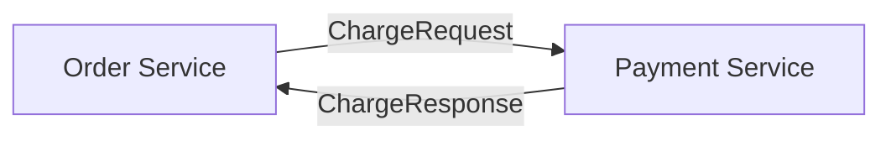
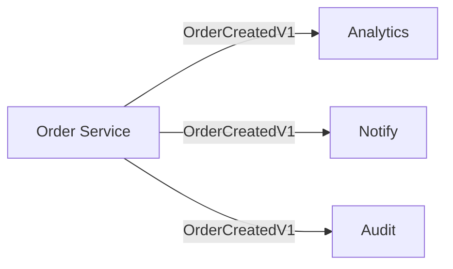
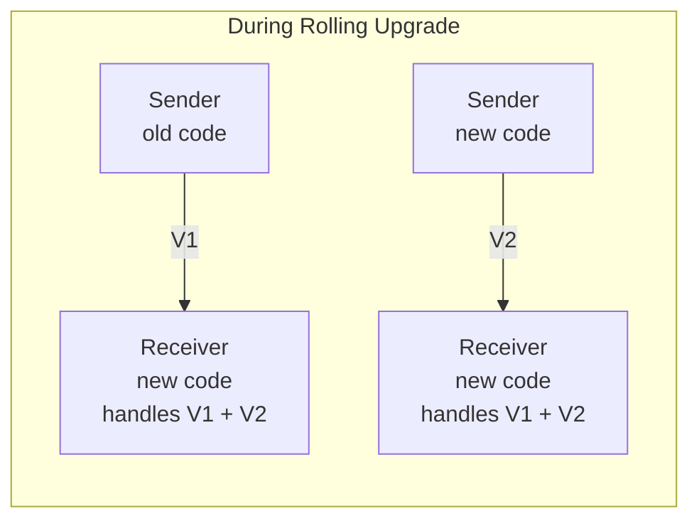

# Message Versioning

Distributed systems evolve. Services gain features, data models change, and deployments happen gradually. During a rolling upgrade, some nodes run new code while others still run the old version. A message sent from a new node must be understood by an old node, and vice versa.

EDF gives you two ways to handle this, and which one is right is a business decision, not a technical default. Strict by default: a message is its exact Go type, so changing a struct creates a new, incompatible type, and every change is explicit and caught at compile time. Or opt into schema evolution: EDF tolerates fields appended to the end of a struct, so a node that has not learned a new field keeps working. Strict typing buys deliberate, visible change control; evolution buys less coordination during rolling deploys. Which matters more is a property of your domain, not of the framework.

This article covers both - how to version messages explicitly, and when schema evolution fits instead - so your cluster handles upgrades gracefully.

## Explicit Versioning

The strict strategy is the default. Unlike Protobuf or Avro, EDF does not provide automatic backward compatibility here: there are no field numbers, and every registered field is encoded positionally and always present on the wire. A struct is its type. Change the struct - create a new type.

A pointer field (`*int`) is still optional in the *value* sense - nil or a value - but the field itself stays part of the type on both sides. That is not the same as a Protobuf optional field, which can be absent from the message entirely; absence-of-field is exactly what the strict default does not allow (and what schema evolution adds, only for trailing fields). The alternative is covered in [Schema Evolution](#schema-evolution) below; pick whichever fits your domain.

The strict approach is straightforward: create a new type for each version.

```go
// Version 1
type OrderCreatedV1 struct {
    OrderID int64
}

// Version 2 - new field
type OrderCreatedV2 struct {
    OrderID  int64
    Priority int
}
```

Both types coexist in the codebase. The receiver handles whichever version arrives:

```go
func (a *Actor) HandleMessage(from gen.PID, message any) error {
    switch m := message.(type) {
    case OrderCreatedV1:
        return a.handleOrderV1(m)
    case OrderCreatedV2:
        return a.handleOrderV2(m)
    }
    return nil
}
```

All message types must be registered with the network stack before connection establishment. The declarative form lives in `ApplicationSpec.Network`:

```go
func (a *MyApp) Load(args ...any) (gen.ApplicationSpec, error) {
    return gen.ApplicationSpec{
        Name: "myapp",
        Network: gen.ApplicationNetwork{
            RegisterTypes: []any{
                OrderCreatedV1{},
                OrderCreatedV2{},
            },
        },
        Group: []gen.ApplicationMemberSpec{ /* ... */ },
    }, nil
}
```

For dynamic registration (types resolved at runtime) the imperative `a.Node().Network().RegisterTypes(...)` from `Load` is also supported. For details on the type registry and the package-level `edf.RegisterTypeOf` API, see [Network Transparency](../networking/network-transparency.md).

## Versioning Strategies

There are two ways to organize versioned types: version in the type name or version in the package path. Both work with EDF. Choose based on your team's preferences.

**Important:** Do not confuse package path versioning with Go modules v2+. Go modules v2+ requires changing both `go.mod` and all import paths when bumping major version (`company.com/events/v2`). This forces all consumers to update imports simultaneously, creates [diamond dependency problems](https://en.wikipedia.org/wiki/Dependency_hell#Problems), and generally causes more pain than it solves. Keep your module below v2.0.0 to avoid triggering this mechanism.

### Version in Type Name

All versions live in the same package:

```
events/
├── order_created_v1.go
├── order_created_v2.go
└── register.go
```

```go
import "company.com/events"

events.OrderCreatedV1{}
events.OrderCreatedV2{}
```

Handler uses type names directly:

```go
switch m := message.(type) {
case events.OrderCreatedV1:
    // ...
case events.OrderCreatedV2:
    // ...
}
```

Advantages:
- Single import for all versions
- All versions visible in one place - evolution is clear
- One registration file for all types
- Simpler directory structure

### Version in Package Path

Each version is a separate package:

```
messaging/
├── v1/
│   └── events/
│       └── order_created.go
└── v2/
    └── events/
        └── order_created.go
```

```go
import eventsv1 "company.com/messaging/v1/events"
import eventsv2 "company.com/messaging/v2/events"

eventsv1.OrderCreated{}
eventsv2.OrderCreated{}
```

Handler uses package aliases:

```go
switch m := message.(type) {
case eventsv1.OrderCreated:
    // ...
case eventsv2.OrderCreated:
    // ...
}
```

Advantages:
- Clean type names without version suffix
- Familiar to Protobuf users
- Clear directory separation between versions
- Removing a version means deleting a directory

#### Module Organization

For projects where message versions evolve in parallel, place `go.mod` in each domain directory:

```
messaging/
├── v1/
│   ├── events/
│   │   ├── go.mod              # module company.com/messaging/v1/events
│   │   └── order_created.go
│   └── payment/
│       ├── go.mod              # module company.com/messaging/v1/payment
│       └── charge.go
└── v2/
    ├── events/
    │   ├── go.mod              # module company.com/messaging/v2/events
    │   └── order_created.go
    └── payment/
        ├── go.mod              # module company.com/messaging/v2/payment
        └── charge.go
```

The `/v1/` and `/v2/` segments are in the middle of the module path, not at the end. Go only applies v2+ import path requirements when `/vN` is the final path element, so `company.com/messaging/v1/events` is safe.

This structure allows:
- V1 to continue receiving new message types while V2 is developed
- Each domain to have isolated dependencies
- Clean removal - deleting a directory removes the module entirely

**Tagging submodules:** Git tags for nested modules must include the path prefix. For module `company.com/messaging/v1/events` located at `v1/events/`, use tag `v1/events/v0.1.0`, not just `v0.1.0`.

### Which to Choose

This documentation uses version in type name for examples. The approach keeps related versions together and requires less import management. However, version in path is equally valid if your team prefers cleaner type names.

Whichever you choose, stay consistent across the codebase.

The versioning mechanism is clear. The next question: where should these types live, and who controls their evolution?

## Message Scopes

The answer depends on how the message is used. Not all messages are equal - some travel between two specific services, others broadcast across the entire cluster.

### Private Messages

Direct communication between specific services. Request/response patterns between known parties.



**Owner:** receiver

Payment Service defines what it accepts. Order Service adapts to Payment's contract.

### Cluster-Wide Events

Domain events published to multiple subscribers. Any service can subscribe.



**Owner:** shared repository

Events represent domain facts, not service-specific contracts. Ownership belongs to a shared module that all services import.

For event publishing patterns, see [Events](../basics/events.md).

## Ownership Rules

Scope determines ownership. Who decides when to create V2? Who approves changes?

| Scope | Owner | Module | Changes approved by |
|-------|-------|--------|---------------------|
| Private messages | Receiver | `receiver-api/` | Receiver team |
| Cluster-wide events | Shared | `events/` | All consumers |

The receiver owns private contracts because it implements the logic. Multiple senders may use the same contract, but they all adapt to what the receiver accepts. This follows the [Consumer-Driven Contracts](https://martinfowler.com/articles/consumerDrivenContracts.html) pattern. Events are shared because they represent domain facts, not service-specific APIs.

### Private Contract Ownership

Payment Service owns its API contract:

```go
// payment-api/charge_v1.go
package paymentapi

type ChargeRequestV1 struct {
    OrderID int64
    Amount  int64
}

type ChargeResponseV1 struct {
    TransactionID string
    Status        string
}
```

Order Service imports and uses it:

```go
import paymentapi "company.com/payment-api"

response, err := a.Call(paymentPID, paymentapi.ChargeRequestV1{
    OrderID: order.ID,
    Amount:  order.Total,
})
```

Payment team decides when to create V2. Order team adapts.

### Cluster Event Ownership

Events require broader coordination:

```
events/
├── OWNERS.md           # who approves changes
├── CHANGELOG.md        # version history
└── order/
    ├── created_v1.go
    └── created_v2.go
```

```markdown
# OWNERS.md

Maintainers (approve all changes):
- platform-team

Reviewers (approve breaking changes):
- order-team
- payment-team
- analytics-team
```

Breaking changes require sign-off from all consumers.

## Repository Organization

With ownership defined, the repository structure follows naturally. Private contracts live with their receivers. Cluster-wide events live in a shared module.

### Version in Type Name

```
company.com/
│
├── events/                     # cluster-wide events
│   ├── go.mod                  # module company.com/events
│   ├── order_created_v1.go
│   ├── order_created_v2.go
│   ├── payment_received_v1.go
│   └── register.go
│
├── payment-api/                # Payment Service contract
│   ├── go.mod                  # module company.com/payment-api
│   ├── charge_v1.go
│   └── refund_v1.go
│
├── order-service/
│   ├── go.mod                  # requires: events, payment-api
│   ├── internal/
│   └── cmd/
│
└── payment-service/
    ├── go.mod                  # requires: events
    ├── internal/
    └── cmd/
```

### Version in Package Path

```
company.com/
│
├── messaging/                  # cluster-wide events and contracts
│   ├── v1/
│   │   ├── events/
│   │   │   ├── go.mod          # module company.com/messaging/v1/events
│   │   │   ├── order_created.go
│   │   │   └── payment_received.go
│   │   └── payment/
│   │       ├── go.mod          # module company.com/messaging/v1/payment
│   │       └── charge.go
│   └── v2/
│       ├── events/
│       │   ├── go.mod          # module company.com/messaging/v2/events
│       │   └── order_created.go
│       └── payment/
│           ├── go.mod          # module company.com/messaging/v2/payment
│           └── charge.go
│
├── order-service/
│   ├── go.mod                  # requires: messaging/v1/events, messaging/v1/payment
│   ├── internal/
│   └── cmd/
│
└── payment-service/
    ├── go.mod                  # requires: messaging/v1/events
    ├── internal/
    └── cmd/
```

### Registration Helper

All message types must be registered with the network stack before connection establishment. During handshake, nodes exchange their registered type lists which become the encoding dictionaries. Registration happens from an application's `Load(node)` callback, which runs after the network stack is initialized but before any traffic. There are two approaches: a centralized helper exported by the shared module, or manual registration per client.

**Centralized helper** exposes a single function that the consumer's application calls from `Load`:

```go
// events/register.go
package events

import "ergo.services/ergo/gen"

func RegisterTypes(network gen.Network) error {
    return network.RegisterTypes([]any{
        OrderCreatedV1{},
        OrderCreatedV2{},
        PaymentReceivedV1{},
    })
}
```

Each consumer calls it from its application:

```go
import "company.com/events"

func (a *OrderService) Load(args ...any) (gen.ApplicationSpec, error) {
    if err := events.RegisterTypes(a.Node().Network()); err != nil {
        return gen.ApplicationSpec{}, err
    }
    return gen.ApplicationSpec{ /* ... */ }, nil
}
```

The shared `events` module owns the canonical list of types. Consumers register them all without having to enumerate each type, so there is no risk of forgetting one. `RegisterTypes` accepts a slice in any order and resolves nested-type dependencies internally.

**Manual registration** means each client registers only the types it uses. This gives more control but introduces risk: a missing registration is only detected at runtime, surfacing as `"no encoder for type"` when sending or `"unknown reg type for decoding"` when receiving. For most projects, centralized registration is simpler and safer. Choose based on your needs.

For message isolation patterns within a single codebase, see [Project Structure](../basics/project-structure.md).

## Compatibility Rules

By default EDF enforces strict type identity: change a struct's field count, order, or types and it is a new, incompatible type. Schema evolution (opt-in, covered below) relaxes this for the trailing fields - you may add to or remove from the end.

| Change | Strict (default) | With schema evolution |
|--------|------------------|-----------------------|
| Rename a field (same type) | Compatible | Compatible |
| Add a field at the end | New version | Compatible |
| Remove a field from the end | New version | Compatible |
| Insert, reorder, retype, or remove a field elsewhere | New version | New version |

Field names are never on the wire - EDF encodes fields positionally - so renaming a field while keeping its type and position is wire-compatible in both modes. Make it a new version only when the rename signals a changed meaning, not a mechanical rename.

Removing a trailing field decodes cleanly by the same mechanism, but unlike appending it is a genuine deletion, not a free change. A node that still carries the field reads it as its zero value the moment an upgraded node stops sending it - and if business logic there depends on the field, it silently reads zero. That is the footgun. Remove a field only after it is deprecated and confirmed unused (see [Version Lifecycle](#version-lifecycle)); evolution only guarantees the removal will not break decoding mid-rollout, not that it is semantically safe.

Under the strict default, every other change requires explicit versioning. This is the opposite of Protobuf/Avro, where adding an optional field is silently compatible - and that difference is the choice you are making, not a verdict on either approach.

Consider the implicit style: you add an optional `Priority` field and everything "just works" - until you spend three days debugging why orders aren't prioritized correctly, because half your cluster sends the field, half ignores it, and receivers default the missing value to zero with nothing in the logs. Strict typing makes that class of bug impossible: the receiver either handles `OrderV2` with its `Priority`, or it doesn't, and you know which at compile time.

That safety has a price - coordination. Every additive change, even a harmless new field, means a new type and a coordinated rollout. For a fast-moving service that mostly appends fields, that ceremony can cost more than the risk it removes. Schema evolution is built for exactly that case: you accept the zero-default behavior for appended fields in return for dropping the per-field versioning. Neither model is universally correct - how much you value explicit change control over deployment velocity is a business call, and EDF lets you make it per connection.

## Schema Evolution

When your domain leans toward deployment velocity, schema evolution removes the per-field versioning ceremony for the append case. Enable it with the `EnableSchemaEvolution` network flag. Like the other capability flags, it is negotiated during handshake: evolution is active only when both ends enable it, so a connection to an older node, or one that left the flag off, stays strict.

```go
// Start from the defaults and add the flag. Building NetworkFlags from scratch
// would turn every other capability off (important delivery, fragmentation,
// simultaneous connect, clock skew, tracing, wrapped errors, keepalive).
flags := gen.DefaultNetworkFlags
flags.EnableSchemaEvolution = true

gen.NodeOptions{
    Network: gen.NetworkOptions{Flags: flags},
}
```

With evolution active, you may add fields to the end of a registered struct without minting a new type. The type keeps its identity, and old and new nodes interoperate through the rolling deploy:

- A node that does not know the appended field **skips** it (a new sender, an old receiver).
- A node that expects a field an older sender did not include reads it as its **zero value** (an old sender, a new receiver).

```go
// Before
type OrderCreated struct {
    OrderID int64
}

// After - Priority appended at the end. Same type, same identity.
type OrderCreated struct {
    OrderID  int64
    Priority int
}
```

During the rollout a node still running the old `OrderCreated` ignores `Priority`; an upgraded node receiving an old message sees `Priority` as `0`. No new type, no handler branch, no anti-corruption layer.

### Limitations

Schema evolution covers the trailing fields, and nothing else:

- **Trailing fields only.** The fields common to both versions must match in type and order; versions may differ only at the end. Appending is the common case; trimming the last field also works on the wire, but that is a genuine deletion with a footgun (old nodes read the dropped field as zero - see the note under the table above). Inserting, reordering, retyping, or removing a field anywhere but the end is a breaking change - create a new version.
- **Both nodes must enable it.** A connection where either side has the flag off runs strict, so an older node never receives a form it cannot parse.
- **No mismatch detection.** Evolution tolerates a difference in the trailing field count; it does not verify that the shared leading fields actually match. A change to those leading fields made by mistake (a reorder, a type change) is not caught - it silently misreads, exactly the zero-default class of bug the strict default prevents. The trailing-only discipline is on you.
- **Size cap per struct.** With evolution on, a single encoded struct is bounded at just under 4GB. The strict default has no such per-struct cap.

Because of the last two points, evolution is a deliberate trade, not a free upgrade: you take on the trailing-only discipline (and its footgun) to drop per-field versioning. For anything beyond appending, or for high-stakes contracts where every change must be a visible compile-time decision, keep the strict default and version explicitly. For how EDF encodes registered types, see [Network Transparency](../networking/network-transparency.md#edf-ergo-data-format).

## Version Lifecycle

With compatibility rules clear, how do versions evolve over time?

### When to Create New Version

Any change from the compatibility table above requires a new version. Additionally, create a new version when changing field semantics (same type, different meaning).

### Deprecation

Mark deprecated versions:

```go
// Deprecated: use ChargeRequestV2. Remove after 2025-Q3.
type ChargeRequestV1 struct {
    OrderID int64
    Amount  int64
}
```

Log when receiving deprecated versions:

```go
case ChargeRequestV1:
    a.Log().Warning("deprecated ChargeRequestV1 from %s", from)
    return a.handleChargeV1(m)
```

### Removal

Remove only when:
1. All senders upgraded to V2
2. Monitoring confirms zero V1 traffic
3. Deprecation period passed

Remove in order:
1. Stop accepting (return error for V1)
2. Remove from registration
3. Delete type definition

## Rolling Upgrades

Back to the scenario from the introduction: you're deploying a new version, nodes restart one by one, and for some time the cluster runs mixed code versions. How do you handle this?

### Upgrade Strategy

1. **Deploy V2 types** to shared module
2. **Update receivers** to handle V1 and V2
3. **Rolling restart** receiver nodes
4. **Update senders** to send V2
5. **Rolling restart** sender nodes
6. **Deprecate** V1 after all nodes upgraded
7. **Remove** V1 after deprecation period

### Coexistence Period



Receivers must support both versions during the upgrade window.

For deployment patterns with weighted routing, see [Building a Cluster](building-a-cluster.md).

## Anti-Corruption Layer

Supporting multiple versions means your handler has multiple code paths. As versions accumulate, this becomes messy. The Anti-Corruption Layer pattern isolates version translation:

```go
// internal/acl/charge.go
package acl

import api "company.com/payment-api"

func ChargeV1ToV2(v1 api.ChargeRequestV1) api.ChargeRequestV2 {
    return api.ChargeRequestV2{
        OrderID:  v1.OrderID,
        Amount:   v1.Amount,
        Currency: "USD", // default for V1 clients
    }
}
```

Use in handler:

```go
func (a *Actor) HandleMessage(from gen.PID, message any) error {
    switch m := message.(type) {
    case api.ChargeRequestV1:
        v2 := acl.ChargeV1ToV2(m)
        return a.processCharge(v2)
    case api.ChargeRequestV2:
        return a.processCharge(m)
    }
    return nil
}
```

Single implementation handles V2. ACL converts V1 to V2. When V1 is removed, delete the ACL function - no changes to business logic needed.

## Contract Testing

With version handling and ACL in place, how do you verify it actually works? [Contract tests](https://martinfowler.com/articles/microservice-testing/#testing-contract-introduction) verify compatibility:

```go
func TestPaymentActorAcceptsBothVersions(t *testing.T) {
    tc := unit.NewTestCase(t, "test@localhost")
    defer tc.Stop()

    actor := tc.Spawn(createPaymentActor)

    // V1 works
    actor.Send(ChargeRequestV1{OrderID: 1, Amount: 100})
    actor.ShouldSend().Message(ChargeResponseV1{}).Once().Assert()

    // V2 works
    actor.Send(ChargeRequestV2{OrderID: 2, Amount: 200, Currency: "EUR"})
    actor.ShouldSend().Message(ChargeResponseV2{}).Once().Assert()
}
```

Test ACL conversion:

```go
func TestACLConvertsV1ToV2(t *testing.T) {
    v1 := ChargeRequestV1{OrderID: 123, Amount: 500}
    v2 := acl.ChargeV1ToV2(v1)

    assert.Equal(t, v1.OrderID, v2.OrderID)
    assert.Equal(t, v1.Amount, v2.Amount)
    assert.Equal(t, "USD", v2.Currency) // default
}
```

Run contract tests in CI before merging changes to shared modules.

For actor testing patterns, see [Unit Testing](../testing/unit.md).

## Naming Conventions

Consistent naming makes code self-documenting. When you see a type name, you should immediately know: is this async or sync? Is it a request or event? What version?

### Async Messages

Prefix with `Message`, suffix with version:

```go
type MessageOrderShippedV1 struct {
    OrderID   int64
    TrackingN string
}
```

The prefix signals fire-and-forget semantics. When reading code, `MessageXXX` means no response is expected. If someone writes `Call(pid, MessageOrderShippedV1{})`, the mismatch is immediately visible.

### Sync Messages

Use `Request`/`Response` suffix:

```go
type ChargeRequestV1 struct {
    OrderID int64
    Amount  int64
}

type ChargeResponseV1 struct {
    TransactionID string
    Status        string
}
```

Paired naming makes contracts explicit. `ChargeRequest` implies `ChargeResponse` exists. The caller knows to expect a result.

### Events

Domain events use past tense without prefix:

```go
type OrderCreatedV1 struct { ... }
type PaymentReceivedV1 struct { ... }
```

Events describe facts that already happened, not requests for action. Past tense (`Created`, `Received`) distinguishes them from commands (`Create`, `Charge`).

### Version Suffix

If using version in type name strategy, always suffix with version number:

```go
type OrderV1 struct { ... }   // correct
type Order struct { ... }     // avoid - unclear versioning
type OrderNew struct { ... }  // avoid - not a version number
```

If using version in path strategy, the package path carries the version and type names stay clean.

## Common Mistakes

These patterns emerge repeatedly in production systems. Avoid them:

**Changing existing type instead of creating new version**

```go
// Wrong under the strict default - breaks existing consumers
type Order struct {
    ID       int64
    Priority int    // appended field changes the wire format
}

// Correct - create new version (in type name or new package path)
type OrderV2 struct {
    ID       int64
    Priority int
}
```

This is a mistake only under the strict default. With [Schema Evolution](#schema-evolution) enabled on both nodes, appending `Priority` at the end keeps the same type and stays compatible - that is the whole point of opting in. Inserting, reordering, retyping, or removing a non-trailing field is still a breaking change either way.

**Forgetting to register new types**

```go
// Type exists but not registered. Encoding fails at runtime.
type OrderV3 struct { ... }

// Register from your application's Load callback before any traffic.
node.Network().RegisterType(OrderV3{})
```

**Long coexistence periods**

Supporting V1 for months creates maintenance burden. Set clear deprecation deadlines and enforce them.

**Registering after connection established**

Types must be registered before connections are formed. Dynamic registration requires connection cycling.

## Summary

Message versioning in EDF is explicit by default: no hidden compatibility rules, no runtime surprises. When your domain favors deployment velocity over that control, schema evolution opts into append-compatibility per connection. Both are valid - the choice is a business one.

| Aspect | Private Messages | Cluster Events |
|--------|------------------|----------------|
| Nature | Service API contract | Domain fact |
| Owner | Receiver (implements logic) | Shared (belongs to domain) |
| Module | `receiver-api/` | `events/` |
| Changes | Receiver team decides | All consumers coordinate |

Key principles:
- Choose strict versioning or schema evolution by what your business needs, not by default
- Version in type name or package path, never in Go module path
- Receiver owns private contracts
- Shared repository for domain events
- Test version compatibility
- Set deprecation deadlines
- Use ACL to isolate version translation
- With schema evolution, keep changes append-only - the discipline is not enforced

