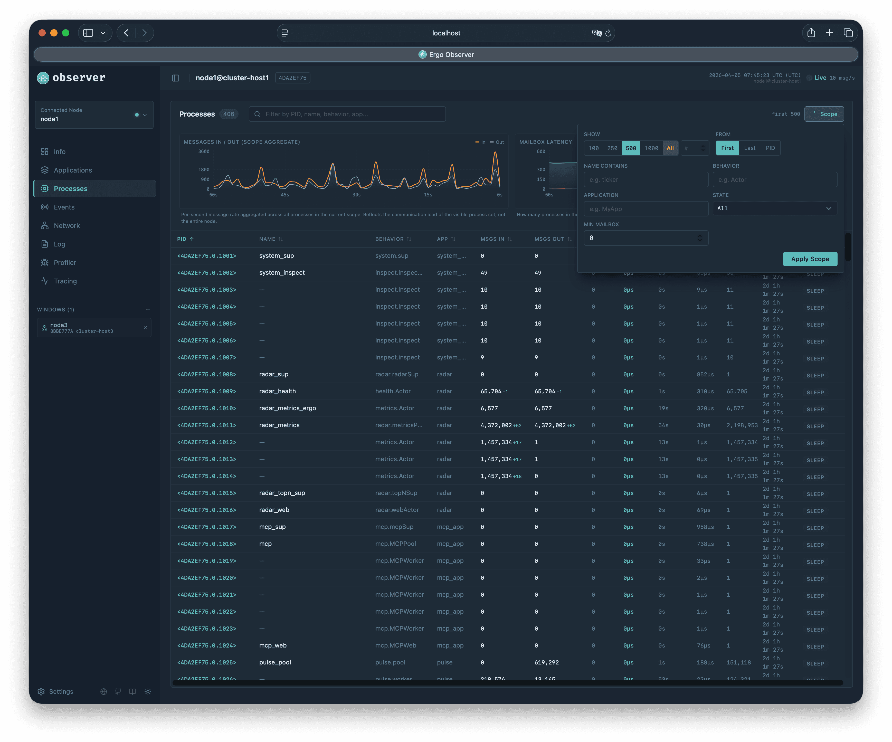
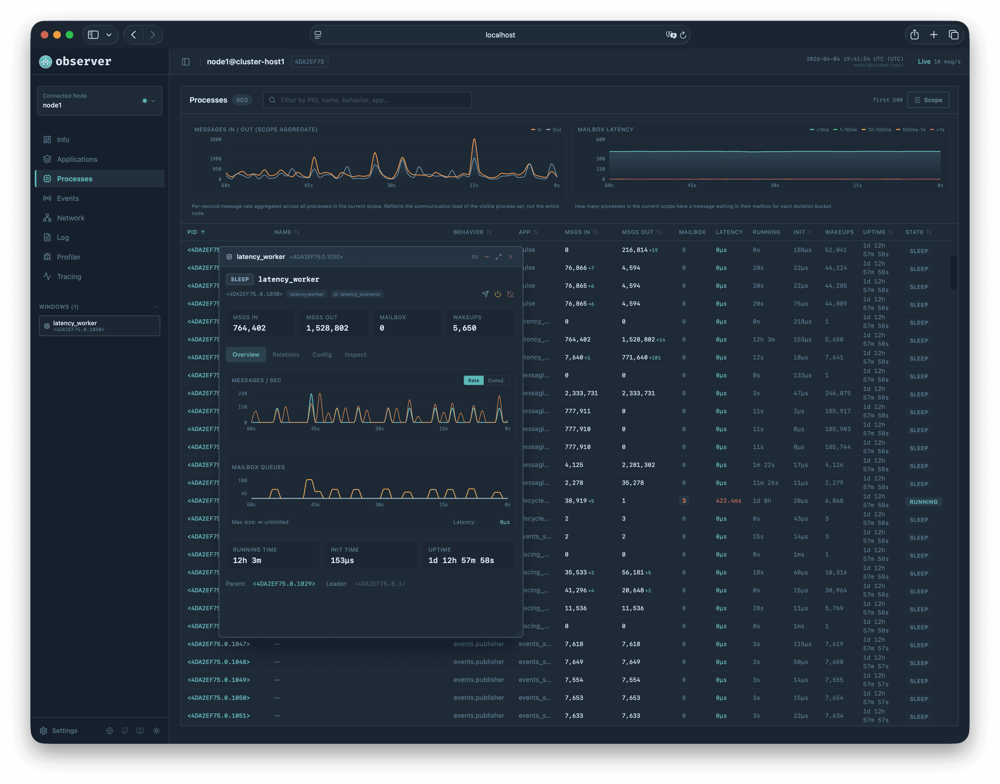
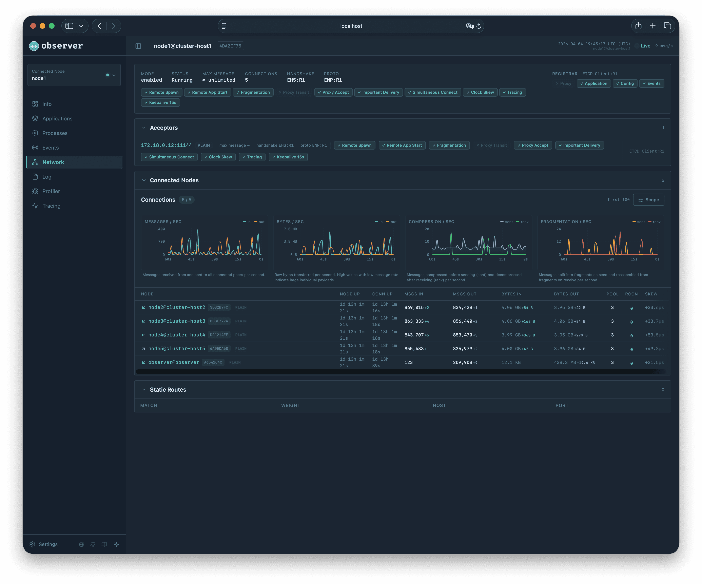
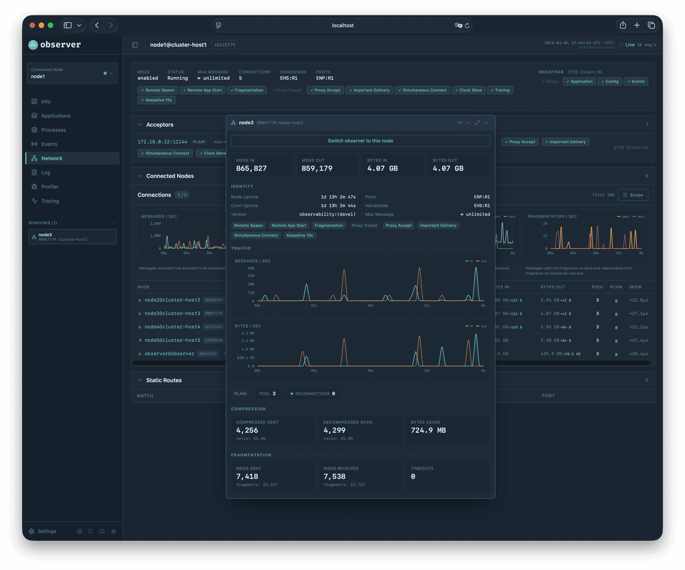
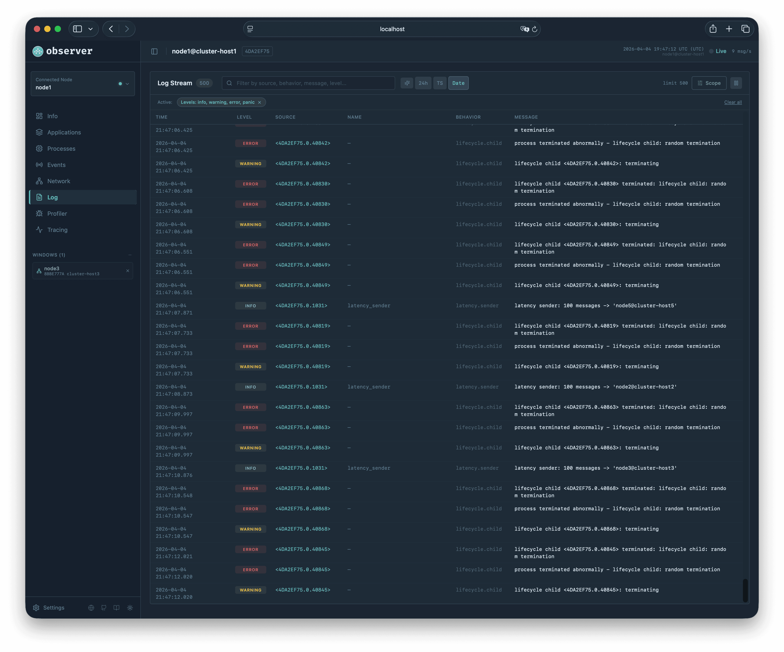
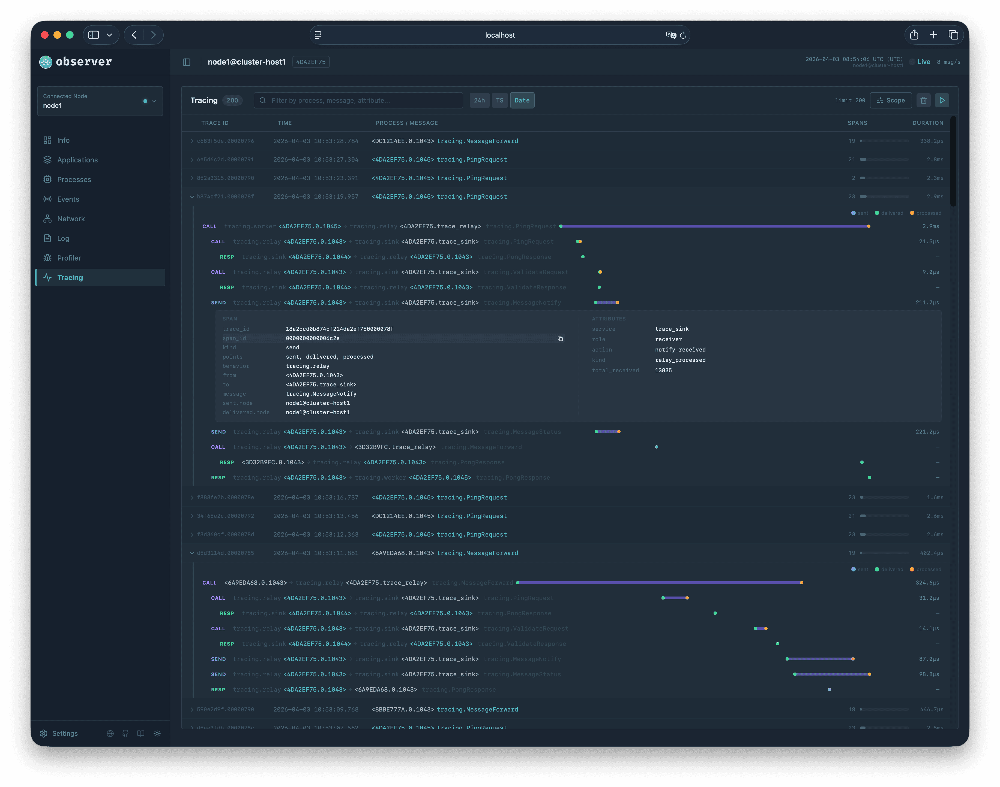

# Inspecting With Observer

This page walks through each page of the Observer web interface. For installation and configuration, see [Observer Application](../extra-library/applications/observer.md).

The sidebar contains a node selector listing all nodes discovered through the registrar. Select a different node and Observer switches to showing that node's data. You deploy Observer on one node and monitor the entire cluster from a single browser tab.

To try Observer with a live cluster:

```bash
git clone https://github.com/ergo-services/examples
cd examples/observability
make up
```

This starts a multi-node cluster with Observer, tracing, health probes, Prometheus metrics, and Grafana dashboards. Open `http://localhost:9911` for Observer, `http://localhost:8888/dashboards` for Grafana.

## Dashboard

<figure><figcaption></figcaption></figure>

The dashboard is the landing page with summary cards, real-time charts, and node-wide counters. Two controls let you manage the node directly from here: the log level dropdown changes the node-level severity threshold (see [Logging](../basics/logging.md)), and the [tracing](distributed-tracing.md) sampler dropdown controls whether the node starts new traces for messages sent via `node.Send()` and `node.Call()`. Both take effect immediately.

The applications page lets you manage the lifecycle of applications running on the node: start in a selected [mode](../basics/application.md#application-modes), stop, or unload. When something goes wrong at the application level, this is where you act. But most investigation happens one level deeper, at individual processes.

## Processes

The processes page is where you spend most of your time when investigating issues.

Every process on the node appears in a table that updates every second. The columns cover identification (PID, name, behavior, application), messaging (messages in/out, mailbox depth, latency), and lifecycle (running time, init time, wakeups, uptime, state). This is enough to answer most diagnostic questions without opening individual process details.

When message counts change between updates, a green delta indicator appears next to the number. A "+42" next to Messages In tells you this process received 42 messages in the last second. The mailbox column changes color as the queue grows, making overloaded processes visually obvious in a list of thousands. The state column shows how long the process has been in its current state. A process stuck in "running" for 30 seconds is probably blocked inside a handler.

All columns are sortable. Clicking Messages In sorts by busiest processes. Clicking Mailbox puts the most backlogged processes at the top. Clicking Running Time reveals which processes spend the most time executing handlers.

Click any PID to open a floating detail window.

### Scope

The table does not show all processes at once. What you see is controlled by the Scope panel, which determines what the server sends to the browser.

The scope works in two modes. In the default mode, you choose a window into the process ID space: "first 500" returns the 500 oldest processes (lowest PIDs), "last 500" returns the 500 newest, and entering a specific PID starts the window from that point. The node scans only the requested range and applies filters within it. This is fast even on nodes with tens of thousands of processes because the node never iterates beyond the requested window.

The "All" mode switches to a full scan: the node iterates all processes, applies filters during iteration, and returns up to 10,000 matches. This mode requires at least one filter to be active to prevent the browser from receiving an unmanageable amount of data.

Filters narrow results by name, behavior type, application, state, or minimum mailbox depth. In windowed mode, filters reduce the result count within the window. In All mode, filters are applied during the scan so only matching processes are counted toward the limit.

Active filters appear as removable chips in the toolbar, and the scope label shows a compact summary like `first 500` or `last 100 . name:"worker"`. A separate search field adds client-side regex filtering on top of the server results for quick ad-hoc lookups without changing the scope.

<details>
<summary>Processes page with scope panel</summary>

<figure><figcaption></figcaption></figure>

**Mailbox.** Total messages across all four mailbox queues (Main, System, Urgent, Log). Changes color as the queue grows: yellow for moderate, red for deep backlog.

**Latency.** Time between a message entering the mailbox and the process starting to handle it. High latency means the process has a backlog and incoming messages are waiting. Requires the `latency` build tag to be enabled (see [Debugging](debugging.md)).

**Running Time.** Total time spent inside handler callbacks (HandleMessage, HandleCall). High running time relative to uptime means the process spends most of its life executing handlers, whether due to computation or blocking I/O.

**Init Time.** Time spent in the `Init` callback during startup. Highlighted red if over one second. Keep initialization fast: spawn has a timeout, and under a supervisor a slow Init blocks the restart of sibling processes.

**Wakeups.** How many times the process was activated to handle messages. Each activation processes one batch from the mailbox. A high wakeup count with low message counts can indicate many small deliveries.

</details>

## Process Details

Floating detail windows are the primary tool for investigating individual processes. Multiple windows can be open simultaneously. They persist when you switch between pages, so you can keep a problematic process open while you check logs or traces elsewhere.

The overview tab shows two real-time charts. The messages chart tracks incoming and outgoing message rates over the last 60 seconds, with a toggle between rate and cumulative views. The mailbox chart tracks the four queue depths: Main, System, Urgent, and Log. Below the charts, cards show running time, init time, and uptime. If the init time is suspiciously long, you know the process took a while to start. If the running time is high relative to uptime, the process is spending most of its life inside handlers rather than waiting for messages. The parent and leader processes appear as clickable links that open their own windows.

The relations tab reveals the process's connections: aliases it has registered, meta processes it owns, events it has created, and its links and monitors grouped by type. This is valuable when you need to understand the supervision tree or figure out which processes will be affected if this one terminates.

The inspect tab shows the output of the process's `HandleInspect` callback as key-value pairs. If your actor implements this method, it can expose internal state: queue lengths, cache sizes, connection counts, or any application-specific metrics. Auto-refresh polls the process once per second.

### Managing a Process

The config tab lets you change settings that take effect immediately. You can raise the log level to get more verbose output from a specific process, enable compression for network messages, change the tracing sampler for targeted diagnostics, or adjust message priority and delivery guarantees. The environment variables section is available if the node has `ExposeEnvInfo` enabled in its security settings.

Three action buttons let you interact with the process. Send Message opens a dialog with a text field; the message is sent as a string value to the process. Send Exit sends an exit signal with a configurable reason. Kill forcefully terminates the process. These actions are disabled for system processes.

<details>
<summary>Process detail window</summary>

<figure><figcaption></figcaption></figure>

</details>

## Events

The events page works like the processes page: it shows only what the scope defines, not the full list.

Each row includes the event name, the producer process, registration time, subscriber count, and message statistics. Delta indicators highlight which events are actively publishing. The default sort is by registration time, newest first.

The Scope panel controls which events the server returns. The From control chooses between First (oldest registered) and Last (newest registered). The node iterates events in registration order and stops after collecting the requested number of matches. Filters narrow by name, notify mode, buffered mode, and minimum subscriber count, and are applied during iteration so only matching events count toward the limit.

Three toggle buttons in the toolbar control how the Registered column displays timestamps: 24h/12h clock format, raw millisecond timestamps for precise correlation, and an optional date prefix. These settings are shared with the Log and Tracing pages.

<details>
<summary>Events page</summary>

<figure><figcaption></figcaption></figure>

**Published.** Total number of times PublishEvent was called by the producer. Each call increments this counter once regardless of how many subscribers receive the message.

**Local Sent.** Total messages delivered to local subscribers. If one publish reaches 5 local subscribers, this increments by 5.

**Remote Sent.** Total messages sent to remote nodes. Counted per remote node, not per subscriber. If a remote node has 10 subscribers, this increments by 1 because the framework uses [shared subscriptions](pub-sub-internals.md#network-optimization-shared-subscriptions) to send one message per node.

**Fanout.** Ratio of Local Sent to Published. Shows the average number of local deliveries per publish. A fanout of 3.0 means each publish reaches about 3 local subscribers.

**Buffer.** Current messages in the event's ring buffer / buffer capacity. [Buffered events](pub-sub-internals.md#buffered-events-partial-optimization) retain recent messages so that new subscribers receive catch-up data. Yellow highlight if the buffer has pending messages.

**Notify.** Whether the producer receives [notifications](pub-sub-internals.md#producer-notifications) (`MessageEventStart`/`MessageEventStop`) when the first subscriber arrives or the last subscriber leaves.

</details>

## Network

The network page shows how the node connects to the rest of the cluster.

The top section displays network configuration: mode, max message size, handshake and protocol versions, and negotiated flags. The registrar section shows the service discovery backend with its capabilities.

The acceptors section lists network listeners with their addresses, TLS configuration, and per-acceptor flags.

Below the acceptors, the page splits into three tabs.

The **Connections** tab is the default view. Four real-time charts show aggregate traffic across all connections: messages per second (in/out), bytes per second (in/out), compression operations per second (sent/received), and fragmentation operations per second (sent/received). A connection list table with its own scope controls shows all connections with delta indicators for message and byte counts. Click a row to open a floating window with detailed connection statistics.

The **Routes** tab shows configured static routes and proxy routes side by side. Static routes are user-defined patterns that tell the node where to dial when a name matches; proxy routes describe how to reach nodes via an intermediate proxy.

The **Types** tab is a one-shot view of the wire-format type registry. Each row shows registration ID, owning proto (the protocol version that registered the type), kind, and canonical name. Click a row to expand its inferred schema (Go-syntax shape, multi-line for structs). Two filters at the top of the panel narrow the list by name and by schema content (useful for finding all types containing a specific field). The Refresh button re-fetches the registry; the panel does not subscribe to live updates because the registry rarely changes after node startup.

The cluster nodes section shows all nodes known through the registrar or active connections, giving you a picture of the cluster topology.

<details>
<summary>Network page</summary>

<figure><figcaption></figcaption></figure>

**Node.** Contains several elements: a direction arrow, the node name, a CRC32 badge, and a TLS badge. The blue arrow (up-right) means the connection was initiated by this node (outgoing). The green arrow (down-left) means the connection was accepted from the remote node (incoming). The badge shows "TLS" if the connection uses TLS or "Plain" if it does not.

**Node Uptime / Connection Uptime.** Node uptime is how long the remote node has been running. Connection uptime is how long this specific connection has been active. If the connection was recently re-established after a network issue, connection uptime will be shorter than node uptime.

**Pool.** Number of TCP connections in the ENP protocol pool for this logical connection. Higher pool size allows more parallel message delivery.

**Reconnections.** How many times the connection was re-established. Non-zero values are highlighted in red. Frequent reconnections may indicate network instability.

**Clock Skew.** Measured difference between the local and remote node clocks. Used by the tracing waterfall to compensate for clock drift when displaying cross-node traces.

</details>

### Connection Details

Clicking a connection row opens a floating window with full connection information.

At the top, four metric cards show messages and bytes in each direction. The identity section shows node and connection uptimes, framework and protocol versions, max message size, and negotiated network flags as colored pills (Remote Spawn, Fragmentation, Important Delivery, etc.). Each flag shows green if both nodes agreed to enable it.

Below the identity section, the pool size and reconnection counter are shown. For outgoing connections, the Pool DSN lists the addresses of TCP connections in the pool.

Two real-time charts track messages per second and bytes per second in each direction. If the connection carries proxy traffic, a third chart shows transit throughput.

The compression section shows how many messages were compressed and decompressed, the compression ratio, and total bytes saved. The fragmentation section shows fragment counts and reassembly timeouts. These sections help diagnose whether compression and fragmentation are working efficiently or causing overhead.

A "Switch observer to this node" button lets you start inspecting the remote node directly.

<details>
<summary>Connection detail window</summary>

<figure><figcaption></figcaption></figure>

</details>

## Log

The log page captures log messages in real time from every source on the node: processes, meta processes, the node itself, and the network stack.

Each log entry shows a timestamp, severity level (color-coded badge), source, registered name, behavior type, and message text. The source column identifies where the message came from: a process PID, meta-process alias, node CRC, or network peer, each with its own color. The rich source toggle adds a type icon and makes the source clickable, opening a floating window for the process, meta-process, or network connection that generated the message. Long messages (over 200 characters or containing newlines) are truncated to three lines and expandable with a click. If the log entry carries structured fields, they appear below the message as key=value pairs.

The Scope panel controls what the server captures. Level toggle buttons let you enable or disable each severity independently. This is server-side filtering: disabling debug means the server stops collecting debug messages entirely, reducing overhead on the node. Additional filters match against source, behavior, field names/values, and message text, with an exclude mode to filter out noise. The limit controls the ring buffer size.

The Play/Pause button stops log capture without disconnecting. When you spot something interesting, pause and read through existing entries without new messages pushing them away.

When the server drops messages because the ring buffer is full, a suppressed count indicator appears as a yellow alert in the toolbar. If you see this frequently, increase the limit in the scope panel.

<details>
<summary>Log page</summary>

<figure><figcaption></figcaption></figure>

</details>

## Profiler

The profiler page has two tabs and a GC Pressure section that is always visible at the top. The key difference between the tabs: the Heap tab updates continuously via a live subscription, while the Goroutines tab captures snapshots on demand when you press the Capture button.

The GC Pressure section shows four real-time charts: allocation rate (objects per second), dead rate (objects collected per second), live ratio (percentage of allocated objects still alive), and GC CPU fraction (percentage of CPU spent in garbage collection). These help you spot memory pressure trends before they become problems.

### Heap

The Heap tab updates continuously and shows allocation records sorted by in-use bytes. Each record shows in-use bytes, in-use objects, total allocated bytes, total allocated objects, and the function name (the first non-runtime function in the allocation stack). Expanding a record reveals the full stack trace. A scope panel filters by function name and limits how many records the server returns. A Pause button freezes the current data so you can examine it without updates overwriting what you are reading.

Use the heap view when memory grows unexpectedly. The allocation stack traces show exactly which code paths are responsible. If a single function dominates the in-use bytes, that is your starting point.

### Goroutines

The Goroutines tab captures snapshots on demand. Press the Capture button to take a goroutine dump. The dump groups goroutines by their call stack: if 500 goroutines are all blocked on the same channel receive, they appear as one group with count 500. Each group shows the count, state (running, IO wait, chan receive, select, sleep, semacquire), wait duration (color-coded: green under 60s, yellow under 5 minutes, red above), and two function names: Origin (where the goroutine was spawned) and Current (where it is now). Expanding a group reveals the full stack trace and goroutine IDs. A scope panel filters the server-side capture by stack content, state, and minimum wait time. A search field filters the captured results client-side.

This is how you diagnose deadlocks and blocking. Filter by state to isolate goroutines stuck in "chan receive". Search by package name to find goroutines from specific actors. A large group with a long wait time in a state that should be transient usually points directly at the problem.

<details>
<summary>Profiler</summary>

<figure><figcaption></figcaption></figure>

</details>

## Tracing

The tracing page shows distributed traces. Traces are collected continuously while Observer is connected, so data is already available when you navigate here. For background on how tracing works, see [Distributed Tracing](distributed-tracing.md).

Because Observer connects to one node at a time, it shows only the observations emitted on that node. For complete cross-cluster traces, use [Pulse](../extra-library/applications/pulse.md) with Grafana Tempo or Jaeger.

### Trace List

Traces are sorted newest first. Each row shows a copyable trace ID, timestamp, root process PID with the root message type, an error icon if any span recorded an error, the span count, a duration bar showing this trace's duration as a proportion of the longest trace in the current scope buffer (red if any span recorded an error), and the total duration.

The search field filters across trace ID, root process, root message, root node, and within spans across span ID, from, to, message text, and attribute keys and values. The Pause button stops the page from accepting new traces until resumed. The Clear button removes all collected traces.

### Waterfall

Click a trace row to expand its waterfall. The waterfall groups all observation points (Sent, Delivered, Processed) for the same message into a single row and arranges rows in a tree by parent-child relationships, with indentation showing the causal chain.

Each row shows a color-coded kind badge (SEND in blue, CALL in violet, RESP in green, SPAWN in amber, TERM in red), the sender and receiver PIDs with their behavior types, the message type, and a timeline bar. The bar renders two phases: a lighter segment for transit time (Sent to Delivered) and a full segment for processing time (Delivered to Processed). Three dot markers show the observation points: blue for Sent, green for Delivered, orange for Processed.

Hovering over the bar shows a tooltip with the node name at each point and the transit and processing durations. The duration column shows both the total and the breakdown. For cross-node spans (where Sent and Delivered happen on different nodes), the transit time calculation subtracts the measured clock skew between the nodes to show a more accurate transit duration.

Local process PIDs in the waterfall are clickable and open detail windows.

Click a span row to expand its detail panel. The panel has two columns: the left shows span fields (trace ID, span ID, kind, which points are present, behavior, from, to, call reference, message, node names, error) and the right shows custom attributes merged from all observation points. All values are copyable.

Expanded traces persist when switching to other pages and back.

### Scope

The Scope panel has toggle buttons for span kinds (SEND, CALL, RESP, SPAWN, TERM) and observation points (Sent, Delivered, Processed). Disabled items appear with strikethrough. A message pattern filter matches against message type and error text, with an exclude toggle that inverts the match. The buffer limit controls how many traces are kept. Active scope filters appear as removable pills below the toolbar with a "Clear all" link.

<details>
<summary>Tracing page with waterfall</summary>

<figure><figcaption></figcaption></figure>

</details>
