# Inspecting With Observer

A running Ergo node is not one program you can step through with a debugger. It is thousands of processes, each on its own goroutine, each handling its own messages, being restarted by supervisors as failures happen. You cannot pause one and read its variables the way you would a function, and adding print statements changes the very timing you are trying to understand.

Observer takes a different approach. It watches the live node the way the system itself does: what each process is doing right now, how messages travel between them, and where CPU and memory go. It embeds into the node, streams updates to your browser as they happen, and needs no changes to the processes it observes. And it is not read-only: from the same screen you can change a setting, send a message, or stop a process on the running system.

You deploy Observer on a single node and inspect the whole cluster from it. Every Ergo node runs the built-in `system` application, which is what Observer talks to, so switching to another node needs nothing extra deployed there. For installation and options, see [Observer Application](../extra-library/applications/observer.md).

To try it against a live cluster:

```bash
git clone https://github.com/ergo-services/examples
cd examples/observability
make up
```

This starts a multi-node cluster with Observer, tracing, health probes, Prometheus metrics, and Grafana dashboards. Open `http://localhost:9911` for Observer and `http://localhost:8888/dashboards` for Grafana.

## How to read this page

The tour goes from the outside in. First how to move around the interface at all, then the node at a glance, its applications, and finding the one process that matters among thousands. Then everything about that process and how to act on it. After that come the specialized views, each answering a specific question: how messages flow, how the node is connected, what the logs say, where memory and time go, and how a single request travels across the system. Then how to point any of these views at any node in the cluster, and last, the same data read by an AI agent rather than by you.

Screenshots are collapsed. Open the one you need; the page stays light if you do not.

<figure>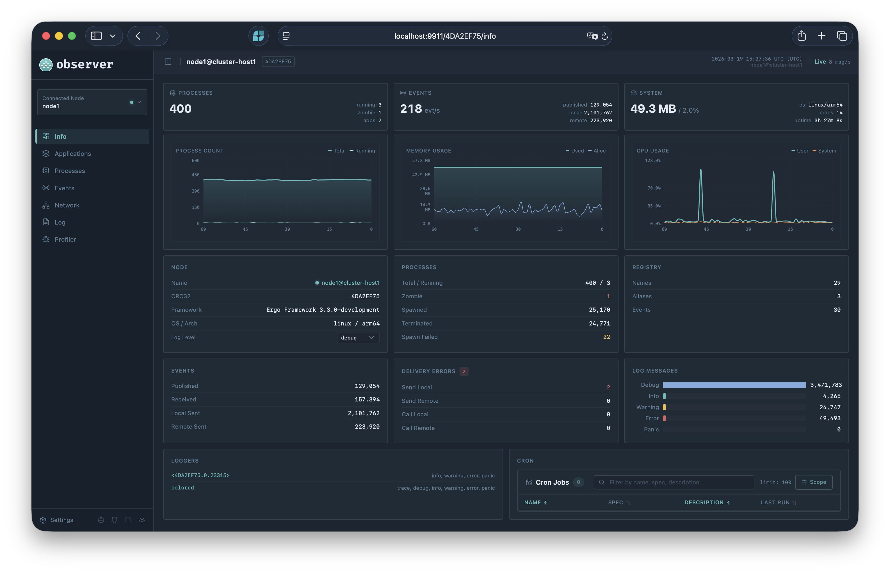<figcaption>The Info page: glance cards and live charts on top, node identity and controls below.</figcaption></figure>

## Getting around

Everything lives behind a sidebar with eight pages, and the page you are on is only half the interface. The other half is floating windows: click a PID, an event, a connection, or an application anywhere in the UI and it opens in its own window on top of the page. Windows drag, resize, minimize, and maximize on a double-click of the title bar. Several can be open at once and they survive page switches, so you can keep a suspect process in view while you read the log or a trace somewhere else.

The sidebar lists every open window below the navigation, so you always know what you have open even when a window is minimized or buried. A window whose subject is gone (the process terminated, the connection dropped) stays open with its name struck through and marked "gone", so a disappearance is something you notice rather than something that silently vanishes. One button minimizes them all.

Each window has a **copy link** action. The link encodes the node and the window, so pasting it into a chat gives a colleague the same process detail window on the same node, not just the page it was on. Opening such a link switches Observer to the right node first, then reopens the window. Links exist for processes, meta processes, connections, applications (optionally at a subtree root), and event streams.

The top bar carries the node selector on the left and the connection indicator on the right. The indicator is not decoration: it reports whether the stream is actually live, and clicking it opens the traffic counters and the list of active subscriptions, which is how you tell "nothing is happening" apart from "the stream is dead". A theme toggle and an About dialog sit at the bottom of the sidebar, which also collapses to icons when you need the width.

## The node at a glance: Info

The Info page answers the first question you ask: is this node healthy, and what is it running? Three glance cards and three live charts across the top track the numbers that move: process count split into total, running and zombie; event throughput published against received; memory used against the GOMEMLIMIT ceiling; and per-second CPU split into user and system time. A climbing memory line or a growing process count shows up here first.

Below the glance, **Node** identifies it (name, CRC32, framework version, operating system and architecture), **Node Runtime** carries the figures the Go runtime reports (goroutines, live heap, the next GC threshold, GC cycles and the CPU fraction spent collecting), and **Node Config** holds two controls that take effect immediately: the [log level](../basics/logging.md), and the [tracing](distributed-tracing.md) sampler that decides whether the node starts new traces for messages sent through `node.Send()` and `node.Call()`. Turn the sampler up to investigate, and back off when you are done.

The rest of the page summarizes the node without leaving it. **Registry** counts registered names, aliases and events. **Delivery Errors** splits failures four ways, send and call, local and remote, which separates "the target is gone" from "the network is broken". **Events** shows published, received, local sent and remote sent. **Loggers** shows the log volume per level beside the loggers currently registered, and **Tracing** counts spans by kind (send, call, request, response, spawn, terminate) beside the registered exporters. Both say plainly when nothing is registered.

<details>

<summary>Build Info</summary>

<figure>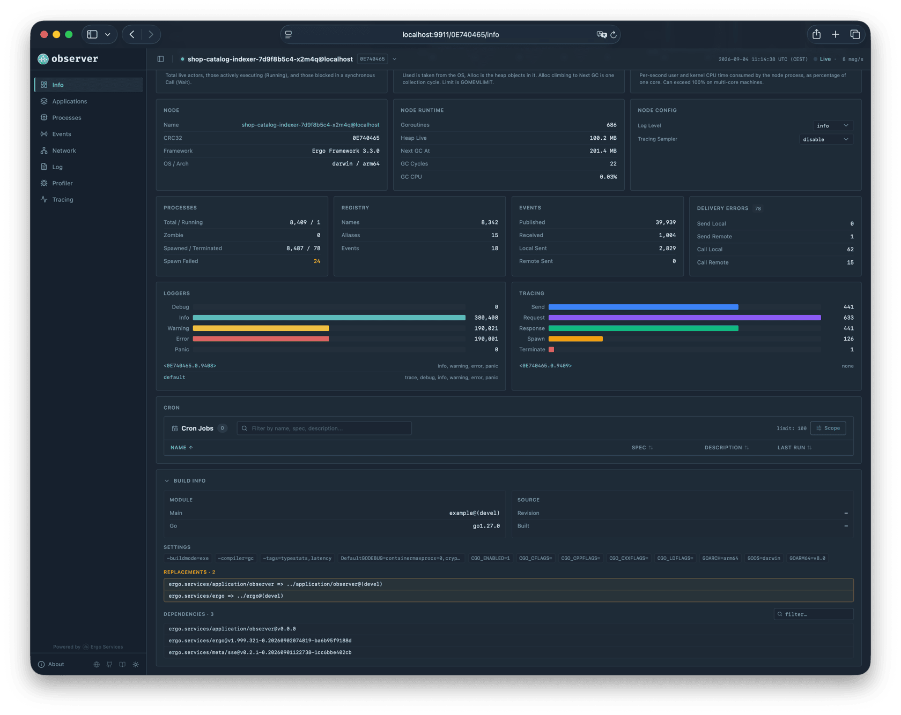<figcaption>Build Info: the module, the source revision, build settings and the dependency list.</figcaption></figure>

A collapsible panel shows exactly which binary is running: the main module and Go version, the source revision (marked "modified" if the working tree was dirty at build time), the build settings, the full dependency list, and any local `replace` directives. That panel is often the quickest way to confirm you deployed what you think you did.

</details>

<details>

<summary>Cron jobs</summary>

<figure>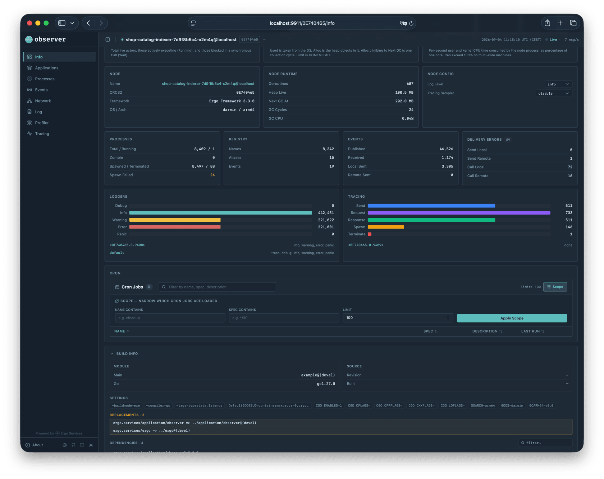<figcaption>The Cron section with its scope panel open: which jobs are loaded is narrowed before they are fetched.</figcaption></figure>

The node's [cron](../basics/cron.md) jobs appear with their schedule, description and next run. The section has a scope of its own, filtering by name and by schedule spec with a row limit, because a node that schedules a job per tenant has more jobs than a panel can list.

</details>

## Managing applications: Applications

An Ergo node runs its work as [applications](../basics/application.md), each a supervised group of processes. A strip across the top counts them by state (total, running, transitioning, loaded) and every application is a card, and the card is a summary of the contract it declared: its state (loaded, running, stopping) and [mode](../basics/application.md#application-modes), its description, version, parent and uptime, whether it depends on the network, and the applications it depends on. Two fields feed service discovery: its weight, the priority the [registrar](../networking/service-discovering.md) applies when several nodes offer the same application, and its tags, the labels a caller selects on (see [Tags for Instance Selection](../basics/application.md#tags-for-instance-selection)).

Two numbers on the card are easy to confuse and worth separating. **Members** is how many processes the application declared in its group. **Processes** is how many exist in its tree right now, the members plus everything they spawned, and the bar draws that as a share of the whole node. An application declaring four members and owning twelve hundred processes is not a contradiction; it is a supervisor tree that grew, and the bar tells you how much of the node it accounts for.

The card also shows the **role map** when the application defines one, which decouples logical roles from process names (see [Process Role Mapping](../basics/application.md#process-role-mapping)), and the application **environment** when it carries any.

The lifecycle controls sit on the card: start in a chosen mode, stop, force-stop when a graceful stop will not complete, or unload. These are the coarse controls; when something is wrong at the application level, this is where you intervene. System applications are protected from all four.

<details>

<summary>Applications page</summary>

<figure>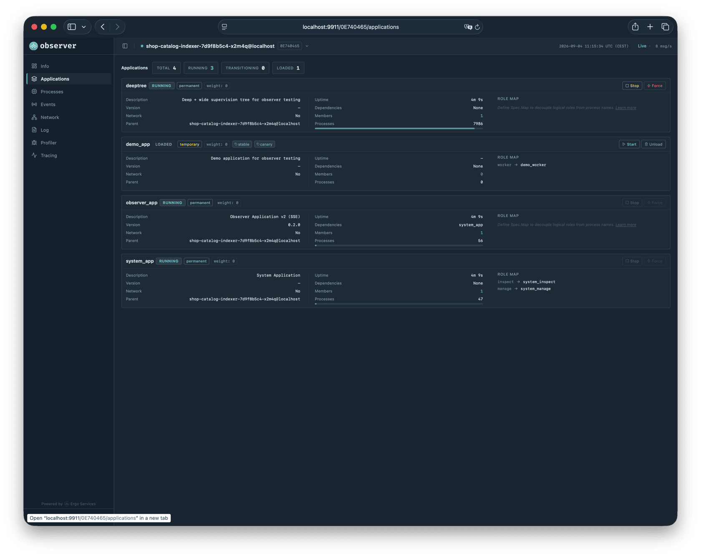<figcaption>Application cards with state and mode badges, the members-to-processes bar, role map and lifecycle controls.</figcaption></figure>

</details>

### The supervision tree

A running application opens its process tree in a floating window, and the tree is more than a diagram.

Colour carries a signal you choose. **Kind** paints each node by what the process is, which the framework reports for its own behaviors and your actors can opt into (see the Kind column below). The other five modes are heatmaps: **mailbox** depth, mailbox **latency**, **utilization** (the share of a process's lifetime spent inside callbacks), **throughput**, and **state**. An entire application lights up by the signal you picked, so a hot or backlogged branch becomes obvious at a glance. Each mode has a "how to read" explanation next to the selector, so the colour scale is never a guess.

The tree is navigable rather than static. Search by name or PID and step through matches with Enter and Shift+Enter, zoom in and out or fit the whole tree to the window, collapse branches beyond a depth you set, and adjust node width and label truncation when names are long. Any node can be opened as a subtree, either in place or in a new window, and a control takes you back to the application root. The node cap bounds how much is fetched at once, and the tree refreshes either on demand or on an interval you choose. Display options are remembered across sessions; per-window ones reset when the window closes.

<details>

<summary>Supervision tree with a heatmap</summary>

<figure>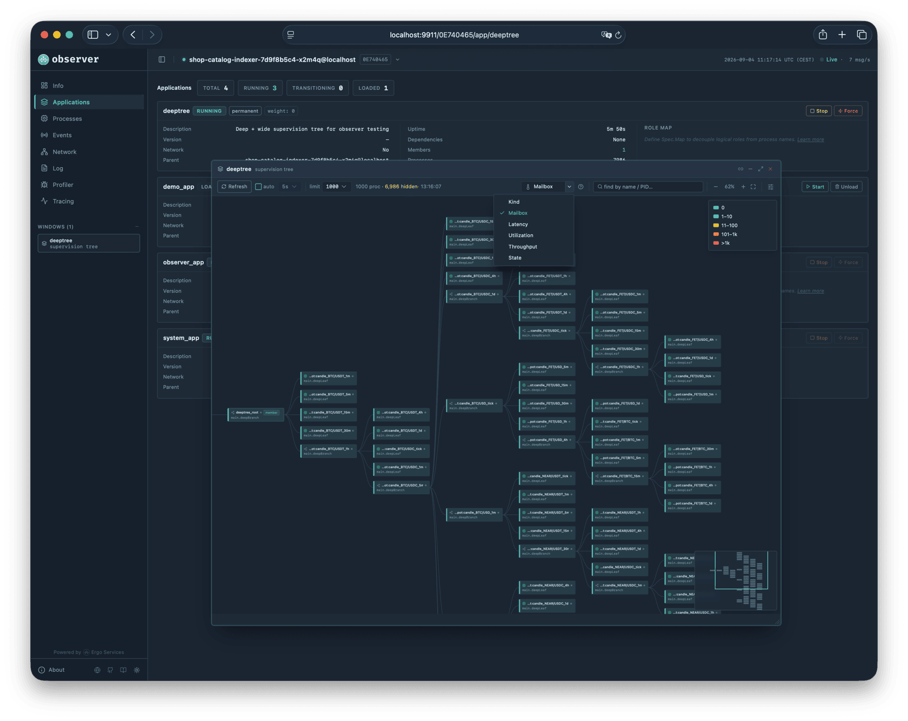<figcaption>An application's supervision tree in a floating window, coloured as a mailbox heatmap, with the colour-mode selector open.</figcaption></figure>

</details>

## Finding the process that matters: Processes

The processes page is where you spend most of your time. Every process on the node appears in a table that refreshes every second, and the columns are less a list of facts than a set of signals you learn to read.

- **Mailbox depth** turning yellow then red is a backlog forming: messages are arriving faster than the process handles them.
- A **state** stuck in "running" for tens of seconds is a process blocked inside a handler, usually on something it should not be doing there.
- High **running time** relative to uptime marks a hot process that spends its life executing handlers rather than waiting.
- A green **delta** like "+42" next to Messages In shows who is active right now, in the last second.

Because the columns are signals, sorting turns the table into a diagnostic tool. Sort by Messages In to find the busiest processes, by Mailbox to bring the most backlogged to the top, by Running Time to see where handler time goes. Fourteen columns cover identification (PID, name, kind, behavior, application), messaging (messages in and out, mailbox depth, latency), and lifecycle (running time, init time, wakeups, uptime, state), which is enough to answer most questions without opening a single process.

**Kind** deserves a note. It classifies a process by what it is for rather than what type implements it: actor, supervisor, pool and router describe structure; fsm, saga, worker, scheduler, queue, producer, consumer and coordinator describe behavior; web, gateway, proxy, stream, broker and client sit on a boundary; store, cache and session hold data; metrics, leader, follower, health, monitor and logger are operational. The base behaviors report their own kind; your actors opt in either statically, by implementing `ProcessKind()`, or at runtime with `SetProcessKind`. Any string is valid, and anything outside the list renders as `custom`. Colour encodes the category and the icon the specific kind, the same way in the table and in the supervision tree; a reference gallery is one click away from either.

Three cards across the top summarize the node rather than the scope: process counters (total, spawned, terminated, spawn failures), a **States** bar showing how they split across running, sleep, wait and zombie, and delivery errors split local and remote. Clicking a segment of the States bar filters the table to it. Below them, three charts follow the current scope: messages in and out, the distribution of utilization, and mailbox latency. Click any PID to open a floating detail window.

### Choosing what the table shows: Scope

A node can run tens of thousands of processes, so the table never shows all of them at once. The Scope panel decides what the node sends to the browser, and it works in two modes.

In the default mode you pick a window into the process list: "first 500" returns the 500 oldest processes, "last 500" the 500 newest, and entering a PID starts the window there. The node scans only that window, which stays fast no matter how many processes exist because it never looks beyond the range you asked for.

The "All" mode switches to a full scan: the node walks every process, applies your filters as it goes, and returns up to 10,000 matches. Because a full unfiltered scan could flood the browser, this mode requires at least one filter.

Filters narrow by name, behavior type, application, state, or minimum mailbox depth, and appear as removable chips in the toolbar. A separate search field adds quick matching over PID, name, behavior and application on top of the returned rows, for ad-hoc lookups without changing the scope.

<details>

<summary>Processes page with scope panel</summary>

<figure><figcaption>The process table with its scope panel, scope charts and state distribution.</figcaption></figure>

**Mailbox.** Total messages across all four mailbox queues (Main, System, Urgent, Log). Changes color as the queue grows: yellow for moderate, red for deep backlog.

**Latency.** Time between a message entering the mailbox and the process starting to handle it. High latency means the process has a backlog and incoming messages are waiting. Requires the `latency` build tag to be enabled (see [Debugging](debugging.md)).

**Running Time.** Total time spent inside handler callbacks (HandleMessage, HandleCall). High running time relative to uptime means the process spends most of its life executing handlers, whether due to computation or blocking I/O.

**Init Time.** Time spent in the `Init` callback during startup. Highlighted red if over one second. Keep initialization fast: spawn has a timeout, and under a supervisor a slow Init blocks the restart of sibling processes.

**Wakeups.** How many times the process was activated to handle messages. Each activation processes one batch from the mailbox. A high wakeup count with low message counts can indicate many small deliveries.

</details>

<details>

<summary>Process kinds</summary>

<figure>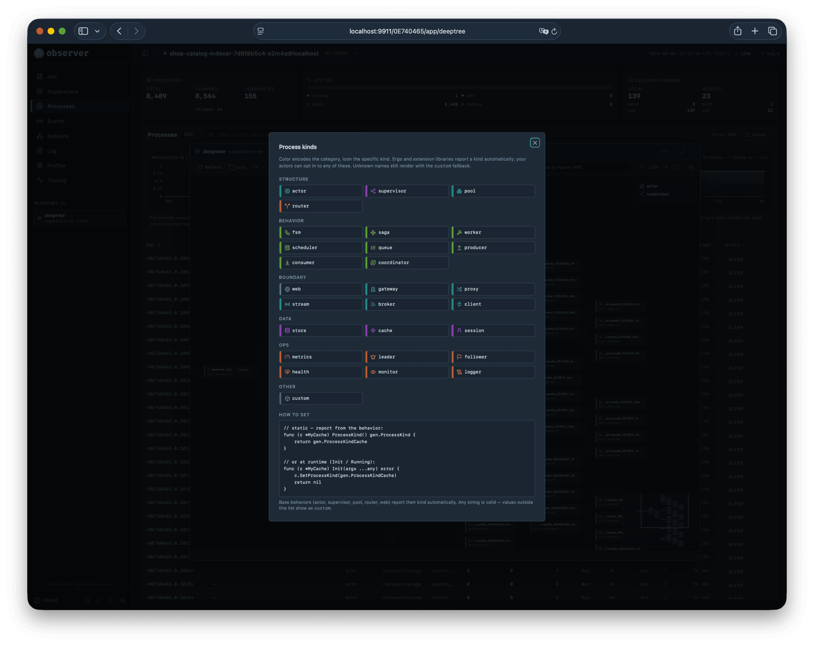<figcaption>The kind gallery: every kind the classifier knows, grouped by category with its colour and icon.</figcaption></figure>

</details>

## Everything about one process: Process Details

Once the table points you at a suspect, the floating detail window tells you everything about it. A header line carries its state, PID, kind, behavior and application, four cards count messages in and out, mailbox depth and wakeups, and four tabs hold the detail.

The **overview** tab shows two live charts: incoming and outgoing message rates over the last minute, and the depths of the four mailbox queues (Main, System, Urgent, Log). Cards below show running time, init time, state time and uptime, the same signals as in the table but plotted over time. The parent and leader processes appear as links that open their own windows.

The **relations** tab reveals how the process is wired into the rest of the system: the aliases it registered, the meta processes it owns, the events it created, and its links and monitors grouped by type (see [Links and Monitors](../basics/links-and-monitors.md)). This answers a question that matters before you touch anything: who else is affected if this process terminates. Events registered on other nodes can be opened from here as remote event streams. From this tab you can also open the process's supervision subtree as a floating tree, with the same colour modes as the application tree, to see where it sits and which branch below it is busy.

The **inspect** tab shows whatever the process chooses to publish about itself through its `HandleInspect` callback, as live key-value pairs, refreshed on demand or on an interval you pick, with a filter over the keys. If your actor implements that method, it can surface any internal state you care about: queue lengths, cache sizes, open connection counts, the current step of a job. This is your own window into a process that the framework cannot see on its own. A process that implements nothing says so rather than showing an empty box.

<details>

<summary>Process detail window</summary>

<figure>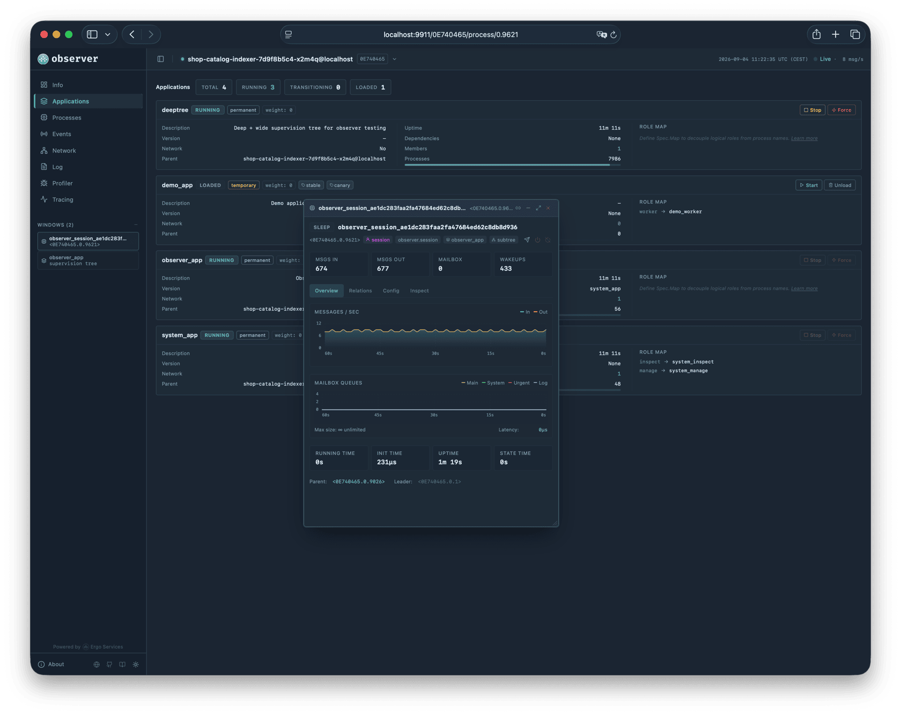<figcaption>A process detail window on the overview tab, with message rate and mailbox queue charts.</figcaption></figure>

</details>

<details>

<summary>Relations and inspect tabs</summary>

<figure>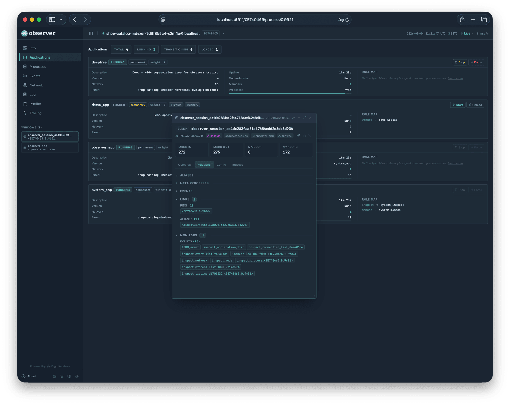<figcaption>The relations tab: aliases, meta processes, events, links and monitors.</figcaption></figure>

<figure>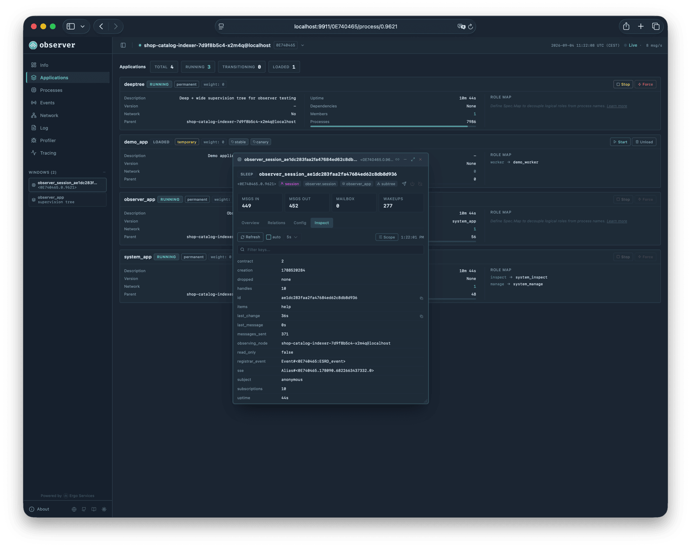<figcaption>The inspect tab: custom HandleInspect state as live key-value pairs.</figcaption></figure>

</details>

### Acting on a live process

The detail window is also where Observer stops being read-only.

The **config** tab changes settings that take effect on the running process immediately: raise its log level to get more detail from just that process, adjust message priority, compression (with its algorithm, level and threshold), important delivery and network ordering for its outgoing messages, or turn on the tracing sampler for a targeted look. The fallback setting shows where messages go when the mailbox overflows. The environment section appears when the node has `ExposeEnvInfo` enabled in its security settings.

Three icons in the window header intervene directly, from whichever tab you are on. **Send Message** delivers a message to the process. **Send Exit** sends an exit signal with a reason you choose, normal, shutdown or your own. **Kill** terminates it immediately. These act on the real system, so each asks for confirmation and names the target; they are disabled for system processes.

<details>

<summary>Config tab and the three actions</summary>

<figure>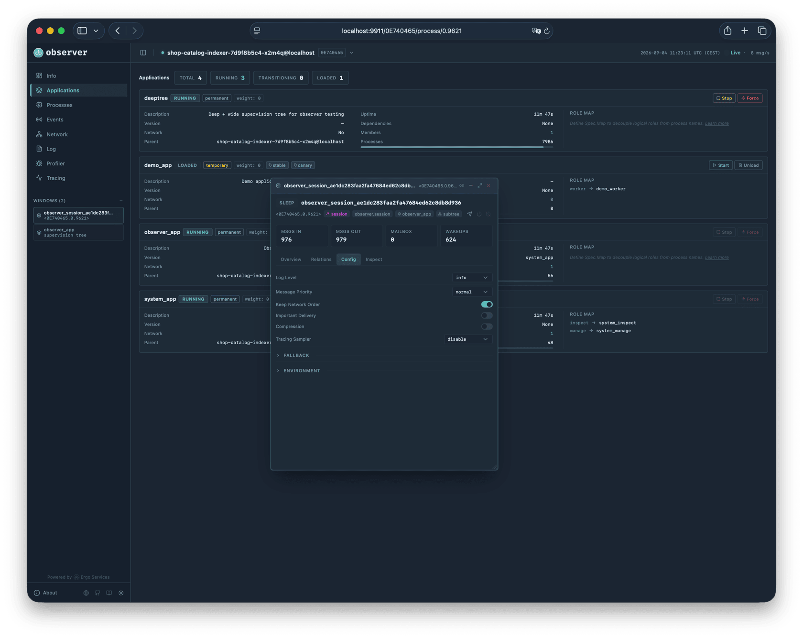<figcaption>The config tab: log level, message priority, network ordering, important delivery, compression and the tracing sampler, applied on the running process.</figcaption></figure>

</details>

## Processes the framework does not schedule: Meta

A [meta process](../basics/meta-process.md) is not an actor with a mailbox loop; it is a goroutine the framework supervises on an actor's behalf, which is how a TCP connection, a web handler or a port stays attached to a process without blocking it. They appear on the relations tab of their owner and open into their own window.

That window is the actor window in miniature and for the same reasons: its two mailbox queues against their size limit, message counters in and out, uptime, the log level and message priority as live controls, and the meta process's own `HandleInspect` state. You can send it a message or an exit signal from there, which is how you close one connection out of thousands without touching the process that owns them.

<details>

<summary>Meta process window</summary>

<figure>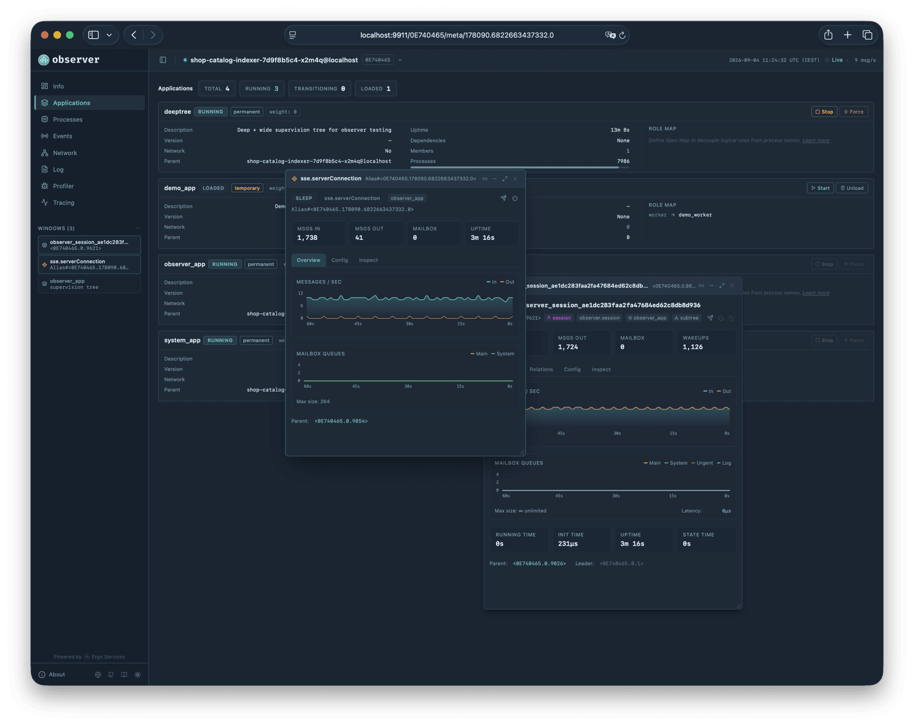<figcaption>A meta process window: queues, counters, live settings and its inspect state.</figcaption></figure>

</details>

## Watching messages flow: Events

Processes rarely work alone; they publish and subscribe to [events](../basics/events.md). The events page makes that traffic visible.

Five cards across the top count the events registered and the messages published, received, delivered locally and sent to remote nodes. Below them, like the processes page, the table shows only what the scope defines. Each row names the event, its producer process, when it was registered, how many subscribers it has, and publication statistics, with delta indicators marking events that are actively publishing. The From control chooses First (oldest registered) or Last (newest), and filters narrow by name, notify mode, buffered mode, open mode, and minimum subscriber count. Three charts above the table summarize the scope: event throughput, event utilization, and how recently each event last published.

Beyond the table, you can open a **live stream** of a single event and watch the actual messages as the producer publishes them, in real time. Filters match the message type and its content, with an exclude mode to hide noise, so you can answer questions the counters cannot: what exactly is this producer emitting, and does it match what subscribers expect. The window states which of the two it is doing: observing a producer that publishes regardless, or acting as the first subscriber of an event whose producer is notified.

<details>

<summary>Events page</summary>

<figure>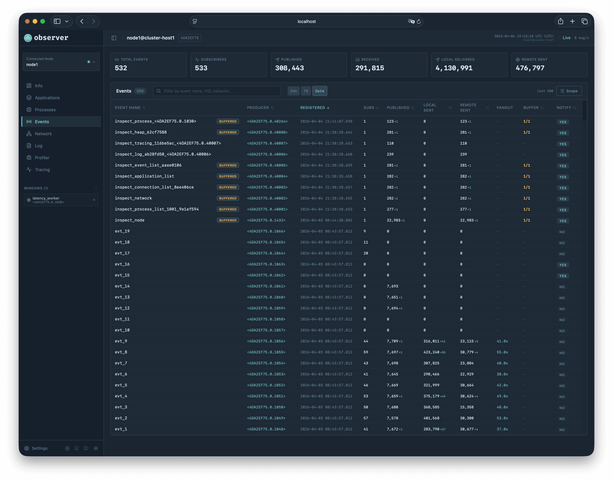<figcaption>The events table with its scope, throughput charts and publication statistics.</figcaption></figure>

**Published.** Total number of times PublishEvent was called by the producer. Each call increments this counter once regardless of how many subscribers receive the message.

**Local Sent.** Total messages delivered to local subscribers. If one publish reaches 5 local subscribers, this increments by 5.

**Remote Sent.** Total messages sent to remote nodes. Counted per remote node, not per subscriber. If a remote node has 10 subscribers, this increments by 1 because the framework uses [shared subscriptions](pub-sub-internals.md#network-optimization-shared-subscriptions) to send one message per node.

**Fanout.** Ratio of Local Sent to Published. Shows the average number of local deliveries per publish. A fanout of 3.0 means each publish reaches about 3 local subscribers.

**Buffer.** Current messages in the event's ring buffer / buffer capacity. [Buffered events](pub-sub-internals.md#buffered-events-partial-optimization) retain recent messages so that new subscribers receive catch-up data. Yellow highlight if the buffer has pending messages.

**Notify.** Whether the producer receives [notifications](pub-sub-internals.md#producer-notifications) (`MessageEventStart`/`MessageEventStop`) when the first subscriber arrives or the last subscriber leaves.

</details>

<details>

<summary>Live event stream</summary>

<figure>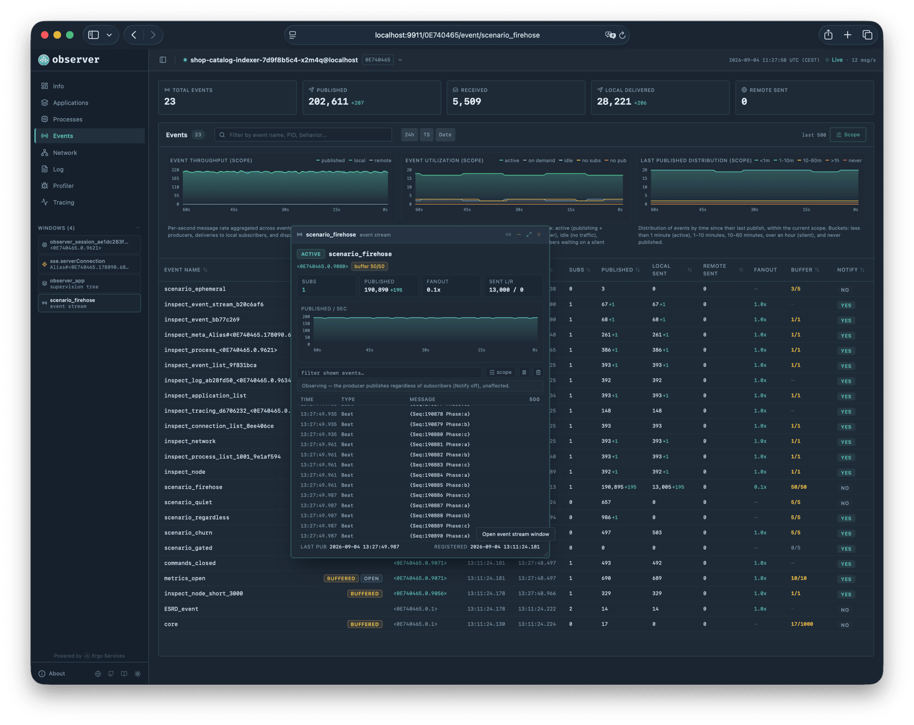<figcaption>Messages published to a named event in real time, with type and content filters.</figcaption></figure>

</details>

## How the node is connected: Network

The network page shows how the node reaches the rest of the cluster and how much traffic flows.

The top of the page is configuration rather than telemetry. **Parameters** holds the network mode, max message size, handshake and protocol versions, and the negotiated flags. **Registrar** shows the service discovery backend, its endpoints, and which of its optional capabilities are available (proxy, application routes, config, events), so a node that cannot find its peers tells you here whether it even has a registrar to ask. **Acceptors** lists the node's listeners with their addresses, TLS configuration and per-acceptor flags. Below that, the page splits into five tabs.

The **Connections** tab is the default. Four live charts plot aggregate traffic across all connections: messages per second, bytes per second, compression operations, and fragmentation operations, each in and out. A connection table with its own scope shows every connection with delta indicators: direction, TLS or plain, node and connection uptimes, messages and bytes each way, pool size, reconnections and measured clock skew. Click a row for a detailed window. A cluster nodes section lists everything known through the registrar or an active connection, which is the quick picture of the topology.

The **Routes** tab shows configured static routes and proxy routes side by side: static routes tell the node where to dial when a name matches, proxy routes describe how to reach nodes through an intermediary. A node with neither says so, which is the expected state when discovery is doing the work.

The **Types** tab is a snapshot of the wire-format type registry, the set of message types the node knows how to serialize. Each row shows its registration ID, owning protocol version, kind, the wire size of a zero value, and canonical name; expand a row for the inferred Go shape of the type. Two filters narrow by name and by schema content. Refresh re-fetches the registry, which rarely changes after startup, so this tab does not stream. **Errors** and **Atoms** are the same idea for the other two registries: the error sentinels and the atoms this node knows how to put on the wire. With the node built using `-tags=typestats`, extra columns show per-type encode and decode counts and wire-byte totals; The average bytes per operation is what to sort on when picking compression candidates: a high average is worth compressing, a low one is not worth the framing overhead. See [The typestats Tag](debugging.md#the-typestats-tag).

<details>

<summary>Network page</summary>

<figure>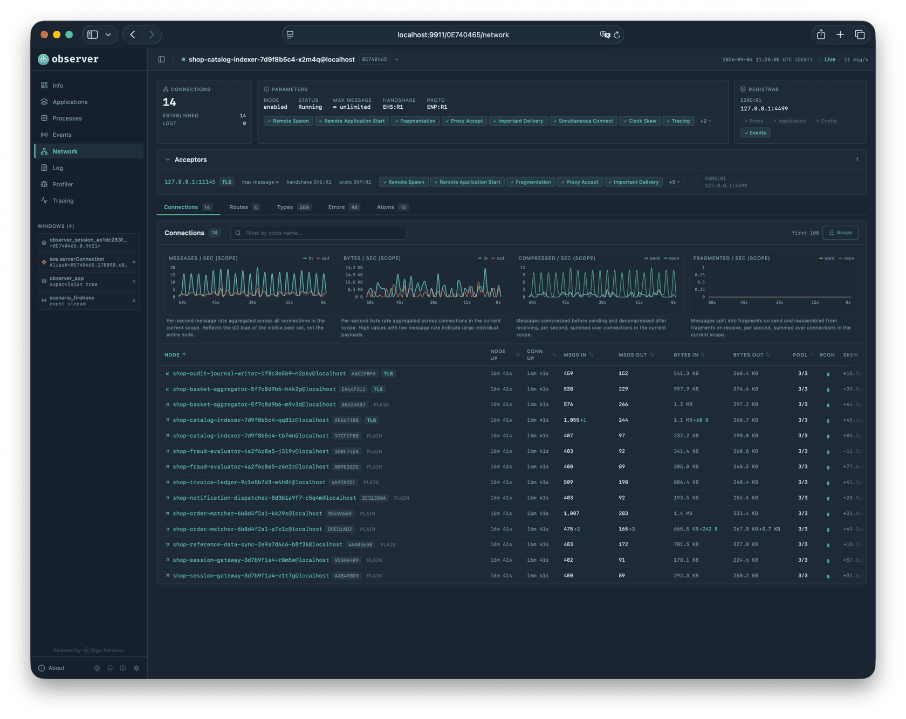<figcaption>The network page: parameters, registrar, acceptors and the connections tab.</figcaption></figure>

**Node.** Contains several elements: a direction arrow, the node name, a CRC32 badge, and a TLS badge. The blue arrow (up-right) means the connection was initiated by this node (outgoing). The green arrow (down-left) means the connection was accepted from the remote node (incoming). The badge shows "TLS" if the connection uses TLS or "Plain" if it does not.

**Node Uptime / Connection Uptime.** Node uptime is how long the remote node has been running. Connection uptime is how long this specific connection has been active. If the connection was recently re-established after a network issue, connection uptime will be shorter than node uptime.

**Pool.** Number of TCP connections in the ENP protocol pool for this logical connection. Higher pool size allows more parallel message delivery.

**Reconnections.** How many times the connection was re-established. Non-zero values are highlighted in red. Frequent reconnections may indicate network instability.

**Clock Skew.** Measured difference between the local and remote node clocks. Used by the tracing waterfall to compensate for clock drift when displaying cross-node traces.

</details>

<details>

<summary>The wire-type registry</summary>

<figure>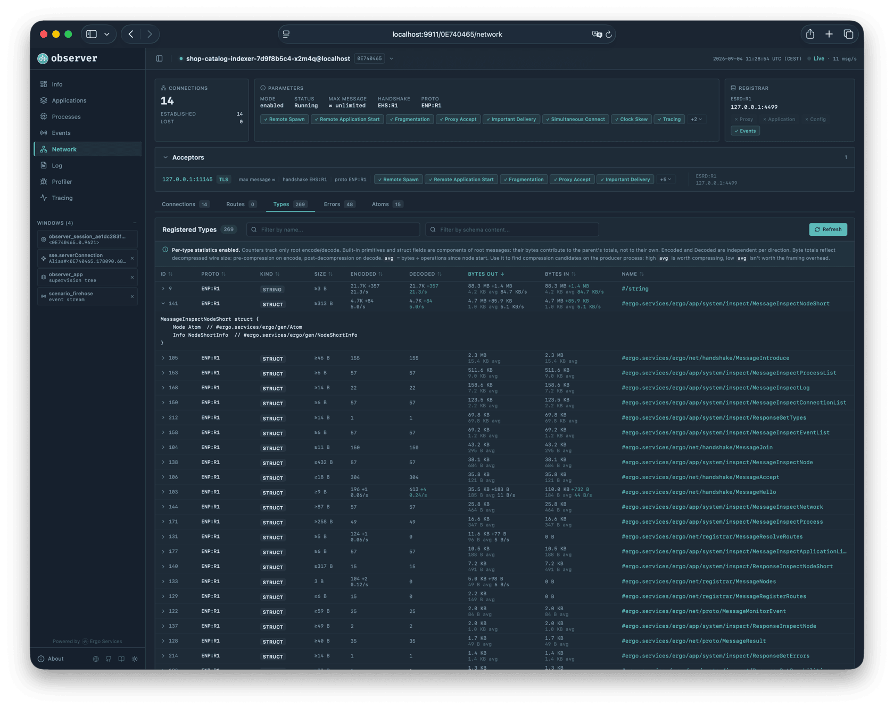<figcaption>The Types tab with one row expanded to reveal the inferred schema of a registered type.</figcaption></figure>

</details>

### Connection details

Clicking a connection row opens a window with the full picture of one connection. Metric cards show messages and bytes in each direction. The **identity** section shows node and connection uptimes, framework and protocol versions, max message size, and the negotiated network flags as colored pills (Remote Spawn, Fragmentation, Important Delivery, and so on), each green when both nodes agreed to enable it. Below, the pool size and reconnection counter appear, and for outgoing connections the Pool DSN lists the addresses of the pooled TCP connections.

Two live charts track messages and bytes per second each way, and a **proxy transit** section adds a third when the connection carries traffic on behalf of other nodes. The **compression** and **fragmentation** sections show how many messages were compressed or fragmented, the ratios, the bytes saved and the reassembly timeouts, which tells you whether those features are helping or adding overhead. A "Switch observer to this node" button re-points Observer at the remote node.

<details>

<summary>Connection detail window</summary>

<figure><figcaption>One connection in full: identity, negotiated flags, traffic charts, compression and fragmentation.</figcaption></figure>

</details>

## What the node is saying: Log

The log page captures log messages in real time from every source on the node: processes, meta processes, the node itself, and the network stack.

Each entry shows a timestamp, a color-coded severity, the source, its registered name and behavior, and the message. The source column tells you where the message came from (a process PID, a meta-process alias, the node, or a network peer), and with the rich source toggle it becomes clickable, opening the detail window for whatever generated it. Long messages collapse and expand on click, structured fields appear as key=value pairs beneath the text, and any message can be copied on its own.

The Scope panel controls what the node captures, and the filtering happens on the server: disabling the debug level means the node stops collecting debug messages entirely, so filtering reduces load rather than just hiding rows. You can also match on source, behavior, field names and values, and message text, with an exclude mode to remove noise, and set the ring-buffer size with the limit.

The Play/Pause button stops the stream without disconnecting, so you can freeze the view and read what is there while the node keeps running. If the buffer fills and the node has to drop messages, a log storm warning appears with the suppressed count; raise the limit or narrow the scope if you see it often.

<details>

<summary>Log page</summary>

<figure>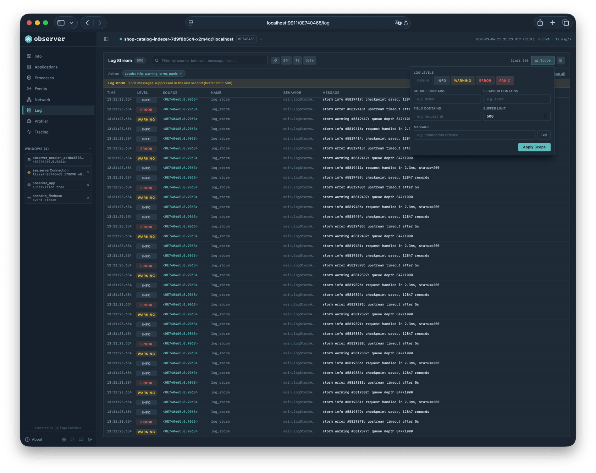<figcaption>The live log stream with its server-side scope and level filters.</figcaption></figure>

</details>

## Where memory and time go: Profiler

The profiler answers the two questions the process table cannot: why is memory growing, and why is something stuck. A **GC Pressure** section stays live at the top with four charts, allocation rate, dead rate, live ratio, and the fraction of CPU spent in garbage collection, so you can see memory pressure building before it becomes a problem. That section streams; the two tabs below it do not.

Both tabs work on a snapshot you ask for. Press **Capture** and the node profiles itself once, or set an interval and let it recapture on a schedule. Neither needs a restart or a special build flag. A heap capture costs the node a garbage collection, which is stated on the button, so it is cheap enough to use during an incident and not something to leave on a one-second timer.

### Heap

The heap snapshot lists allocations sorted by in-use bytes, and can be re-sorted by in-use objects, allocated bytes, or allocated objects: the difference between "what is alive" and "what has been churned" is often the whole answer. For each entry you get the in-use and total bytes and objects, and the function responsible, meaning the first non-runtime function in the allocation stack. Expand a row for the full stack trace, or switch from the table to the **flamegraph** to see which call paths own the memory by area rather than by row. Filter by function name and by a minimum byte threshold to drop the noise.

Reach for this when memory grows unexpectedly: the stacks point straight at the code paths doing the allocating, and if one dominates the in-use bytes, that is where to start.

### Goroutines

The goroutine snapshot groups goroutines by call stack, so 500 goroutines blocked on the same channel receive show up as one group of 500, with the state (running, chan receive, select, sleep, and so on), how long they have waited (green under a minute, yellow under five, red beyond), and where each was spawned versus where it is now. Expand a group for the full stack and goroutine IDs, or switch to the flamegraph view for the same snapshot arranged by stack. Filter by stack content, by state, and by a minimum wait time.

This is how you find deadlocks and blocking. Filter to "chan receive", search for a package name to isolate a specific actor, and a large group stuck for a long time in a state that should be brief usually points right at the problem.

<details>

<summary>Profiler</summary>

<figure>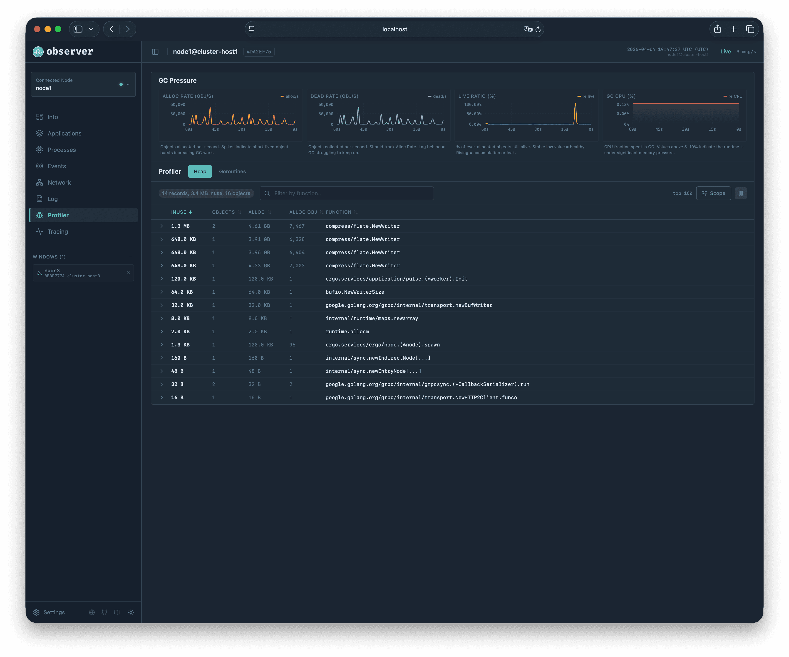<figcaption>GC Pressure charts above a captured heap profile.</figcaption></figure>

</details>

<details>

<summary>Grouped goroutines and the flamegraph</summary>

<figure>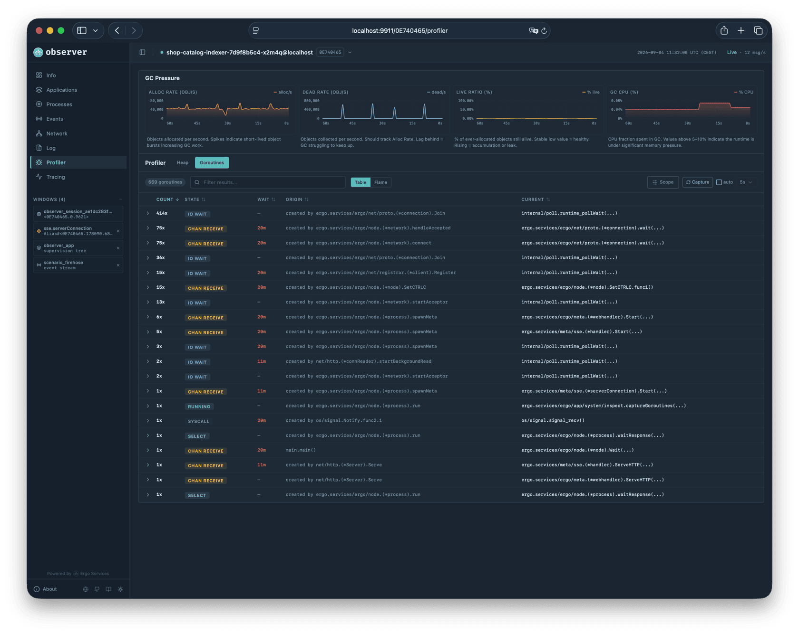<figcaption>Goroutines grouped by call stack, with state and wait time.</figcaption></figure>

<figure>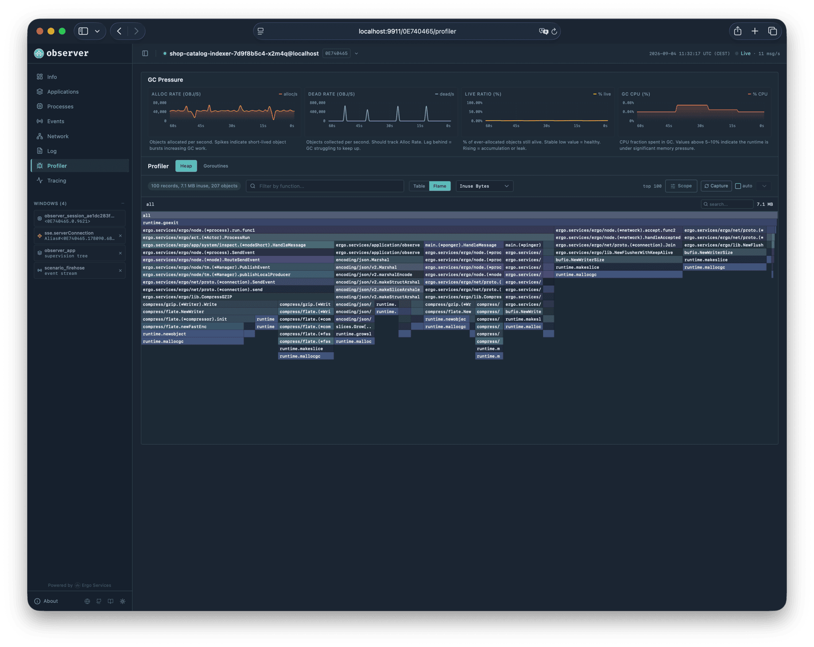<figcaption>The same snapshot as a flamegraph, arranged by call path.</figcaption></figure>

</details>

## Following a request across the system: Tracing

The hardest question in a message-passing system is what actually happened when a request came in, because the work spreads across many processes and often many nodes. Tracing answers it. When tracing is on, Observer collects traces continuously, so data is already waiting when you open the page. For how tracing works, see [Distributed Tracing](distributed-tracing.md).

Because Observer connects to one node at a time, it shows the observations recorded on that node. For a single trace stitched across the whole cluster, export to [Pulse](../extra-library/applications/pulse.md) with Grafana Tempo or Jaeger.

### Trace list

Traces are listed newest first. Each row shows a copyable trace ID, the root process and the message that started the trace, an error marker if any span failed, the span count, a bar showing this trace's duration against the longest in view, and the total duration. The search field matches across trace and span fields alike (IDs, from, to, message text, attributes), Pause holds new traces back, and Clear empties the buffer.

### Waterfall

Click a trace to expand its waterfall. It groups the observation points for each message (Sent, Delivered, Processed) into one row and arranges the rows into a tree by parent and child, so the indentation is the causal chain of who triggered whom.

Each row carries a color-coded kind (SEND, CALL, RESP, SPAWN, TERM, and SPAN for a business span opened with `StartTracingSpan`), the sender and receiver with their behaviors, the message type, and a timeline bar split into a lighter transit segment (Sent to Delivered) and a solid processing segment (Delivered to Processed). Hovering shows the node at each point and the exact durations. For a message that crosses nodes, the transit time subtracts the measured clock skew between them, so the number reflects real travel time rather than clock drift. Local PIDs are clickable and open detail windows, and clicking a row opens a panel with every field of the span and the custom attributes merged from all of its observation points.

### Scope

The Scope panel toggles which span kinds (SEND, CALL, RESP, SPAWN, TERM) and observation points (Sent, Delivered, Processed) are collected, and a message pattern filter matches message type and error text with an optional exclude. The buffer limit sets how many traces are kept. Collecting fewer kinds is not just less noise on screen: the node stops recording what you switched off.

<details>

<summary>Tracing page with waterfall</summary>

<figure><figcaption>A trace expanded into its waterfall, transit and processing segments side by side.</figcaption></figure>

</details>

## Inspecting the whole cluster

Everything above applies to one node, but you rarely run just one. The node selector in the top bar lists every node Observer can see through the registrar, searchable by name or by CRC32; pick one and all the views above re-point to it. Nothing needs to be deployed on the target: it already runs the `system` application that Observer talks to, and the list updates live as nodes join and leave the cluster. The node you are on is part of the URL, which is what makes a copied window link land on the right node.

You can also reach a node that Observer is not yet connected to. If the registrar knows it, selecting it is enough; otherwise you give its name, host, port and cookie, optionally over TLS, and Observer establishes the connection. The "Switch observer to this node" button on a connection detail window does the same for a peer you are already looking at. From a single browser tab, you move freely across the entire cluster.

<details>

<summary>Node selector and connecting by address</summary>

<figure>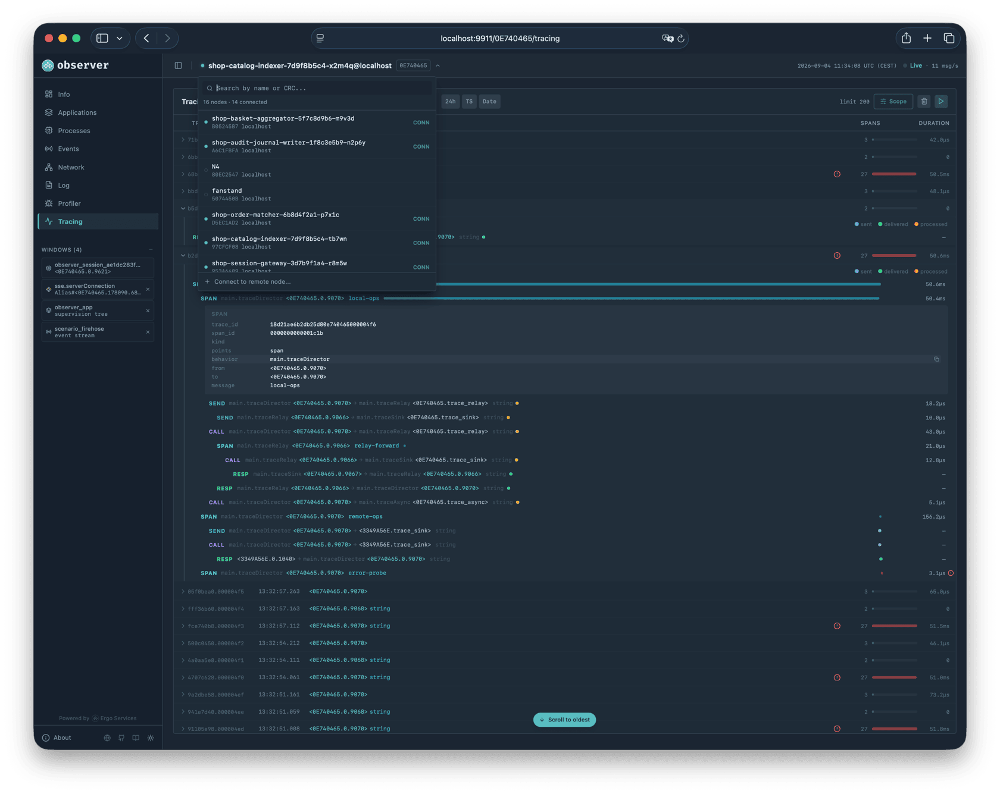<figcaption>The node selector: every node the registrar knows, searchable by name or CRC32, the connected ones marked, and an entry point for reaching one by address.</figcaption></figure>

</details>

The map of the whole cluster, every node at once with the traffic between them, is not part of this UI. It belongs to the cloud interface at [ergo.observer](https://ergo.observer), which reads the same observer over the same API. What the embedded UI gives you is one node at a time, with free movement between them.

## The same node, read by an agent

Every view on this page is a layout somebody decided on in advance, which is what makes it fast to read and useless for a question nobody anticipated. The same observer serves a second surface for exactly those questions: an [MCP](mcp.md) endpoint where an AI agent reads the node as addressable resources and calls tools on demand.

It is the same data, the same node, and the same authorization: a read-only ceiling refuses an agent's kill for the same reason it hides yours. What differs is who chooses the next question. See [Inspecting With an AI Agent](mcp.md).
