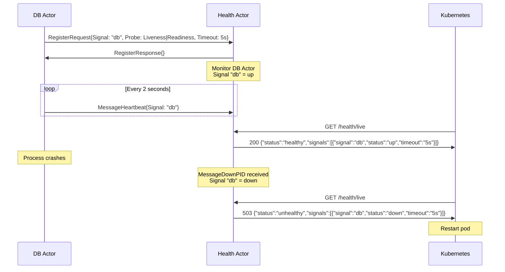

# Health

The health actor provides Kubernetes-compatible health probe endpoints for Ergo applications. Instead of each application building its own HTTP health check logic, the health actor centralizes probe management into a single process that serves `/health/live`, `/health/ready`, and `/health/startup` endpoints.

Actors register named signals with the health actor, optionally sending periodic heartbeats. The health actor aggregates signal states and serves HTTP responses that Kubernetes (or any other orchestrator) can use to determine whether to restart a pod, route traffic to it, or wait for it to finish starting.

## The Problem

Kubernetes uses three types of probes to manage pod lifecycle:

**Liveness:** Is the application alive? A failing liveness probe causes Kubernetes to restart the pod. Use this for detecting deadlocks, infinite loops, or corrupted state that prevents the application from functioning.

**Readiness:** Can the application serve traffic? A failing readiness probe removes the pod from service endpoints. Use this for temporary conditions like database connection loss, cache warming, or downstream dependency outages where restarting would not help.

**Startup:** Has the application finished initializing? A failing startup probe prevents liveness and readiness checks from running. Use this for slow-starting applications that need time to load data, run migrations, or establish connections before health checks begin.

In traditional applications, you implement these probes as HTTP handlers that check internal state. In actor systems, the "state" is distributed across many processes. A database connection actor, a cache warmer, and a message queue consumer each know their own status, but no single actor knows the overall health.

The health actor solves this by accepting signal registrations from any actor in the system. Each actor reports its own status, and the health actor aggregates these signals into per-probe HTTP responses.

## How It Works

The health actor follows a registration and heartbeat pattern:

1. **Actors register signals:** Each actor that contributes to health sends a `RegisterRequest` to the health actor (synchronous Call), specifying a signal name, which probes it affects, and an optional heartbeat timeout. The Call returns after the signal is registered, preventing race conditions with subsequent heartbeats.

2. **The health actor monitors registrants:** When a signal is registered, the health actor monitors the registering process. If that process terminates, all its signals are automatically marked as down.

3. **Actors send heartbeats:** For signals with a timeout, the registering actor periodically sends `MessageHeartbeat`. If the heartbeat interval exceeds the timeout, the health actor marks the signal as down.

4. **HTTP handlers read atomic state:** The HTTP handlers read pre-built JSON responses from atomic values. The actor goroutine rebuilds these atomic values after every state change. No mutexes or channels are involved in serving HTTP requests.



## ActorBehavior Interface

The health actor extends `gen.ProcessBehavior` with a specialized interface:

```go
type ActorBehavior interface {
    gen.ProcessBehavior

    Init(args ...any) (Options, error)
    HandleMessage(from gen.PID, message any) error
    HandleCall(from gen.PID, ref gen.Ref, message any) (any, error)
    HandleInspect(from gen.PID, item ...string) map[string]string
    HandleSignalDown(signal gen.Atom) error
    HandleSignalUp(signal gen.Atom) error
    Terminate(reason error)
}
```

All callbacks have default (no-op) implementations. You only override what you need.

`HandleSignalDown` is called when a signal transitions from up to down, due to heartbeat timeout, process termination, or explicit `MessageSignalDown`. Use this for alerting, logging, or triggering recovery actions.

`HandleSignalUp` is called when a signal transitions from down to up, via heartbeat recovery or explicit `MessageSignalUp`. Use this to log recovery events or update external systems.

## Basic Usage

Spawn the health actor and register it with a name so other actors can find it:

```go
package main

import (
    "ergo.services/actor/health"
    "ergo.services/ergo"
    "ergo.services/ergo/gen"
)

func main() {
    node, _ := ergo.StartNode("mynode@localhost", gen.NodeOptions{})
    defer node.Stop()

    node.SpawnRegister(gen.Atom("health"), health.Factory, gen.ProcessOptions{},
        health.Options{Port: 8080})

    // Endpoints:
    //   http://localhost:8080/health/live
    //   http://localhost:8080/health/ready
    //   http://localhost:8080/health/startup
    node.Wait()
}
```

Default configuration:
- **Host**: `localhost`
- **Port**: `3000`
- **Path**: `/health`
- **CheckInterval**: `1 second`

With no signals registered, all three endpoints return 200 with `{"status":"healthy"}`. This means a freshly started health actor does not block deployment. Signals opt in to health checking; only registered signals can cause a probe to fail.

## Configuration

```go
options := health.Options{
    Host:          "0.0.0.0",          // Listen on all interfaces
    Port:          8080,               // HTTP port
    Path:          "/health",          // Path prefix (default: "/health")
    CheckInterval: 2 * time.Second,   // Heartbeat check interval
}
```

**Host** determines which network interface the HTTP server binds to. Use `"0.0.0.0"` for production/containerized environments.

**Port** should not conflict with other services on the same pod.

**Path** sets the prefix for health endpoints. Endpoints are registered as `Path+"/live"`, `Path+"/ready"`, `Path+"/startup"`. Change this when the default conflicts with your routing or when deploying behind a reverse proxy. For example, with `Path: "/k8s"` the endpoints become `/k8s/live`, `/k8s/ready`, `/k8s/startup`.

**CheckInterval** controls how frequently the actor checks for expired heartbeats. The actor sends itself a timer message at this interval and iterates over all signals with a non-zero timeout, marking expired ones as down. Shorter intervals detect failures faster but increase message processing overhead. For most applications, 1-2 seconds provides a good balance.

**Mux** accepts an external `*http.ServeMux`. When provided, the health actor registers its handlers on this mux and skips starting its own HTTP server. This is useful when you want to serve health endpoints alongside other HTTP handlers on a single port, for example, combining with the [Metrics](metrics.md) actor.

```go
mux := http.NewServeMux()

healthOpts := health.Options{Mux: mux}
node.SpawnRegister("health", health.Factory, gen.ProcessOptions{}, healthOpts)

metricsOpts := metrics.Options{Mux: mux}
node.Spawn(metrics.Factory, gen.ProcessOptions{}, metricsOpts)

// Serve the shared mux yourself
```

When `Mux` is set, `Host` and `Port` are ignored.

## Signal Registration

### Probe Types

Each signal specifies which probes it affects using a bitmask:

```go
const (
    ProbeLiveness  Probe = 1 << iota  // 1: /health/live
    ProbeReadiness                     // 2: /health/ready
    ProbeStartup                       // 4: /health/startup
)
```

Combine probes with bitwise OR. A database connection that affects both liveness and readiness:

```go
health.Register(w, gen.Atom("health"), "db",
    health.ProbeLiveness|health.ProbeReadiness, 5*time.Second)
```

A migration signal that only affects startup:

```go
health.Register(w, gen.Atom("health"), "migrations",
    health.ProbeStartup, 0)
```

When `Probe` is 0, it defaults to `ProbeLiveness`.

### Helper Functions

The package provides convenience functions:

```go
// Register a signal (sync Call -- blocks until registered)
health.Register(process, to, signal, probe, timeout)

// Remove a signal (sync Call -- blocks until removed)
health.Unregister(process, to, signal)

// Send heartbeat (async Send)
health.Heartbeat(process, to, signal)

// Manual control (async Send)
health.SignalUp(process, to, signal)
health.SignalDown(process, to, signal)
```

`Register` and `Unregister` use synchronous Call to confirm the operation completed. This prevents race conditions where a heartbeat or status update arrives before the signal is registered. All other helpers use async Send.

The `to` parameter accepts anything that identifies a process: a `gen.Atom` name, `gen.PID`, `gen.ProcessID`, or `gen.Alias`.

### Message Types

If you prefer sending messages directly instead of using helpers:

| Message | Type | Description |
|---------|------|-------------|
| `RegisterRequest` / `RegisterResponse` | sync (Call) | Register a signal. Fields: `Signal gen.Atom`, `Probe Probe`, `Timeout time.Duration` |
| `UnregisterRequest` / `UnregisterResponse` | sync (Call) | Remove a signal. Fields: `Signal gen.Atom` |
| `MessageHeartbeat` | async (Send) | Update heartbeat timestamp. Fields: `Signal gen.Atom` |
| `MessageSignalUp` | async (Send) | Mark a signal as up. Fields: `Signal gen.Atom` |
| `MessageSignalDown` | async (Send) | Mark a signal as down. Fields: `Signal gen.Atom` |

All types are registered with EDF for network transparency. Actors on remote nodes can register signals with a health actor on any node in the cluster.

## Heartbeat Pattern

The heartbeat pattern is the primary mechanism for detecting failures in long-running dependencies. The actor that owns a resource (database, external API, message queue) knows best whether the resource is healthy. It registers a signal with a timeout and sends periodic heartbeats as long as the resource is available.

```go
type DBWorker struct {
    act.Actor
    heartbeatTimer gen.CancelFunc
}

type messageHeartbeatTick struct{}

func (w *DBWorker) Init(args ...any) error {
    // Register with 5-second heartbeat timeout
    health.Register(w, gen.Atom("health"), "db",
        health.ProbeLiveness|health.ProbeReadiness, 5*time.Second)

    // Send heartbeat every 2 seconds (well within the 5s timeout)
    w.heartbeatTimer, _ = w.SendAfter(w.PID(), messageHeartbeatTick{}, 2*time.Second)
    return nil
}

func (w *DBWorker) HandleMessage(from gen.PID, message any) error {
    switch message.(type) {
    case messageHeartbeatTick:
        health.Heartbeat(w, gen.Atom("health"), "db")
        w.heartbeatTimer, _ = w.SendAfter(w.PID(), messageHeartbeatTick{}, 2*time.Second)
    }
    return nil
}

func (w *DBWorker) Terminate(reason error) {
    if w.heartbeatTimer != nil {
        w.heartbeatTimer()
    }
}
```

Choose the heartbeat interval to be at least 2x shorter than the timeout. This provides one missed heartbeat as a safety margin before the signal is marked as down.

When the actor crashes, the health actor receives a `gen.MessageDownPID` (because it monitors the registrant) and marks all signals from that process as down. Heartbeat timeout is a secondary detection mechanism for situations where the process is alive but the resource it manages is not, for example, a database connection pool actor that is running but has lost all connections.

## HTTP Endpoints

| Path | Probe | Default (no signals) |
|------|-------|---------------------|
| `{Path}/live` | ProbeLiveness | 200 healthy |
| `{Path}/ready` | ProbeReadiness | 200 healthy |
| `{Path}/startup` | ProbeStartup | 200 healthy |

Each endpoint evaluates only signals registered for that specific probe. A signal registered for `ProbeLiveness` only does not affect `/health/ready` or `/health/startup`.

**200 OK:** all signals for this probe are up, or no signals are registered.

**503 Service Unavailable:** at least one signal for this probe is down.

### Response Format

Healthy response with signals:

```json
{"status":"healthy","signals":[{"signal":"db","status":"up","timeout":"5s"}]}
```

Unhealthy response:

```json
{"status":"unhealthy","signals":[{"signal":"db","status":"down","timeout":"5s"},{"signal":"cache","status":"up"}]}
```

Healthy response with no signals (probe has no registered signals):

```json
{"status":"healthy"}
```

The `timeout` field appears only for signals that have a heartbeat timeout configured. Signals without timeout omit this field.

## Failure Detection

The health actor detects failures through three mechanisms:

### Process Termination

When a process that registered signals terminates (normally or abnormally), the health actor receives `gen.MessageDownPID` through its monitor. All signals from that process are immediately marked as down. This is the fastest and most reliable detection mechanism.

### Heartbeat Timeout

For signals with a non-zero timeout, the health actor periodically checks whether the last heartbeat was received within the timeout window. If a heartbeat is overdue, the signal is marked as down and `HandleSignalDown` is called.

Heartbeat timeout catches situations where the process is alive but the resource it monitors is unavailable. The process continues to run (so no `MessageDownPID` arrives) but stops sending heartbeats because the resource check fails.

### Manual Control

Actors can explicitly report status changes using `MessageSignalUp` and `MessageSignalDown`. Use this when you can detect failures immediately without waiting for a timeout, for example, catching a database connection error in a callback and immediately marking the signal as down, then marking it up again when the connection is re-established.

## Extending with Custom Behavior

Embed `health.Actor` in your own struct to add custom behavior:

```go
type MyHealth struct {
    health.Actor
}

func MyHealthFactory() gen.ProcessBehavior {
    return &MyHealth{}
}

func (h *MyHealth) Init(args ...any) (health.Options, error) {
    return health.Options{Port: 8080}, nil
}

func (h *MyHealth) HandleSignalDown(signal gen.Atom) error {
    h.Log().Error("signal went down: %s", signal)
    // Alert external monitoring, update metrics, trigger recovery
    return nil
}

func (h *MyHealth) HandleSignalUp(signal gen.Atom) error {
    h.Log().Info("signal recovered: %s", signal)
    return nil
}
```

Override `HandleMessage` to handle application-specific messages alongside health management. The health actor dispatches its own types internally (`RegisterRequest`/`UnregisterRequest` via HandleCall, `MessageHeartbeat`/`MessageSignalUp`/`MessageSignalDown` via HandleMessage); only unrecognized messages are forwarded to your callbacks.

## Kubernetes Configuration

Configure Kubernetes probes to point to the health actor's endpoints:

```yaml
apiVersion: v1
kind: Pod
spec:
  containers:
    - name: myapp
      livenessProbe:
        httpGet:
          path: /health/live
          port: 3000
        initialDelaySeconds: 5
        periodSeconds: 10
      readinessProbe:
        httpGet:
          path: /health/ready
          port: 3000
        initialDelaySeconds: 5
        periodSeconds: 10
      startupProbe:
        httpGet:
          path: /health/startup
          port: 3000
        failureThreshold: 30
        periodSeconds: 2
```

Adjust `initialDelaySeconds` based on how long your application takes to start and register signals. The startup probe with `failureThreshold: 30` and `periodSeconds: 2` gives the application 60 seconds to complete initialization before Kubernetes considers it failed.

## Common Patterns

### Database Health

Register liveness and readiness signals with heartbeat:

```go
func (w *DBWorker) Init(args ...any) error {
    health.Register(w, gen.Atom("health"), "postgres",
        health.ProbeLiveness|health.ProbeReadiness, 10*time.Second)

    w.scheduleHeartbeat()
    return nil
}

func (w *DBWorker) HandleMessage(from gen.PID, message any) error {
    switch message.(type) {
    case messageHeartbeat:
        if w.db.Ping() == nil {
            health.Heartbeat(w, gen.Atom("health"), "postgres")
        }
        w.scheduleHeartbeat()
    }
    return nil
}
```

If `db.Ping()` fails, no heartbeat is sent, and the signal times out. The health actor marks it as down, causing Kubernetes to remove the pod from service endpoints (readiness) and eventually restart it (liveness).

### Startup Gate

Use the startup probe for slow initialization:

```go
func (w *Migrator) Init(args ...any) error {
    health.Register(w, gen.Atom("health"), "migrations",
        health.ProbeStartup, 0)  // No timeout -- manual control

    w.Send(w.PID(), messageRunMigrations{})
    return nil
}

func (w *Migrator) HandleMessage(from gen.PID, message any) error {
    switch message.(type) {
    case messageRunMigrations:
        if err := w.runMigrations(); err != nil {
            health.SignalDown(w, gen.Atom("health"), "migrations")
            return err
        }
        health.SignalUp(w, gen.Atom("health"), "migrations")
        // Unregister since startup is complete
        health.Unregister(w, gen.Atom("health"), "migrations")
    }
    return nil
}
```

While migrations run, the startup probe returns 503, preventing Kubernetes from running liveness and readiness checks. Once migrations complete, the signal is unregistered and the startup probe returns 200.

### Temporary Degradation

Use readiness-only signals for recoverable issues:

```go
func (w *CacheWorker) HandleMessage(from gen.PID, message any) error {
    switch msg := message.(type) {
    case CacheConnectionLost:
        health.SignalDown(w, gen.Atom("health"), "cache")
        // Pod removed from service but not restarted

    case CacheConnectionRestored:
        health.SignalUp(w, gen.Atom("health"), "cache")
        // Pod added back to service
    }
    return nil
}
```

Register the signal for `ProbeReadiness` only. The pod stops receiving traffic during the outage but is not restarted, since the cache connection will likely recover on its own.

## Observer Integration

The health actor integrates with Observer via `HandleInspect()`. Inspecting the health actor shows the endpoint URL, signal count, check interval, and current status of each registered signal.

## Radar Application

If your node needs both health probes and Prometheus metrics, consider the [Radar](../applications/radar.md) application. It runs the health actor and metrics actor together on a single HTTP port and provides helper functions so your actors don't need to import either package directly.
