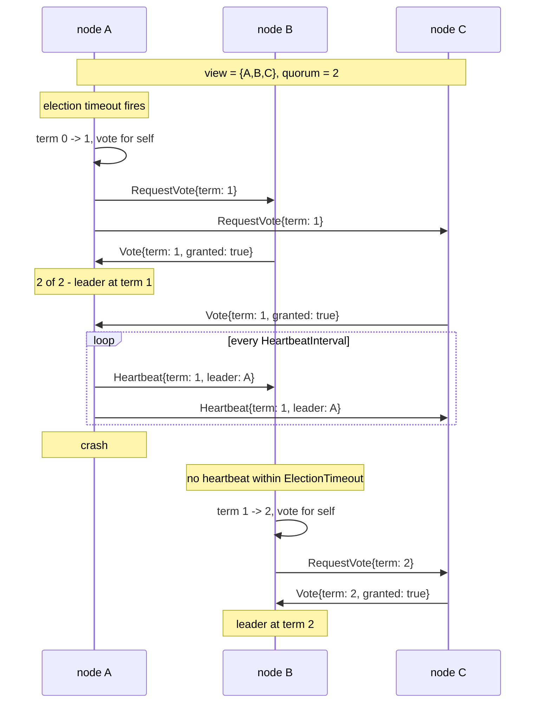

# Leader

The leader actor elects exactly one coordinator among a group of nodes and tells your code when it becomes that coordinator and when it stops being one. You embed it, implement two callbacks, and the work that must run in exactly one place starts and stops on its own.

Discovery is not part of it. Resolve peers however suits your deployment - a registrar lookup, static configuration, a message from another system - and hand the names to `Join`. The actor negotiates with them from there, and membership spreads through the protocol once one side knows the other.

## The Problem

Plenty of work must happen once, not once per node. A scheduler that fires cron jobs. A reconciler that scans a database and dispatches what it finds. A single writer to a resource that cannot take concurrent writers. Run it on every node and you get duplicate jobs, duplicate dispatches, duplicate writes. Run it on one designated node and you have a single point of failure that needs a human to move.

The obvious shortcut is to pick deterministically: sort the node names, lowest one wins. It needs no messages and it is genuinely appealing, right up to the moment two nodes disagree about the list. Node A believes the set is `{A, B, C}` and picks A; node B has just begun suspecting A and believes the set is `{B, C}`, so it picks B. Both act. Nothing in the scheme prevents it, because nothing in the scheme requires anyone to agree.

Election is the fix. A node cannot take leadership by deciding it deserves it; it has to be granted by a majority of the group it believes in. Two nodes whose views differ slightly cannot both collect a majority, because their views overlap and a voter grants one vote per term.

## How It Works

The actor is a Raft-style election with no log: terms, votes, heartbeats, and nothing replicated.

**Roles.** Every actor is in one of four states.

- `unclustered` - the view is smaller than `MinClusterSize`, so this node may not have a leader at all. Not a failure; a group too small to be a cluster is behaving correctly by not operating as one.
- `follower` - accepting another node's leadership, or waiting to campaign.
- `candidate` - campaigning for a term, waiting for grants.
- `leader` - holding leadership, sending heartbeats.

**The view.** Membership is the set of peers this node has been told about, plus itself. Peers arrive through `Options.Bootstrap` at startup, through `Join` at any time, and through the protocol itself - a node that sends a valid message is a member. A peer counts from the moment it is declared, before it has answered anything.

**Terms.** A term is a logical clock, not a wall clock. A candidate increments it before asking for votes, and a higher term always wins: any node seeing one adopts it and steps back to follower. This is what settles disagreement without a shared clock.

**Quorum.** To win, a candidate needs a majority of its view, counting itself. Three nodes need two votes, four need three, five need three. The denominator is the current view, so it moves as membership changes - and `MinClusterSize` is the floor that stops it moving somewhere useless.



**The contract, in three sentences.** There is exactly one leader per cluster. A network partition does not put two leaders in one cluster - it splits one cluster into two, each electing its own, and a side too small to meet `MinClusterSize` or to hold a majority of its own view elects none. When connectivity returns they converge back into one cluster with one leader.

That last point deserves the attention it gets in [What It Guarantees](#what-it-guarantees) below, because it decides what you may safely build on top.

## Setup

Two steps, and both fail quietly if you skip them: the node starts, nothing errors, and the problem shows up later as a cluster that never converges.

### Register the wire types

The package registers nothing on import. Type registration is node-scoped, so it cannot happen in a package `init()`, and doing it inside the actor would be too late - a node whose leader process starts after a connection is already established could not decode a peer's message, and could not repair that after the fact.

The actor checks this at `Init` and refuses to start if its protocol is not registered: an unregistered vote fails to encode on every send, so the alternative is a healthy-looking node that never joins an election.

Declare them on the application that hosts the actor:

```go
gen.ApplicationSpec{
    Name: "scheduler",
    Network: gen.ApplicationNetwork{
        RegisterTypes:  leader.NetworkTypes(),
        RegisterErrors: leader.ErrorTypes(),
    },
    Group: []gen.ApplicationMemberSpec{
        {Name: "coordinator", Factory: factoryCoordinator},
    },
}
```

`ApplicationSpec.Network` is processed during `ApplicationLoad`, before any process in the application is spawned, which is exactly the timing this needs. Registering on the node directly works too, as long as it happens before the node starts serving:

```go
node.Network().RegisterTypes(leader.NetworkTypes())
node.Network().RegisterErrors(leader.ErrorTypes())
```

`ErrorTypes()` returns nothing today - the actor sends no sentinel errors over the wire. It exists so your setup code stays uniform if that changes.

### Set MinClusterSize

`MinClusterSize` is the smallest view - this node plus the peers it knows - that may have a leader at all. The default is 3: the smallest size whose majority, two, survives losing one node.

Lower values are permitted and warned about rather than rejected, because both have legitimate uses and neither breaks the contract:

- `1` lets a lone node appoint itself. A single-node deployment must set this explicitly, and nothing then prevents a fragment of one from operating alone.
- `2` gives a quorum of two out of two, so losing either node ends leadership. Sensible only when an external authority gates leadership through `HandleConfirmLeader`.

Inheriting the default silently is the thing to avoid. Decide the number, write it down.

## Basic Usage

```go
package main

import (
    "time"

    "ergo.services/actor/leader"
    "ergo.services/ergo"
    "ergo.services/ergo/gen"
)

type coordinator struct {
    leader.Actor

    running bool
}

type messageDiscoverPeers struct{}

func factoryCoordinator() gen.ProcessBehavior {
    return &coordinator{}
}

func (c *coordinator) Init(args ...any) (leader.Options, error) {
    // Join from a handler frame, not from here: the options below have not been
    // applied yet, so a vote sent from Init would carry an empty ClusterID and be
    // dropped by the receiver's own guard.
    if err := c.Send(c.PID(), messageDiscoverPeers{}); err != nil {
        return leader.Options{}, err
    }

    return leader.Options{
        ClusterID:      "scheduler",
        MinClusterSize: 3,
    }, nil
}

func (c *coordinator) HandleMessage(from gen.PID, message any) error {
    switch message.(type) {
    case messageDiscoverPeers:
        for _, node := range discoverNodes() { // your discovery, whatever it is
            c.Join(gen.ProcessID{Name: "coordinator", Node: node})
        }
        // Re-run it: peers appear and disappear, and a node that starts before its
        // peers must keep looking.
        if _, err := c.SendAfter(c.PID(), messageDiscoverPeers{}, 5*time.Second); err != nil {
            return err
        }
    }
    return nil
}

func (c *coordinator) HandleBecomeLeader() error {
    c.Log().Info("became leader at term %d", c.Term())
    c.running = true
    return c.Send(c.PID(), messageTick{})
}

func (c *coordinator) HandleBecomeFollower(leader gen.PID) error {
    c.Log().Info("no longer leader, following %s", leader)
    c.running = false
    return nil
}

func main() {
    node, err := ergo.StartNode("n1@localhost", gen.NodeOptions{})
    if err != nil {
        panic(err)
    }
    defer node.Stop()

    node.Network().RegisterTypes(leader.NetworkTypes())
    node.SpawnRegister("coordinator", factoryCoordinator, gen.ProcessOptions{})

    node.Wait()
}
```

Two habits in that code worth copying. `Join` runs from a handler frame rather than from `Init`, and it re-runs on a timer - discovery is your responsibility, and a one-shot lookup leaves a node that started early with no peers forever. And `HandleBecomeFollower` stops the work unconditionally; treat it as the only place leadership ends, because it is.

## Configuration

```go
leader.Options{
    ClusterID:          "scheduler",  // required
    MinClusterSize:     3,            // default 3
    Bootstrap:          peers,        // optional, []gen.ProcessID
    ElectionTimeoutMin: 150,          // ms, default 150
    ElectionTimeoutMax: 300,          // ms, default 300
    HeartbeatInterval:  50,           // ms, default 50
    GhostTTL:           5000,         // ms, default 5000
}
```

**ClusterID** is required and namespaces the election. Messages carrying a different one are dropped and counted, so two logically separate groups can share a network without interfering. Give distinct clusters distinct ids; sharing one by accident merges them.

**MinClusterSize** - see [Set MinClusterSize](#set-minclustersize) above.

**Bootstrap** is a static list of peers, and it is exactly `Join` declared up front: the entries seed the same membership rather than being a second, parallel set of targets. Use it when the peer set is known at deploy time; use `Join` when it is discovered at runtime; use both if some of it is known and some is not.

**ElectionTimeoutMin / ElectionTimeoutMax** bound the randomised wait before a follower campaigns. Randomising it is what stops every node timing out at the same instant and splitting the vote. Set only one and the other is derived - min alone doubles to a max, max alone halves to a min - so a partial configuration resolves instead of failing at startup.

**HeartbeatInterval** is how often a leader asserts itself. It must be comfortably smaller than `ElectionTimeoutMin`, or followers will time out between heartbeats and campaign against a healthy leader; the actor warns at startup if it is not.

**GhostTTL** is how long a peer whose connection dropped stays in the view before being dropped. It exists because those two things - a blip and a departure - look identical from here, and neither extreme works: keep an unreachable peer forever and, with dynamic node names, the view fills with names that will never return until quorum exceeds the number of nodes that exist; drop it immediately and a one-second blip lowers quorum. Five seconds separates the cases - far longer than a 150-300 ms election cycle, far shorter than a stage of a rolling deploy.

It is not a safety control; `MinClusterSize` is. `GhostTTL` only bounds how long a gone peer keeps inflating quorum, and it is a net under `Leave` rather than a replacement for it - see [Membership](#membership). The cost of the window is that quorum is briefly too high, so a node that dies while the cluster sits exactly on its quorum leaves it leaderless for up to that long. That is the reason not to raise it to a minute.

The defaults suit a local network. On a pod-to-pod network across zones, or anywhere a garbage-collection pause can exceed a couple of hundred milliseconds, raise all three together - for example 1000 / 2000 / 300. Aggressive timeouts do not make failover safer, they make spurious elections more likely.

## ActorBehavior Interface

```go
type ActorBehavior interface {
    gen.ProcessBehavior

    Init(args ...any) (Options, error)
    HandleMessage(from gen.PID, message any) error
    HandleCall(from gen.PID, ref gen.Ref, request any) (any, error)
    Terminate(reason error)
    HandleInspect(from gen.PID, item ...string) map[string]string

    // Leadership
    HandleConfirmLeader() (bool, error)
    HandleBecomeLeader() error
    HandleBecomeFollower(leader gen.PID) error

    // Membership
    HandlePeerJoined(peer gen.PID) error
    HandlePeerLeft(peer gen.PID) error

    // Framework message classes
    HandleEvent(event gen.MessageEvent) error
    HandleSpan(span gen.TracingSpan) error
    HandleLog(message gen.MessageLog) error
}
```

Only `Init` has no default - embedding `leader.Actor` satisfies the rest. `HandleBecomeLeader` and `HandleBecomeFollower` do have defaults, but they log a warning, because winning leadership and doing nothing with it is almost always a missing implementation rather than an intention.

**HandleBecomeLeader** is where the singleton work starts. Returning an error rolls the transition back: the actor steps down again and the error terminates it, so use it to refuse leadership you cannot honour.

**HandleBecomeFollower** is where it stops, and it fires on every transition into follower - not only when a leader is demoted. A follower whose leader disappeared and a candidate that stood down both arrive here, with an empty PID when no leader is known. Make it idempotent.

**HandleConfirmLeader** is consulted after this node has won the election and before leadership is published. Returning `false`, or an error, withholds it: `HandleBecomeLeader` does not run and the node re-campaigns after a backoff that grows with consecutive denials. An error counts as a denial, not as consent - the usual error is a timeout talking to whatever you are asking, which is exactly when someone else may be holding it. See [Leadership Safety](#leadership-safety).

**HandlePeerJoined / HandlePeerLeft** report membership changes. They are informational; membership is already applied by the time they run.

## Membership

Discovery belongs to your code. The actor's job is to negotiate with the names you give it.

**`Join(peer gen.ProcessID)`** declares a peer and opens negotiation. The peer counts toward the view immediately, before it has answered - which is what lets a node reach `MinClusterSize` without needing traffic that only a campaigning node produces. Idempotent per node.

**`Leave(node gen.Atom)`** withdraws a peer from the view and from every quorum computed afterwards. Call it when your discovery stops listing a node: you know the pod is gone, the actor can only guess. A withdrawal is sticky for one election timeout, so traffic already in flight cannot re-admit what you just removed.

**A peer going down** is handled by reason. A death reported with an actual reason - the remote process terminated - removes the member immediately. A drop reported as `gen.ErrNoConnection` does not: the member stays in the view, with only the knowledge of how to reach it forgotten, and is dropped after `GhostTTL` if it has not come back. Silence alone never shrinks the view inside that window, because shrinking it lowers quorum and would let a momentary blip hand a fragment the ability to elect.

**With dynamic node names this matters more than it looks.** Where every pod gets a name that will never be reused - `$(POD_NAME)@$(POD_IP)` and the like - a replaced pod leaves an unreachable member behind, and the framework reports everything on a lost node as `ErrNoConnection` whatever actually happened to it. Without a bound, two rolling deploys of a five-node cluster leave a view of thirteen and a quorum of seven that the five living nodes can never assemble - a cluster that is permanently leaderless and looks healthy field by field. `GhostTTL` bounds it, and calling `Leave` from your discovery loop closes it properly.

**Heartbeats go only to peers that have answered.** A declared peer that has never replied is not a follower: there is no election timer of yours to suppress, and if it is up it will campaign and be corrected by the reply. Vote requests do go to everyone declared, because reaching out is the whole point of a campaign.

## What It Guarantees

**Within a cluster, one leader.** A node cannot hold leadership without a majority of its view having granted it for the current term, and a voter grants one vote per term.

**A leader that loses contact steps down by itself.** On each heartbeat tick it requires evidence of reaching a quorum - an accepted send or any inbound protocol message within one election timeout. Without it, it relinquishes leadership without waiting to be told. This is what prevents an isolated leader from holding on indefinitely, since every other exit from leadership needs an inbound message and an isolated node receives none.

**A cluster reconverges after a partition.** When the two sides can talk again, the higher term wins and the other side steps down; the view grows back and quorum is recomputed over it.

**No leader below the floor.** A group smaller than `MinClusterSize` reports `unclustered` and elects nobody.

And what it does not guarantee:

**Not a fixed number of clusters.** The invariant is one leader per cluster, but the number of clusters is not fixed - so from outside, looking at the deployment as one thing, you can see two leaders at once, for as long as the split lasts. Worth being precise about when:

- **A connectivity partition of a converged cluster does not do this.** A lost connection keeps the peer in the view - only what the actor knew about reaching it is forgotten - so the quorum denominator does not shrink. Two disjoint groups cannot both be a majority of the same set, so at most one side elects and the other reports `unclustered` or waits.
- **Diverged views do.** If each side only ever learned about its own members, each holds a majority of its own smaller view and each elects. That is the cold-start case: nodes come up, discovery resolves only what is reachable, and two groups form without ever having been one.
- **So does losing members for real.** A process that actually died, or a peer you withdrew with `Leave`, leaves the view and lowers quorum with it.

This is the price of dynamic membership with no seed list: the actor is never told how large the deployment is meant to be, so it cannot tell a group of three from half of six. If you would rather pay in availability than in duplicate leadership, that is what `MinClusterSize` is for - **set it above half the expected node count**, and two disjoint groups can never both qualify, at the cost of no leader in any partition smaller than that.

**No replicated state.** Leadership changes hands; nothing carries state across. If the new leader needs to know what the old one did, put that somewhere both can read.

**No persistence.** Election state lives in memory. A restarted node rejoins with a fresh term.

**Nothing about your external resources.** Leadership is scoped to a cluster; a database row, a queue or a lock is not. See below.

## Leadership Safety

Three properties are usually conflated, and only the middle one is the election's job.

**Two nodes briefly believing they lead.** Unavoidable in an asynchronous system - a superseded leader learns late. Harmless on its own.

**Two nodes acting as leader inside one cluster.** Prevented, by majority voting and the quorum requirement above.

**Two nodes performing an irreversible external action.** Not addressed by any election, including this one. When a partition turns one cluster into two, a shared resource is now serving two clusters, each with a legitimate leader, and nothing in the protocol can tell it which to obey.

If leadership authorises something irreversible, the resource has to arbitrate. Two mechanisms, and they compose:

**Gate leadership on an external authority.** Implement `HandleConfirmLeader` so that winning the election is necessary but not sufficient - the node must also hold something only one holder can have. A Kubernetes `Lease` is the natural choice where you already run on Kubernetes: no new infrastructure, and `metadata.resourceVersion` increases monotonically, so it doubles as a fencing token.

```go
func (c *coordinator) HandleConfirmLeader() (bool, error) {
    return c.lease.Held(), nil // cheap read of locally cached state
}
```

The callback runs on the actor's goroutine. It may talk over the network - it is called once per won election, not on a hot path - but bound it with a timeout well under the election timeout, and prefer answering from state that a separate process keeps up to date. That separate process is also the right place to relinquish leadership when a renewal fails, which the callback alone cannot do because it is only consulted at the transition.

**Fence the resource.** Carry a monotonically increasing token with every irreversible action and let the resource reject a stale one:

```sql
UPDATE resources SET owner_token = :token
WHERE id = :id AND (owner_token IS NULL OR owner_token < :token)
```

Zero rows updated means a newer holder exists, and the caller must stop. This is the only part of the arrangement that does not depend on timing, and it is what turns "we try to have one writer" into "a superseded writer cannot take effect".

A lock without a monotonic token - a plain `SETNX` in Redis, for instance - shrinks the window rather than closing it, and cannot survive a failover that promotes a replica which never saw the write. Worth knowing which of the two you have built.

## Partitions and Healing

Take a five-node cluster, `{A,B,C,D,E}`, `MinClusterSize: 3`, A leading at term 4. The network splits into `{A,B,C}` and `{D,E}`.

**The majority side.** A still reaches B and C: two peers plus itself is three, a majority of its view, so it keeps leadership at term 4. Nothing changes for the work it is running.

**The minority side.** D and E stop hearing heartbeats and campaign. Their views stay at five - a lost connection does not remove a member, it only forgets how to reach it - so the quorum they need is still three, and between them they can muster two. Neither wins, and they keep retrying until the partition heals.

That is the reason a converged cluster does not split into two leaders: the denominator survives the partition, and two disjoint groups cannot both be a majority of the same five. Two leaders need diverged views, not a dropped connection - see [What It Guarantees](#what-it-guarantees).

**Healing.** Connectivity returns. Each side rediscovers the other through the protocol: a vote request or heartbeat resolves the peers, the views grow back to five, and quorum returns to three. If the far side had elected a leader at a higher term, the term comparison settles it - A adopts the higher term and steps down, and one leader remains. If nobody outranked A, its heartbeats simply reach D and E again and they follow.

**What a leader on the wrong side does.** If A had ended up in the minority instead, its heartbeat tick would have found fewer reachable members than its quorum requires, and it would have stepped down on its own within one election timeout - without needing to hear from the majority side.

## API Methods

State, all safe to call from within your callbacks:

```go
c.IsLeader()      // bool
c.Leader()        // gen.PID of the leader this node recognises, zero if none
c.Term()          // uint64
c.ClusterID()     // string
```

Membership:

```go
c.Peers()         // []gen.PID of the peers whose PID is known
c.PeerCount()     // int
c.HasPeer(pid)    // bool
c.Bootstrap()     // []gen.ProcessID as configured
c.Join(procID)    // declare a peer
c.Leave(node)     // withdraw one
```

Messaging:

```go
failed, err := c.Broadcast(message)
```

`Broadcast` sends to every member of the current view, addressing each by PID where known and by name otherwise, and returns how many targets failed together with the first error. It does not stop at the first failure.

Exit handling:

```go
c.SetTrapExit(true)   // an exit from anyone but the parent arrives as a message
c.TrapExit()          // bool
```

Off by default, in which case any exit signal terminates the actor. Turn it on when the actor links to children whose failure should not remove this node from the cluster - an application group member is not restarted, so an untrapped exit takes the node out of the election for good.

## Common Patterns

### Leader-only work

Start on promotion, stop on demotion, and check on every tick rather than trusting a flag set long ago:

```go
func (c *coordinator) HandleBecomeLeader() error {
    return c.Send(c.PID(), messageTick{})
}

func (c *coordinator) HandleMessage(from gen.PID, message any) error {
    switch message.(type) {
    case messageTick:
        if c.IsLeader() == false {
            return nil // demoted between ticks
        }
        c.doWork()
        _, err := c.SendAfter(c.PID(), messageTick{}, time.Second)
        return err
    }
    return nil
}
```

### Forwarding to the leader

A request can arrive at any node. Handle it locally when you lead, forward when you do not, and reject when there is no leader - do not queue for one that may never appear:

```go
func (c *coordinator) HandleCall(from gen.PID, ref gen.Ref, request any) (any, error) {
    if c.IsLeader() {
        return c.handle(request), nil
    }
    leader := c.Leader()
    if leader == (gen.PID{}) {
        return nil, gen.ErrNotAllowed // no leader right now
    }
    return c.Call(leader, request)
}
```

### Draining before standing down

`HandleBecomeFollower` runs on the actor's goroutine, so it cannot wait for in-flight work. Mark the actor as not leading, let the work notice on its next step, and keep the teardown itself immediate:

```go
func (c *coordinator) HandleBecomeFollower(leader gen.PID) error {
    c.running = false // the tick handler checks this and stops rescheduling
    return nil
}
```

## Observability

`HandleInspect` reports the full election state. Passing item names returns only those keys; pass `help` for the list, and an unknown item comes back as `<unknown item>` rather than silently missing.

The keys, grouped by what they answer:

- **Role and term** - `ergo:state` (`leader`, `candidate`, `follower`, `unclustered`), `ergo:leader` (this node's own belief, as a boolean), `ergo:leader_pid`, `ergo:leader_node`, `ergo:term`, `ergo:voted_for`, `ergo:term_changed_at`
- **Membership** - `ergo:cluster` (the cluster id this actor belongs to), `ergo:view_size`, `ergo:quorum`, `ergo:min_cluster_size`, `ergo:peers`, `ergo:peers_list`, `ergo:declared`, `ergo:bootstrap`, `ergo:unreachable` (each member whose connection dropped, with how long ago), `ergo:ghost_ttl`
- **The current election** - `ergo:votes_granted`, `ergo:votes_count`
- **Liveness** - `ergo:election_timer_armed`, `ergo:heartbeat_timer_armed`, `ergo:heartbeat_in_last`, `ergo:heartbeat_out_last`, `ergo:election_timeout_min`, `ergo:election_timeout_max`, `ergo:heartbeat_interval`
- **Problems** - `ergo:dropped_by_reason` (per-reason counters for every message the actor discarded), `ergo:send_failing_peers`, `ergo:confirm_denied`, `ergo:last_denied_at`

Three of those are worth knowing about before you need them. `ergo:state` distinguishes a stuck candidate from a healthy follower, which a boolean cannot. `ergo:election_timer_armed` distinguishes a node waiting to campaign from one that has stopped. And `ergo:dropped_by_reason` is often the only trace a discarded message leaves anywhere.

The election state uses the reserved `ergo:` prefix, the same convention the core behaviors follow. When embedding `leader.Actor` and overriding `HandleInspect()`, your keys are merged on top of base inspection data, so your own fields sit beside the election state and one of its keys is replaced only if you name it with the prefix.

For guidance on designing your own inspection surface, see [Inspecting Actor State](../../advanced/inspecting-state.md).

## Observer Integration

[Observer](../../advanced/observer.md) shows the election state of any leader actor in the process view, updating live, and the process kind reflects the role - `leader`, `follower` or `candidate` - so a stuck candidate is visible in a process list without opening it.

## MCP

The [MCP surface of Observer](../applications/observer.md) exposes the same inspection as resources and tools an AI agent asks for on demand, across every node in the cluster from the one node that serves it. For a leader actor that means the whole election can be read in one pass: which node each replica thinks is leading, at which term, with which view and quorum - which is how a divergence between replicas becomes obvious rather than inferred.
