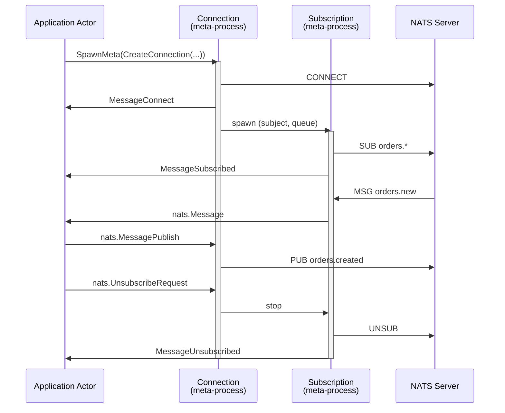

# NATS

NATS is a message broker built around subjects: a publisher sends a message to a subject, and everyone subscribed to that subject receives it. There is no queue to declare, no exchange to bind, no routing key syntax to learn - a subject is a dot-separated string, and a subscription is a string with optional wildcards.

The framework provides a NATS meta-process implementation that integrates a NATS connection with the actor model. Messages from the broker arrive in `HandleMessage` like any other message, and publishing is sending a message to the connection.

```go
import "ergo.services/meta/nats"
```

## The Integration Problem

A NATS connection needs two capabilities at once:

**Continuous reading**: something must keep pulling messages out of every subscription and hand them to the actors that care about them.

**Asynchronous writing**: any actor must be able to publish at any time, from anywhere in the cluster, without owning the connection.

This is what meta-processes solve. The difference from a socket is that the NATS client library runs its own goroutines and multiplexes every subject over one TCP connection, so the question is not "how do we read the socket" but "what is the unit that reads". Here that unit is a subscription: each one gets its own meta-process, its own reader, and its own target process.

## Components

Two kinds of meta-processes work together:

**Connection**: one NATS connection. It is the control plane - it publishes, it creates and ends subscriptions, and it reports the state of the link. It is spawned by an actor with `SpawnMeta`, and its alias is the only one a user has to keep.

**Subscription**: one subscription on that connection, spawned by the connection itself. It reads its subject and delivers what arrives to a process. It is not something a user spawns or terminates directly: subscribing and unsubscribing go through the connection.



## Creating a Connection

Use `nats.CreateConnection` and spawn it as a meta-process:

```go
type OrderService struct {
    act.Actor
    conn gen.Alias
}

func (s *OrderService) Init(args ...any) error {
    conn, err := nats.CreateConnection(nats.ConnectionOptions{
        Servers: []string{"nats://localhost:4222"},
        Name:    "order-service",
        Subscriptions: []nats.Subscription{
            {Subject: "orders.new", Queue: "orders"},
            {Subject: "orders.cancel", Queue: "orders"},
        },
    })
    if err != nil {
        return err
    }

    s.conn, err = s.SpawnMeta(conn, gen.MetaOptions{})
    return err
}
```

`CreateConnection` only validates the options. The connection itself is established when the meta-process is spawned, so `SpawnMeta` is what reports a broker that is down.

Connection options:

**Servers**: the servers to connect to, `nats://host:4222`. Several entries are a cluster - the client picks one and fails over to the others. Empty means `nats://127.0.0.1:4222`.

**Name**: the client name as the server sees it, which is what `nats server report connections` shows. Empty means the node name.

**Process**: the process that receives the connection-level messages. Empty means the actor that spawned the connection.

**Subscriptions**: the subscriptions to establish at start. A failure here terminates the connection: a subject named in the options is a part of the contract, not a best effort.

**ConnectTimeout**: how long one connect attempt may take. Zero means 2 seconds.

**Reconnect**: what the client does when the connection drops. Reconnecting is the job of the NATS client; the meta-process only reports it. `Max` bounds the attempts (zero means unlimited), `Wait` and `Jitter` pace them, `BufferSize` bounds what may be published while the connection is down, and `RetryOnFailedConnect` keeps the meta-process alive when the *first* connect fails instead of refusing to start.

**NoEcho**: drops the messages published by this very connection, so a service that publishes to a subject it also subscribes to does not hear itself.

**DrainTimeout**: above zero, terminating the connection drains it instead of closing it - subscriptions are closed, what is buffered is written out, and the connection closes after that.

**MetaOptions**: how subscriptions are spawned, unless a subscription overrides it. `MailboxSize` is the field that matters, see [Overflow](#overflow-when-the-receiver-falls-behind).

## Receiving Messages

A subscription delivers what arrives to a process - the actor that owns the connection by default, or the one named in `SubscriptionOptions.Process`:

```go
func (s *OrderService) HandleMessage(from gen.PID, message any) error {
    switch m := message.(type) {
    case nats.Message:
        s.Log().Info("%s: %s", m.Subject, m.Data)

    case nats.MessageSubscribed:
        s.Log().Info("subscribed to %s", m.Subject)

    case nats.MessageConnect:
        s.Log().Info("connected to %s", m.URL)

    case nats.MessageDisconnect:
        s.Log().Warning("disconnected: %s", m.Reason)
    }
    return nil
}
```

`nats.Message` is one message from the broker:

```go
type Message struct {
    ID      gen.Alias  // subscription it arrived on
    Conn    gen.Alias  // connection it arrived through
    Subject string
    Header  Header     // nil when the message carried no headers
    Data    []byte
}
```

`Subject` is the concrete subject, which matters when the subscription used a wildcard: a subscription to `orders.>` receives `orders.new.eu` with that full subject in the field.

`Data` and `Header` are not copied on local delivery - the receiver owns them. Passing the same message on to several processes shares that memory with all of them.

Messages arrive with `MessagePriorityNormal` and everything else in this package with `MessagePriorityHigh`. For an ordinary actor that means the state of the link is seen before the data queued behind it. For an `act.Router` it means the data lands in `RouteMessage` and the rest in `HandleMessage`, with no filtering of its own.

## Publishing

Publishing is sending a message to the connection alias:

```go
s.SendAlias(s.conn, nats.MessagePublish{
    Subject: "orders.created",
    Data:    payload,
})
```

```go
type MessagePublish struct {
    Subject string
    ReplyTo string  // ask for an answer on this subject; usually empty
    Header  Header
    Data    []byte
}
```

Publishing is fire-and-forget: a successful `SendAlias` means the message reached the connection, not that the broker took it. Core NATS is at-most-once by design - a subject with no subscriber at the moment of publishing drops the message and nobody is told.

A publish the broker refuses - a payload over the server limit, a subject the credentials do not allow - does not kill the connection. It is counted and reported as `nats.MessageError`:

```go
case nats.MessageError:
    s.Log().Error("nats error on %q: %s", m.Subject, m.Reason)
```

Headers require a NATS server 2.2 or above. `nats.Header` is a `map[string][]string` with canonicalized keys, the same shape as `http.Header`:

```go
header := nats.Header{}
header.Set("Content-Type", "application/json")

s.SendAlias(s.conn, nats.MessagePublish{
    Subject: "orders.created",
    Header:  header,
    Data:    payload,
})
```

## Answering Requests

NATS has no separate request protocol. A request is an ordinary message that carries one extra field - the subject to answer on - and the answer is an ordinary publish to that subject. The requester subscribes to an inbox of its own, puts it in the message, and waits there.

A message that names such a subject arrives as its own type:

```go
type MessageRequest struct {
    ID      gen.Alias
    Conn    gen.Alias  // connection to answer through
    Subject string
    ReplyTo string     // never empty: the subject the answer goes to
    Header  Header
    Data    []byte
}
```

Answering it makes the actor a NATS service:

```go
case nats.MessageRequest:
    return s.SendAlias(m.Conn, nats.MessageResponse{
        ReplyTo: m.ReplyTo,
        Data:    s.handle(m.Data),
    })
```

`ReplyTo` is the whole correlation - the inbox the caller is waiting on - so answering keeps no state anywhere. `Conn` is the connection the request came through, which is what lets a process that does not own the connection answer at all: carry those two fields to wherever the answer is produced, and it can be sent from there, later, by another actor.

The two types exist so that a request cannot be mistaken for a notification. A `nats.Message` never expects an answer; a `nats.MessageRequest` always does, and forgetting to answer it leaves a caller hanging until its own timeout with nothing to see on this side.

The other direction - an actor issuing a NATS request and waiting for the answer - is not in this package yet.

## Subscribing at Runtime

Subscriptions do not have to be known at start. `SubscribeRequest` is a synchronous call to the connection:

```go
result, err := s.CallAlias(s.conn, nats.SubscribeRequest{
    Subject: "orders.cancelled",
    Queue:   "orders",
}, 5)
if err != nil {
    return err
}
id := result.(nats.SubscribeResponse).ID
```

Subject and queue are what a subscription is. Everything else has a default and lives in `Options`:

```go
s.CallAlias(s.conn, nats.SubscribeRequest{
    Subject: "events.>",
    Options: nats.SubscriptionOptions{
        Process:  "event-logger",     // empty: the owner of the connection
        Overflow: nats.OverflowDrop,  // default: OverflowWait
    },
}, 5)
```

Subscription options:

**Process**: the process that receives the messages of this subscription. This is how one connection feeds several actors - one subject to one worker, another to another.

**PendingLimitMessages** and **PendingLimitBytes**: what the NATS client buffers for this subscription between the socket and its reader. Zero means the client defaults, 512k messages and 64MB. Above these the client drops messages and reports a slow consumer.

**Overflow**: what happens when the receiving process cannot take a message. See [Overflow](#overflow-when-the-receiver-falls-behind).

**MetaOptions**: how this subscription meta-process is spawned. Zero means the one of the connection.

Whichever way a subscription is created, the receiving process gets `nats.MessageSubscribed` before the first message of that subscription:

```go
type MessageSubscribed struct {
    ID      gen.Alias  // subscription
    Conn    gen.Alias  // connection
    Subject string
    Queue   string
}
```

This is also the only way to learn the alias of a subscription declared in the connection options, which is what `InspectMeta` takes.

## Unsubscribing

Unsubscribing speaks the same language as subscribing - the subject:

```go
result, err := s.CallAlias(s.conn, nats.UnsubscribeRequest{
    Subject: "orders.cancelled",
}, 5)
ended := result.(nats.UnsubscribeResponse).Count
```

`UnsubscribeRequest` is a filter. The subject alone ends every subscription on it, including the members of a queue group; `Queue` narrows it to one group. An empty request is refused rather than taken as "all of them". Unsubscribing from a subject nobody is subscribed to is not an error - the answer counts zero - so doing it twice is safe.

The response says how many subscriptions were asked to end. Each of them reports the fact once it has:

```go
type MessageUnsubscribed struct {
    ID      gen.Alias
    Conn    gen.Alias
    Subject string
    Queue   string
    Reason  error  // nil when asked to end
}
```

`Reason` is what tells the three endings apart: `nil` means this was an unsubscribe, `nats.ErrConnectionClosed` means the connection went away and took the subscription with it, and anything else is the subscription failing on its own - a permissions violation, for instance.

## Queue Groups: Scaling Consumers

Several subscriptions can share a subject through a queue group: the server hands each message to exactly one member of the group. This is the NATS way to process a subject in parallel, and it is why this package has no worker pool of its own - a pool would round-robin messages of one subscription across processes and lose the order NATS guarantees, while a queue group keeps the order within each consumer and balances on the server.

```go
for _, worker := range []gen.Atom{"worker1", "worker2", "worker3"} {
    s.CallAlias(s.conn, nats.SubscribeRequest{
        Subject: "orders.new",
        Queue:   "orders",
        Options: nats.SubscriptionOptions{Process: worker},
    }, 5)
}
```

The same group name works across nodes and across processes: starting another node with the same queue subscription adds it to the rotation, and stopping one takes it out. Nothing has to know how many members there are.

## Connection Lifecycle

The connection reports its state to `ConnectionOptions.Process`, or to the actor that owns it:

**nats.MessageConnect** - the connection is established. Arrives once.

```go
type MessageConnect struct {
    ID         gen.Alias
    URL        string  // the server actually connected to
    ServerID   string
    MaxPayload int64   // the largest message this server accepts
}
```

**nats.MessageDisconnect** - the connection dropped. Unless reconnecting is disabled, the meta-process keeps running and the client starts reconnecting. Publishing during that window is buffered up to `Reconnect.BufferSize`.

**nats.MessageReconnect** - the connection is back. It carries the server it landed on and how many times this connection has been re-established. Subscriptions are restored by the client; the subscription meta-processes do not notice the gap.

**nats.MessageError** - an asynchronous failure: a refused publish, a refused subscription, a slow consumer, a permissions violation.

Terminating the connection terminates its subscriptions. They are not children of the connection in the supervision sense - `MetaProcess.Spawn` creates them under the same actor - so the connection does not kill them; it cancels a context they all share, which wakes every reader. Each subscription then unsubscribes on the server and reports `MessageUnsubscribed` with `Reason: nats.ErrConnectionClosed`.

The reverse does not hold: a subscription ending, for whatever reason, does not touch the connection.

## Overflow: When the Receiver Falls Behind

Core NATS has no flow control. Nothing a subscriber does can slow a publisher down, so when the receiving process cannot keep up there are only three possible outcomes: memory grows, messages are lost, or the subscription dies. `SubscriptionOptions.Overflow` chooses:

**nats.OverflowWait** (default): the reader stops and retries with a backoff. A short burst - a GC pause, a slow database call - is absorbed by the buffer of the NATS client and nothing is lost. A lasting overload overflows that buffer instead, and the client drops messages and reports a slow consumer through `MessageError`, where it is visible and counted.

**nats.OverflowDrop**: discard immediately and count it. For telemetry and other streams where fresh data matters more than complete data.

**nats.OverflowTerminate**: end the subscription. For the cases where losing a message is worse than losing the consumer.

This only takes effect when the receiving process bounds its mailbox. With the default unbounded mailbox a send never fails, no mode ever triggers, and a slow receiver simply grows:

```go
node.Spawn(factoryWorker, gen.ProcessOptions{MailboxSize: 10000})
```

A receiving process that is momentarily gone - restarted by its supervisor, so its registered name resolves to nothing - is treated the same way as a full mailbox, and for the same reason: it comes back, and taking every subscription down over an ordinary restart would be worse than waiting.

## Inspection

Both meta-processes answer `InspectMeta`:

```go
info, _ := s.InspectMeta(s.conn)
// state:          CONNECTED
// servers:        nats://localhost:4222
// name:           order-service
// connected_url:  nats://localhost:4222
// server_id:      NDHJZ...
// max_payload:    1048576
// subscriptions:  2        (live now)
// subscribed:     5        (created since start)
// published:      58211
// publish_failed: 0
// responses:      1503     (answers to a request; counted in published too)
// reconnects:     1
// in_msgs:        102934
// out_msgs:       58211
// in_bytes:       9834221
// out_bytes:      4102883
// last_error:     nats: slow consumer, messages dropped
// uptime:         4h12m0s
```

```go
info, _ := s.InspectMeta(subscriptionID)
// state:         subscribed
// subject:       orders.new
// queue:         orders
// process:       worker1
// connection:    Alias#<...>
// delivered:     48213
// requests:      1503     (of the delivered, how many expected an answer)
// dropped:       0
// pending_msgs:  12
// pending_bytes: 4096
// overflow:      wait
// last_message:  1s
// uptime:        4h12m0s
```

A subscription alias comes from `SubscribeResponse` or from `MessageSubscribed`. Note that `subscriptions` and `dropped` together answer the question that matters under load: whether the consumer is keeping up.

## Authentication and TLS

Credentials go in `Auth`, one method at a time:

```go
nats.ConnectionOptions{
    Servers: []string{"nats://nats.internal:4222"},
    Auth:    nats.Auth{User: "orders", Password: secret},
}
```

**User** and **Password**, **Token**, **CredsFile** (a `.creds` file holding a JWT and an nkey seed), or **NKeySeedFile**. Filling in more than one is refused when the connection is created.

TLS uses the framework's `gen.CertManager`, the same one the node uses for its own network, so certificates live in one place and a rotation is picked up without restarting anything:

```go
nats.ConnectionOptions{
    Servers:     []string{"tls://nats.internal:4222"},
    CertManager: certManager,
}
```

If the manager also implements `gen.CertAuthManager`, its root CAs and server name are used to verify the broker.

## Network Transparency

A meta-process is addressed by `gen.Alias`, and an alias works across the cluster. Any actor on any node can publish through a connection it does not own:

```go
// an actor on node2 publishes through the connection living on node1
actor.SendAlias(connectionAlias, nats.MessagePublish{
    Subject: "orders.created",
    Data:    payload,
})
```

The same holds in the other direction: `SubscriptionOptions.Process` can name a process on another node, and the messages of that subject will travel there.

For that, the types of this package have to be transferable. Register them on both nodes, from an application `Load` or an `init`, before the first peer connects:

```go
if err := nats.RegisterTypes(node); err != nil {
    return err
}
```

This registers the message types and the sentinel errors they carry. Without it, everything still works as long as the sender and the receiver are on the same node.

## What This Package Does Not Do

**Outgoing request/reply**: an actor answering a NATS request is supported, an actor issuing one and waiting for the answer is not yet.

**JetStream**: persistence, acknowledgements and real flow control are JetStream, and this package speaks core NATS. Everything here is at-most-once: no replay, no delivery guarantee, no redelivery on failure. If a message must not be lost, core NATS is the wrong layer for it.
