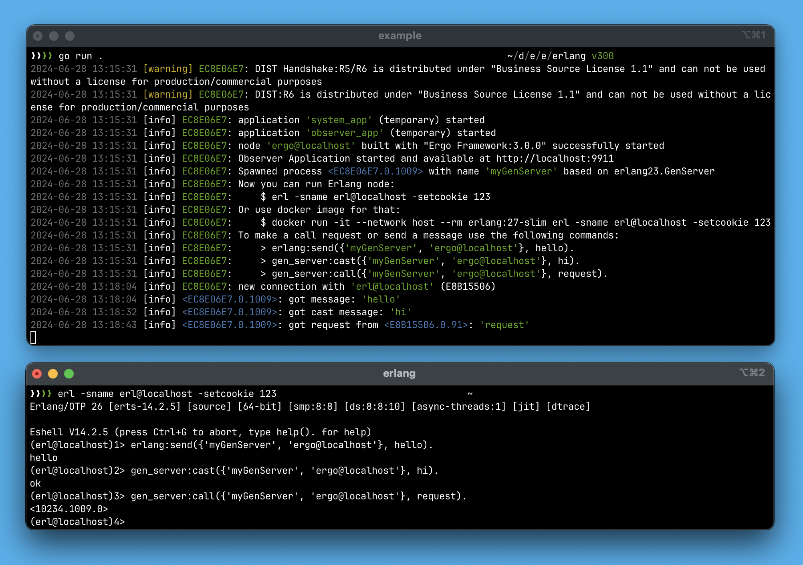

# Erlang

This package implements the Erlang network stack, including the DIST protocol, ETF data format, EPMD registrar functionality, and the Handshake mechanism.&#x20;

It is compatible with OTP-23 to OTP-27. The source code is available on the project's GitHub page at [https://github.com/ergo-services/proto](https://github.com/ergo-services/proto) in the `erlang23` directory.&#x20;

Note that the source code is distributed under the _Business Source License 1.1_ and cannot be used for production or commercial purposes without a license, which can be purchased on the project's sponsor page.

### EPMD

The `epmd` package implements the `gen.Registrar` interface. To create it, use the `epmd.Create` function with the following options:

* **Port**: Registrar port number (default: `4369`).
* **EnableRouteTLS**: Enables TLS for all `gen.Route` responses on resolve requests. This is necessary if the Erlang cluster uses TLS.
* **DisableServer**: Disables the internal server mode, useful when using the Erlang-provided `epmd` service.

To use this package, include `ergo.services/proto/erlang23/epmd`.

### Handshake

The `handshake` package implements the `gen.NetworkHandshake` interface. To create a handshake instance, use the `handshake.Create` function with the following options:

* **Flags**: Defines the supported functionality of the Erlang network stack. The default is set by `handshake.DefaultFlags()`.
* **UseVersion5**: Enables handshake version 5 mode (default is version 6).

To use this package, include `ergo.services/proto/erlang23/handshake`.

### DIST protocol

The `ergo.services/proto/erlang/dist` package implements the `gen.NetworkProto` and `gen.Connection` interfaces. To create it, use the `dist.Create` function and provide `dist.Options` as an argument, where you can specify the `FragmentationUnit` size in bytes. This value is used for fragmenting large messages. The default size is set to `65000` bytes.

To use this package, include `ergo.services/proto/erlang/dist`.&#x20;

### ETF data format&#x20;

Erlang uses the _ETF (Erlang Term Format)_ for encoding messages transmitted over the network. Due to differences in data types between Golang and Erlang, decoding received messages involves converting the data to their corresponding Golang types:

* `number` -> `int64`
* `float` number -> `float64`
* `big number` -> `big.Int`  from `math/big`, or to `int64`/`uint64`
* `map` -> `map[any]any`
* `binary` -> `[]byte`
* `list` -> `etf.List` (`[]any`)
* `tuple` -> `etf.Tuple` (`[]any`) or a registered struct type
* `string` -> `[]any`.  convert to string using `etf.TermToString`
* `atom` -> `gen.Atom`
* `pid` -> `gen.Pid`
* `ref` -> `gen.Ref`
* `ref` (alias) -> `gen.Alias`
* `atom` = true/false -> `bool`

When encoding data in the _Erlang ETF format_:

* `map` -> `map` `#{}`
* `slice`/`array` -> `list` `[]`
* `struct` -> `map` with field names as keys (considering `etf:` tags on struct fields)
* registered type of `struct` -> `tuple` with the first element being the registered struct name, followed by field values in order.&#x20;
* `[]byte` -> `binary`
* `int*`/`float*`/`big.Int` -> `number`
* `string` -> `string`
* `gen.Atom` -> `atom`
* `gen.Pid` -> `pid`
* `gen.Ref` -> `ref`
* `gen.Alias -> ref` (alias)
* `bool` -> `atom` true/false

You can also use the functions `etf.TermIntoStruct` and `etf.TermProplistIntoStruct` for decoding data. These functions take into account `etf:` tags on struct fields, allowing the values to map correctly to the corresponding struct fields when decoding `proplist` data.

To automatically decode data into a struct, you can register the struct type using `etf.RegisterTypeOf`. This function takes the object of the type being registered and decoding options `etf.RegisterTypeOption`. The options include:

* `Name` - The name of the registered type. By default, the type name is taken using the `reflect` package in the format `#/pkg/path/TypeName`&#x20;
* `Strict` - Determines whether the data must strictly match the struct. If disabled, non-matching data will be decoded into `any`.&#x20;

To be automatically decoded the data sent from Erlang must be a tuple, with the first element being an atom whose value matches the type name registered in Golang. For example:

```go
type MyValue struct{
    MyString string
    MyInt    int32
}

...
// register type MyValue with name "myvalue"
etf.RegisterTypeOf(MyValue{}, etf.RegisterTypeOptions{Name: "myvalue", Strict: true})
...
```

The values sent by an Erlang process should be in the following format:

```erlang
> erlang:send(Pid, {myvalue, "hello", 123}).
```

### Ergo-node in Erlang-cluster

If you want to use the Erlang network stack by default in your node, you need to specify this in `gen.NetworkOptions` when starting the node:

```go
import (
    "fmt"
    
    "ergo.services/ergo"
    "ergo.services/ergo/gen"
    "ergo.services/proto/erlang23/dist"
    "ergo.services/proto/erlang23/epmd"
    "ergo.services/proto/erlang23/handshake"
)

func main() {
    var options gen.NodeOptions
    
    // set cookie
    options.Network.Cookie = "123"
    
    // set Erlang Network Stack for this node
    options.Network.Registrar = epmd.Create(epmd.Options{})
    options.Network.Handshake = handshake.Create(handshake.Options{})
    options.Network.Proto = dist.Create(dist.Options{})

    // starting node
    node, err := ergo.StartNode(gen.Atom(OptionNodeName), options)
    if err != nil {
        fmt.Printf("Unable to start node '%s': %s\n", OptionNodeName, err)
        return
    }
    
    node.Wait()
}
```

In this case, all outgoing and incoming connections will be handled by the Erlang network stack. For a complete example, you can refer to the repository at [https://github.com/ergo-services/examples](https://github.com/ergo-services/examples), specifically the `erlang` project

<figure><figcaption></figcaption></figure>

If you want to maintain the ability to accept connections from Ergo nodes while using the Erlang network stack as a main one, you need to add an acceptor in the `gen.NetworkOptions` settings:

```go
import (
    "fmt"
    "ergo.services/ergo"
    "ergo.services/ergo/gen"
    
    // Ergo Network Stack
    hs "ergo.services/ergo/net/handshake"
    "ergo.services/ergo/net/proto"
    "ergo.services/ergo/net/registrar"

    // Erlang Network Stack    
    "ergo.services/proto/erlang23/dist"
    "ergo.services/proto/erlang23/epmd"
    "ergo.services/proto/erlang23/handshake"
)

func main() {
    ...
    acceptorErlang := gen.AcceptorOptions{}
    acceptorErgo := gen.AcceptorOptions{
        Registrar: registrar.Create(registrar.Options{}),
        Handshake: hs.Create(hs.Options{}),
        Proto:     proto.Create(),
    }
    options.Network.Acceptors = append(options.Network.Acceptors, 
                                    acceptorErlang, acceptorErgo)
    // starting node
    node, err := ergo.StartNode(gen.Atom(OptionNodeName), options)
```

Please note that if the list of acceptors is empty when starting the node, it will launch an acceptor with the network stack using `Registrar`, `Handshake`, and `Proto` from `gen.NetworkOptions`.&#x20;

If you set the `options.Network.Acceptor`, you must explicitly define the parameters for all necessary acceptors. In the example, `acceptorErlang` is created with empty `gen.AcceptorOptions` (the Erlang stack from `gen.NetworkOptions` will be used), while for `acceptorErgo`, the Ergo Framework stack (`Registrar`, `Handshake`, and `Proto`) is explicitly defined.

In this example, you can establish incoming and outgoing connections using the Erlang network stack. However, the Ergo Framework network stack can only be used for incoming connections. To create outgoing network connections using the Ergo Framework stack, you need to configure a static route for a group of nodes by defining a match pattern:&#x20;

```go
...
// starting node
node, err := ergo.StartNode(gen.Atom(OptionNodeName), options)
// add static route  
route := gen.NetworkRoute{
    Resolver: acceptorErgo.Registrar.Resolver(),
}
match := ".ergonodes.local"
if err := node.Network().AddRoute(match, route, 1); err != nil {
    panic(err)
}
```

For more detailed information, please refer to the [Static Routes](../../networking/static-routes.md) section.&#x20;

### Erlang-node in Ergo-cluster

If your cluster primarily uses the Ergo Framework network stack by default and you want to enable interaction with Erlang nodes, you'll need to add an acceptor using the Erlang network stack. Additionally, you must define a static route for Erlang nodes using a match pattern:

```go
import (
    "fmt"
    
    "ergo.services/ergo"
    "ergo.services/ergo/gen"
    "ergo.services/proto/erlang23/dist"
    "ergo.services/proto/erlang23/epmd"
    "ergo.services/proto/erlang23/handshake"
)

func main() {
    var options gen.NodeOptions
    
    // set cookie
    options.Network.Cookie = "123"
    
    // add acceptors
    acceptorErgo := gen.AcceptorOptions{}
    acceptorErlang := gen.AcceptorOptions{
        Registrar: epmd.Create(epmd.Options{}),
        Handshake: handshake.Create(handshake.Options{}),
        Proto:     dist.Create(dist.Options{}),
    }
    options.Network.Acceptors = append(options.Network.Acceptors, 
                                    acceptorErgo, acceptorErlang)

    // starting node
    node, err := ergo.StartNode(gen.Atom(OptionNodeName), options)
    if err != nil {
        fmt.Printf("Unable to start node '%s': %s\n", OptionNodeName, err)
        return
    }
    
    // add static route  
    route := gen.NetworkRoute{
        Resolver: acceptorErlang.Registrar.Resolver(),
    }
    if err := node.Network().AddRoute(".erlangnodes.local", route, 1); err != nil {
        panic(err)
    }
    
    node.Wait()
}
```

### Actor `GenServer`

The `erlang23.GenServer` actor implements the low-level `gen.ProcessBehavior` interface, enabling it to handle messages and synchronous requests from processes running on an Erlang node. The following message types are used for communication in Erlang:

* regular messages - sent from Erlang using `erlang:send` or the `Pid ! message` syntax
* cast-messages - sent from Erlang with `gen_server:cast`
* call-requests - from Erlang made with `gen_server:call`

`erlang23.GenServer` uses the `erlang23.GenServerBehavior` interface to interact with your object. This interface defines a set of callback methods for your object, which allow it to handle incoming messages and requests. All methods in this interface are optional, meaning you can choose to implement only the ones relevant to your specific use case:

```go
type GenServerBehavior interface {
	gen.ProcessBehavior

	Init(args ...any) error
	HandleInfo(message any) error
	HandleCast(message any) error
	HandleCall(from gen.PID, ref gen.Ref, request any) (any, error)
	Terminate(reason error)

	HandleEvent(message gen.MessageEvent) error
	HandleInspect(from gen.PID, item ...string) map[string]string
}
```

The callback method `HandleInfo` is invoked when an asynchronous message is received from an Erlang process using `erlang:send` or via the `Send*` methods of the `gen.Process` interface. The `HandleCast` callback method is called when a cast message is sent using `gen_server:cast` from an Erlang process. Synchronous requests sent with `gen_server:call` or `Call*` methods are handled by the `HandleCall` callback method.

If your actor only needs to handle regular messages from Erlang processes, you can use the standard `act.Actor` and process asynchronous messages in the `HandleMessage` callback method.

To start a process based on `erlang23.GenServer`, create an object embedding `erlang23.GenServer` and implement a factory function for it.&#x20;

Example:

```go
import "ergo.services/proto/erlang23"

func factory_MyActor gen.ProcessBehavior {
    return &MyActor{}
}

type MyActor struct {
    erlang23.GenServer
}
```

To send a cast message, use the `Cast` method of `erlnag23.GenServer`.

```go
func (ma *MyActor) HandleInfo(message any) error {
    ...
    ma.Cast(Pid, "cast message")
    return nil
}
```

To send regular messages, use the `Send*` methods of the embedded `gen.Process` interface. Synchronous requests are made using the `Call*` methods of the `gen.Process` interface.

Like `act.Actor`, an actor based on `erlang23.GenServer` supports the `TrapExit` functionality to intercept exit signals. Use the `SetTrapExit` and `TrapExit` methods of your object to manage this functionality, allowing your process to handle exit signals rather than terminating immediately when receiving them.
