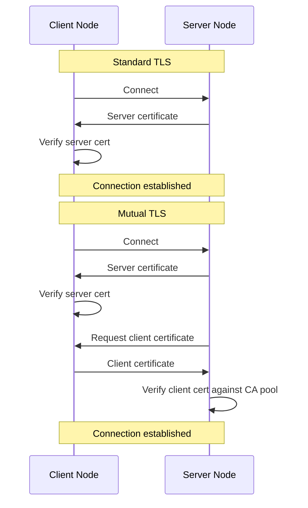

# Mutual TLS

Standard TLS provides server authentication - the client verifies the server's certificate. The server accepts any client that completes the TLS handshake. This works for public services where you want encryption but don't need to verify client identity.

Mutual TLS (mTLS) adds client authentication. The server presents its certificate, and the client presents its certificate too. Both sides verify each other. Only clients with certificates signed by a trusted CA can connect. This provides strong authentication for internal services where you control both ends.



## CertAuthManager

The `gen.CertManager` interface handles server certificates with runtime updates. For mTLS, you need additional configuration: CA pools for certificate verification and client authentication settings.

`gen.CertAuthManager` extends `CertManager` with these capabilities:

```go
type CertAuthManager interface {
    CertManager

    // server-side: CA pool to verify client certificates
    SetClientCAs(pool *x509.CertPool)
    ClientCAs() *x509.CertPool

    // client-side: CA pool to verify server certificates
    SetRootCAs(pool *x509.CertPool)
    RootCAs() *x509.CertPool

    // server-side: client authentication policy
    SetClientAuth(auth tls.ClientAuthType)
    ClientAuth() tls.ClientAuthType

    // client-side: server name for SNI and verification
    SetServerName(name string)
    ServerName() string
}
```

All settings support runtime updates. Change CA pools, rotate certificates, or modify authentication policies without restarting the node.

## Server-Side Configuration

Configure an acceptor to require client certificates:

```go
// Load server certificate
serverCert, err := tls.LoadX509KeyPair("server.pem", "server-key.pem")
if err != nil {
    panic(err)
}

// Load CA certificate for verifying clients
caCert, err := os.ReadFile("ca.pem")
if err != nil {
    panic(err)
}
clientCAs := x509.NewCertPool()
clientCAs.AppendCertsFromPEM(caCert)

// Create CertAuthManager
certManager := gen.CreateCertAuthManager(serverCert)
certManager.SetClientCAs(clientCAs)
certManager.SetClientAuth(tls.RequireAndVerifyClientCert)

// Configure acceptor
node, err := ergo.StartNode("server@localhost", gen.NodeOptions{
    Network: gen.NetworkOptions{
        Acceptors: []gen.AcceptorOptions{
            {
                Port:        15000,
                CertManager: certManager,
            },
        },
    },
})
```

The `ClientAuth` setting controls how strictly client certificates are enforced:

| Value | Behavior |
|-------|----------|
| `tls.NoClientCert` | Don't request client certificate (default) |
| `tls.RequestClientCert` | Request but don't require |
| `tls.RequireAnyClientCert` | Require certificate, don't verify against CA |
| `tls.VerifyClientCertIfGiven` | Verify against CA if provided |
| `tls.RequireAndVerifyClientCert` | Require and verify against CA |

For secure internal communication, use `RequireAndVerifyClientCert`.

## Client-Side Configuration

Configure a static route to present a client certificate:

```go
// Load client certificate
clientCert, err := tls.LoadX509KeyPair("client.pem", "client-key.pem")
if err != nil {
    panic(err)
}

// Load CA certificate for verifying server
caCert, err := os.ReadFile("ca.pem")
if err != nil {
    panic(err)
}
rootCAs := x509.NewCertPool()
rootCAs.AppendCertsFromPEM(caCert)

// Create CertAuthManager
certManager := gen.CreateCertAuthManager(clientCert)
certManager.SetRootCAs(rootCAs)
certManager.SetServerName("server.example.com") // for SNI

// Configure static route
route := gen.NetworkRoute{
    Route: gen.Route{
        Host: "10.0.1.50",
        Port: 15000,
        TLS:  true,
    },
    Cert: certManager,
}

node.Network().AddRoute("server@localhost", route, 100)
```

When connecting to `server@localhost`, the node presents `clientCert` and verifies the server's certificate against `rootCAs`.

## Runtime Updates

Both server and client configurations support live updates:

```go
// Rotate CA pool (e.g., adding new CA, removing compromised one)
newCACert, _ := os.ReadFile("new-ca.pem")
newPool := x509.NewCertPool()
newPool.AppendCertsFromPEM(newCACert)

certManager.SetClientCAs(newPool) // server-side
certManager.SetRootCAs(newPool)   // client-side

// Rotate certificate
newCert, _ := tls.LoadX509KeyPair("new.pem", "new-key.pem")
certManager.Update(newCert)

// Change authentication policy
certManager.SetClientAuth(tls.VerifyClientCertIfGiven)
```

Changes take effect for new connections. Existing connections continue with their original settings until they close.

## Complete Example

A cluster where all nodes authenticate each other:

```go
func startSecureNode(name string) (gen.Node, error) {
    // Each node has its own certificate signed by the cluster CA
    cert, err := tls.LoadX509KeyPair(
        fmt.Sprintf("%s.pem", name),
        fmt.Sprintf("%s-key.pem", name),
    )
    if err != nil {
        return nil, err
    }

    // All nodes trust the same CA
    caCert, err := os.ReadFile("cluster-ca.pem")
    if err != nil {
        return nil, err
    }
    caPool := x509.NewCertPool()
    caPool.AppendCertsFromPEM(caCert)

    // Server-side: accept connections with valid client certs
    serverCertManager := gen.CreateCertAuthManager(cert)
    serverCertManager.SetClientCAs(caPool)
    serverCertManager.SetClientAuth(tls.RequireAndVerifyClientCert)

    // Client-side: present cert when connecting, verify servers
    clientCertManager := gen.CreateCertAuthManager(cert)
    clientCertManager.SetRootCAs(caPool)

    return ergo.StartNode(gen.Atom(name), gen.NodeOptions{
        Network: gen.NetworkOptions{
            Acceptors: []gen.AcceptorOptions{
                {
                    Port:        15000,
                    CertManager: serverCertManager,
                },
            },
            Routes: []gen.NetworkRoute{
                {
                    Match: ".*", // all nodes use mTLS
                    Route: gen.Route{TLS: true},
                    Cert:  clientCertManager,
                },
            },
        },
    })
}
```

This configuration ensures:
- All incoming connections must present a valid certificate signed by `cluster-ca.pem`
- All outgoing connections present this node's certificate
- Both sides verify each other against the shared CA

## Using CertManager vs CertAuthManager

Use `gen.CertManager` (via `gen.CreateCertManager`) when you only need server certificates without client authentication. This is simpler and sufficient for:
- Public-facing services with TLS encryption
- Connections where you trust any client that can reach you
- Development and testing

Use `gen.CertAuthManager` (via `gen.CreateCertAuthManager`) when you need:
- Client certificate verification (mTLS)
- Custom CA pools for certificate validation
- SNI configuration for connecting to specific server names

`CertAuthManager` embeds `CertManager`, so it works everywhere `CertManager` works. The framework detects the interface type and uses the additional settings when available.

## Troubleshooting

**Connection rejected with certificate error**

Verify the client certificate is signed by a CA in the server's `ClientCAs` pool. Check certificate expiration dates. Ensure the certificate chain is complete.

**Server certificate verification failed**

The server's certificate must be signed by a CA in the client's `RootCAs` pool. If using self-signed certificates, add them directly to the pool or set `InsecureSkipVerify: true` (development only).

**SNI mismatch**

If the server uses virtual hosting or the certificate's Common Name doesn't match the connection address, set `ServerName` on the client's `CertAuthManager` to the expected server name.

**Changes not taking effect**

Updates apply to new connections only. Existing connections use their original settings. For immediate effect, close existing connections (they'll reconnect with new settings).
