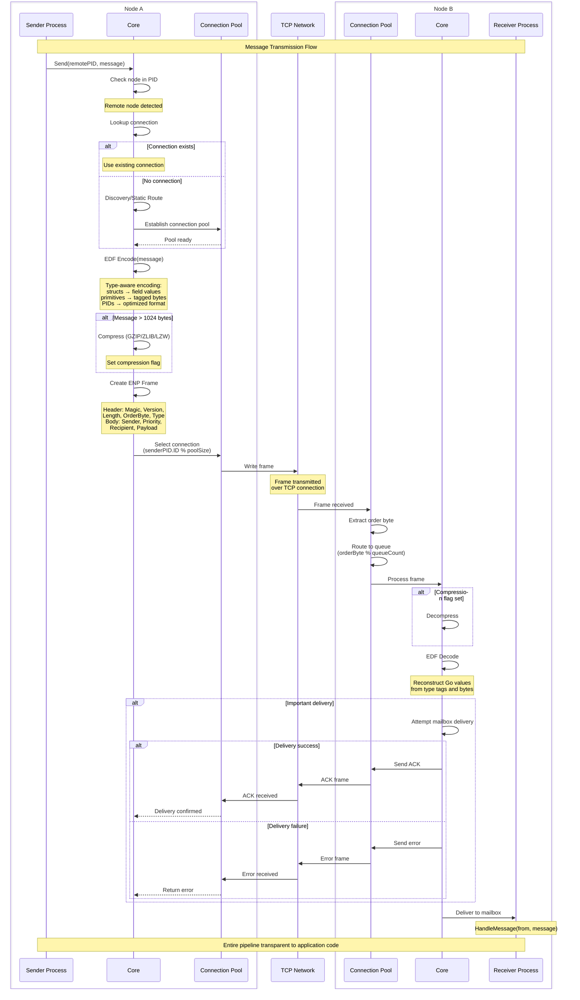

# Network Transparency

Network transparency means the location of a process - whether it's in the same goroutine, on the same node, or on a remote node halfway across the world - doesn't change how you interact with it. You send messages the same way. You make calls with the same API. You establish links and monitors with the same methods. The framework handles the complexity of discovering nodes, encoding messages, and routing them across the network.

This isn't just convenient. It's fundamental to building distributed systems in the actor model. If remote operations looked different from local operations, you'd be constantly checking location and branching your logic. That locality awareness would spread throughout your code, making it brittle and hard to reason about. Network transparency lets you design systems as collections of communicating actors, and deployment topology becomes an operational concern rather than a code concern.

But transparency has limits. Networks are slower than in-process communication. They fail in ways local operations don't. Messages can be lost. Connections drop. Remote nodes crash or become unreachable. The framework makes remote operations look local, but the network's physical reality still matters.

## What Transparency Means in Practice

Consider a simple example. You have a `gen.PID` and you want to send it a message:

```go
process.Send(pid, OrderRequest{OrderID: 12345, Items: []string{"item1", "item2"}})
```

This code is identical whether `pid` points to a local process or a remote one. You don't check. You don't call different methods. You just send.

Behind the scenes, the framework does different things:

**For a local process**: The message is placed directly in the recipient's mailbox queue. The framework checks the priority, selects the appropriate queue (Main, System, or Urgent), and pushes the message. If the process is sleeping, it wakes up. The entire operation happens in microseconds.

**For a remote process**: The node extracts the node name from the `gen.PID`, checks if a connection to that node exists, discovers the node's address if needed, establishes a connection pool if necessary, encodes your `OrderRequest` using EDF, wraps it in a protocol frame, sends it over TCP, and waits for the remote node to acknowledge delivery. The remote node receives the frame, decodes it, routes it to the recipient's mailbox, and sends an acknowledgment back. This takes milliseconds.

From your code's perspective, both operations look identical. The framework abstracts the complexity.

## The Transparency Illusion

Network transparency is an illusion carefully maintained by the framework. Several mechanisms work together to create this effect.

**Unified addressing** - Every process has a `gen.PID` that includes the node name. Local and remote processes have the same identifier structure. You don't need different types for "local process" and "remote process". A `gen.PID` is just a `gen.PID`, and it works everywhere.

**Automatic routing** - When you send to a process, the framework examines the node portion of the identifier. If it matches the local node, the message is delivered locally. If it doesn't match, the framework initiates discovery to find the remote node and routes the message over the network. You don't trigger this logic explicitly - it happens automatically.

**Location independence** - You can receive a `gen.PID` from anywhere - as a return value, in a message, from a registry lookup - and immediately use it for communication. You don't need to check where it's from or set up connections. The framework handles it.

**Failure semantics** - When you send to a local process that doesn't exist, you get an error immediately. When you send to a remote process that doesn't exist, you get... nothing, by default. The message is sent over the network, and if nobody's listening, it's silently dropped. This asymmetry breaks the transparency illusion. The Important delivery flag fixes this: with Important enabled, sending to a missing remote process gives you an immediate error, just like local delivery. The framework makes the network behave like local memory.

## How Messages Cross The Network

When you send a message to a remote process, what actually happens? The framework performs a complex series of operations to transform your Go value into bytes, transmit them over TCP, and reconstruct them on the receiving side. Understanding this flow helps you design efficient distributed systems and debug problems when they arise.

The sequence diagram below shows the complete message transmission pipeline, from the moment you call `Send` to the moment the recipient's `HandleMessage` is invoked:



When you send a message, the framework:

1. **Encodes** your value using EDF, transforming it into a byte sequence
2. **Compresses** it if the message exceeds the compression threshold (default 1024 bytes)
3. **Frames** it with protocol headers containing metadata (message type, sender, recipient, priority)
4. **Transmits** the frame over one of the TCP connections in the pool to the remote node
5. **Receives acknowledgment** if Important delivery is enabled

The remote node reverses this:

1. **Reads** the frame from the TCP connection
2. **Decompresses** if the compression flag is set
3. **Decodes** the bytes back into a Go value using EDF
4. **Routes** the message to the recipient's mailbox
5. **Sends acknowledgment** back if Important delivery was requested

This entire pipeline is invisible. You call `Send`, and the framework executes these steps. The receiving process calls `HandleMessage`, and it receives your value as if you'd passed it locally.

## EDF: Ergo Data Format

EDF (Ergo Data Format) is a binary serialization format designed for distributed actor systems. It solves a fundamental problem: how do you serialize Go values - structs, slices, maps, framework types like `gen.PID` - across the network with the performance of code-generated serializers like Protocol Buffers, but without requiring code generation?

The answer is dynamic specialization. When you register a type, EDF analyzes its structure and builds specialized encoding and decoding functions specifically for that type. For structs, it creates functions for each field and composes them into a single encoder. This happens once at registration time, not during encoding. When you send a message, EDF uses these pre-built functions - no reflection, no runtime type analysis.

```go
type Order struct {
    ID    int64
    Items []string
}

func (a *MyApp) Load(args ...any) (gen.ApplicationSpec, error) {
    if err := a.Node().Network().RegisterType(Order{}); err != nil {
        return gen.ApplicationSpec{}, err
    }
    return gen.ApplicationSpec{ /* ... */ }, nil
}

// Later, during message sending:
process.Send(to, Order{ID: 42, Items: []string{"item1"}})  // Uses pre-built encoder
```

This approach delivers Protocol Buffers-class performance without `.proto` files or `protoc` code generation.

Registration happens at runtime - no build step, no generated files. You call `node.Network().RegisterType()` from your application's `Load()` callback, and the framework builds the optimized encoders. Framework types like `gen.PID`, `gen.Ref`, and `gen.Event` have native support with specialized encodings. During node handshake, both sides exchange their registered type lists and negotiate short numeric IDs, turning a full type name into 3 bytes on the wire. Field names aren't encoded - only field values in declaration order.

Performance benchmarks (see `benchmarks/serial/`) show encoding is 50-100% faster than Protocol Buffers, while decoding is 20-60% slower. The encoding advantage comes from the specialized functions built during registration.

EDF enforces strict type contracts - both nodes must register identical type definitions. Type identity is the full package path plus type name, not just the type name. For example, `Order` in package `github.com/myapp/orders` becomes `#github.com/myapp/orders/Order`. Two packages with the same type name `Order` are different types in EDF - this is Go's type system enforced at the protocol level.

This strict typing is a deliberate design choice that pushes version management to the application level. When you need to evolve a message type, you version it explicitly in your code:

```go
package orders

type OrderV1 struct { ID int64 }                    // #github.com/myapp/orders/OrderV1
type OrderV2 struct { ID int64; Priority int }      // #github.com/myapp/orders/OrderV2
```

Your actors handle both versions, routing logic based on the type received. Each node declares what it understands, and the application code manages compatibility - explicit and visible. This strict-by-default behavior suits contracts where every change should be a deliberate decision.

When your domain favors deployment velocity instead, the `EnableSchemaEvolution` network flag opts into protocol-level tolerance for appended fields: enabled on both nodes, adding a field to the end of a struct keeps the same type, and a node that has not learned the field skips it. It is a per-connection capability, off by default. Which model fits is a business decision - see [Message Versioning](../advanced/message-versioning.md).

### Type Constraints

EDF imposes size limits on certain types. These limits balance memory safety with practical message sizes.

**Atoms** (`gen.Atom`) - Maximum 255 bytes. Atoms are used for names - node names, process names, event names. Names longer than 255 bytes are uncommon and likely indicate a design issue. The 255-byte limit keeps name handling efficient.

**Strings** - Maximum 65,535 bytes (2^16-1). This covers most string use cases. For larger text (documents, logs, large payloads), use binary encoding (`[]byte`) instead, which supports up to 4GB.

**Errors** - Maximum 32,767 bytes (2^15-1). Error messages longer than 32KB are unusual. If you need to send detailed diagnostic information, use a separate field in your message struct.

**Binary** (`[]byte`) - Maximum 4,294,967,295 bytes (2^32-1, ~4GB). This is the largest single value EDF can encode. Messages containing multi-gigabyte binaries work but are inefficient. Consider chunking large data into multiple messages or using meta processes for streaming.

**Collections** (map, array, slice) - Maximum 2^32 elements. A map can have up to 4 billion entries. A slice can have 4 billion elements. These limits are unlikely to be hit in practice - a slice of 4 billion int64 values would consume 32GB of memory.

**Evolvable structs** - With the `EnableSchemaEvolution` network flag active on a connection, a single encoded struct is bounded at just under 4GB. Without the flag there is no separate per-struct size cap. See [Message Versioning](../advanced/message-versioning.md#schema-evolution).

These limits are enforced during encoding. If you attempt to encode a 70,000 byte string, the encoder returns an error. The message isn't sent. On the receiving side, if a malicious sender tries to send an oversized value, the decoder rejects it and closes the connection.

## Type Registration Requirements

For custom types to cross the network, both sending and receiving nodes must register them. Registration tells the active wire-format proto how to encode and decode the type, and creates a numeric ID that's shared during handshake for efficient encoding.

The preferred way is to declare wire-format values in the application's spec. The framework registers them during `ApplicationLoad`, before any process in the application is spawned:

```go
type Order struct {
    ID    int64
    Items []string
}

func (a *MyApp) Load(args ...any) (gen.ApplicationSpec, error) {
    return gen.ApplicationSpec{
        Name: "myapp",
        Network: gen.ApplicationNetwork{
            RegisterTypes: []any{Order{}, Customer{}, Address{}},
        },
        Group: []gen.ApplicationMemberSpec{ /* ... */ },
    }, nil
}
```

If the node's network mode is `NetworkModeDisabled`, the entries are silently ignored. The application loads as usual.

The imperative form remains available for dynamic cases (registering types based on runtime configuration):

```go
func (a *MyApp) Load(args ...any) (gen.ApplicationSpec, error) {
    if err := a.Node().Network().RegisterType(Order{}); err != nil {
        return gen.ApplicationSpec{}, err
    }
    return gen.ApplicationSpec{ /* ... */ }, nil
}
```

`Network().RegisterType` distributes registration across every active wire-format proto (e.g., the default ENP/EDF stack). If your node has multiple wire-format protocols configured (for example, a previous-generation ENP and a newer one running side by side), one call registers in all of them. The call fails if any proto rejects the type. Wire-format consistency is enforced strictly to prevent silent split-brain registries.

For batch registration of multiple types, use `RegisterTypes` (see the **Nested types** subsection below for the dependency-resolution behavior):

```go
func (a *MyApp) Load(args ...any) (gen.ApplicationSpec, error) {
    err := a.Node().Network().RegisterTypes([]any{
        Order{},
        Customer{},
        Address{},
    })
    if err != nil {
        return gen.ApplicationSpec{}, err
    }
    return gen.ApplicationSpec{ /* ... */ }, nil
}
```

`RegisterTypes` resolves inter-type dependencies internally. You can list types in any order, and the framework figures out the correct registration sequence. The same is true for the `Network.RegisterTypes` field in `ApplicationSpec`: order in the slice is irrelevant.

### Registration Requirements

**Only exported fields** - Structs must have all fields exported (starting with uppercase). This is by design: exported fields define your actor's contract. When actors communicate - locally or across the network - they exchange messages according to explicit contracts. Unexported fields are implementation details, internal state that shouldn't cross actor boundaries. If registration encounters unexported fields, it fails with `"struct Order has unexported field(s)"`.

```go
type Order struct {
    ID    int64   // Exported - part of the contract
    items []Item  // Unexported - internal state, registration fails
}
```

**Excluding fields from wire encoding** - If your struct must hold internal state alongside its public contract (caches, file handles, runtime pointers, anything that doesn't make sense for a remote actor), tag those fields with `edf:"-"`. Tagged fields are skipped during encode and left as their zero value during decode. The tag works on both exported and unexported fields, so it is also the way to register a type with private internal state.

```go
type Order struct {
    ID    int64                  // part of the contract
    items []Item     `edf:"-"`   // unexported internal state, skipped
    cache *LocalCache `edf:"-"`  // exported but runtime-only, skipped
}
```

Without `edf:"-"` the unexported `items` would cause registration to fail. With it, only `ID` participates in the wire format. This is the right escape hatch when the type as a whole must travel across the network but specific fields cannot be serialized.

**Pointer types** - Starting from version 3.3, EDF supports pointer types. Pointers can be `nil` or point to a value, and this state is preserved during encoding/decoding. Nested pointers (`**int`) are not supported.

```go
var discount *float64           // nil or value
var prices []*int               // slice with nil elements
var cache map[string]*Config    // map with nil values

type Order struct {
    Priority *int  // optional field
}
```

Note that pointers to external resources like `*Database` or `*Connection` are meaningless to a remote actor - it cannot dereference your memory address. Use pointers for optional value semantics, not for sharing local resources. For distributed references, use framework types: `gen.PID`, `gen.Alias`, `gen.Ref`.

**Nested types** - If your type contains other custom types, the inner types must be registered before the outer type. Use `RegisterTypes` (batch) which resolves dependency order automatically:

```go
type Address struct {
    City   string
    Street string
}

type Person struct {
    Name    string
    Address Address
}

func (a *MyApp) Load(args ...any) (gen.ApplicationSpec, error) {
    // Order in the slice doesn't matter. The framework registers
    // inner types first and retries until everything resolves.
    err := a.Node().Network().RegisterTypes([]any{Person{}, Address{}})
    if err != nil {
        return gen.ApplicationSpec{}, err
    }
    return gen.ApplicationSpec{ /* ... */ }, nil
}
```

If you call `RegisterType` (singular) on `Person` before `Address`, registration fails with `"type Address must be registered first"`. With `RegisterTypes`, the framework iteratively retries pending types whose dependencies become available. Only types that genuinely cannot be resolved produce an error. Registration builds the encoding schema by examining fields; once `Address` is registered, registering `Person` references its schema for efficient nested encoding.

### Custom Marshaling for Special Cases

If you only need to exclude specific fields, prefer the `edf:"-"` tag (see above) - it is lighter than implementing a full marshaler. Reach for custom marshaling when the type itself needs an alternative on-wire representation, for example to compact a complex value, to maintain backward compatibility with an old wire format, or to integrate with an external serialization scheme.

```go
type Config struct {
    public  string
    private int
}

// Option 1: edf.Marshaler/Unmarshaler (recommended for performance)
func (c Config) MarshalEDF(w io.Writer) error {
    buf := make([]byte, 0, 256)
    buf = append(buf, c.public...)
    buf = binary.BigEndian.AppendUint64(buf, uint64(c.private))
    _, err := w.Write(buf)
    return err
}

func (c *Config) UnmarshalEDF(b []byte) error {
    c.public = string(b[:len(b)-8])
    c.private = int(binary.BigEndian.Uint64(b[len(b)-8:]))
    return nil
}

// Option 2: encoding.BinaryMarshaler/Unmarshaler (standard interface)
func (c Config) MarshalBinary() ([]byte, error) {
    buf := make([]byte, 0, 256)
    buf = append(buf, c.public...)
    buf = binary.BigEndian.AppendUint64(buf, uint64(c.private))
    return buf, nil
}

func (c *Config) UnmarshalBinary(b []byte) error {
    c.public = string(b[:len(b)-8])
    c.private = int(binary.BigEndian.Uint64(b[len(b)-8:]))
    return nil
}
```

EDF supports both `edf.Marshaler`/`Unmarshaler` and Go's standard `encoding.BinaryMarshaler`/`Unmarshaler` interfaces. The key difference is performance: `edf.Marshaler` writes directly to EDF's internal buffer (`io.Writer`), avoiding intermediate allocations. When you call `MarshalEDF(w)`, the `io.Writer` is EDF's reusable buffer - your bytes go straight to the wire. With `encoding.BinaryMarshaler`, you must allocate and return a `[]byte`, which EDF then copies into its buffer.

For high-throughput message types, prefer `edf.Marshaler`. For types that implement standard interfaces or rarely-sent messages, `encoding.BinaryMarshaler` works fine.

### Encoding Errors

Go's `error` type is an interface, which means encoding it across the network requires extra care. Two things matter to user code: the error text on the receiver, and whether `errors.Is` against a known sentinel still works.

Framework errors in the `gen.Err*` set (`gen.ErrProcessUnknown`, `gen.TerminateReasonNormal`, `gen.ErrExceeded`, and the rest) are pre-registered out of the box. Their identity is preserved automatically across nodes. The `act.Err*` set is local to the actor library and not pre-registered for the wire: those errors are returned only from local management APIs and don't cross the network in the default framework path.

Application errors must be registered on every node that needs to compare against them. The declarative form lives in `ApplicationSpec.Network`:

```go
var (
    ErrInvalidOrder = errors.New("invalid order")
    ErrOutOfStock   = errors.New("out of stock")
)

func (a *MyApp) Load(args ...any) (gen.ApplicationSpec, error) {
    return gen.ApplicationSpec{
        Name: "myapp",
        Network: gen.ApplicationNetwork{
            RegisterErrors: []error{ErrInvalidOrder, ErrOutOfStock},
        },
        Group: []gen.ApplicationMemberSpec{ /* ... */ },
    }, nil
}
```

Imperative equivalents are `Network().RegisterError` (single) and `Network().RegisterErrors` (batch). The same shape applies to atoms via `Network.RegisterAtoms` and `Network().RegisterAtom`/`Network().RegisterAtoms`.

If both peers have a sentinel registered, the receiver decodes it to its own local instance, so `errors.Is(err, ErrInvalidOrder)` returns true across the network. If the sender has not registered it, the error arrives with the correct text but a fresh identity, and `errors.Is` against the original sentinel returns false. Code that branches on identity needs the sentinel registered on the sender side.

Sentinels have to be `errors.New` values. `gen.Errorf` produces a `*gen.Error`, which the error cache refuses to register: the encoder has a dedicated branch for `*gen.Error` and takes it before it consults the cache, so a registered chain would still be encoded field by field and rebuilt as a new value on the receiver, leaving `errors.Is` false against the original. The text arrives intact, which is what makes this mistake invisible in logs and in single-node tests.

Structure is the other limit. In a field declared as `error`, two things keep it: a sentinel value registered on both peers, and `*gen.Error`. A concrete error type of your own keeps nothing - `RegisterType` refuses any type that implements `error`, and the error encoder consults neither the type registry nor a custom `MarshalEDF`, so such a value goes on the wire as its `Error()` text and arrives as a plain error. Anything structured that the receiver has to compute with belongs in a typed field beside the error rather than inside it.

### Preserving Wrap Chains Across the Network

`fmt.Errorf("...: %w", err)` is the standard Go idiom for wrapping. Locally it works as expected: `errors.Is` and `errors.Unwrap` follow the chain. Across the network, the chain collapses to a flat string: the receiver sees the correct `err.Error()` text, but `errors.Is(err, originalMarker)` returns false and `errors.Unwrap(err)` returns nil.

`gen.Errorf` is the drop-in replacement that preserves the chain end-to-end:

```go
return gen.Errorf("user %d: %w", userID, ErrPaymentDeclined)
// on the receiver:
//   err.Error()                        // "user 42: payment declined"
//   errors.Is(err, ErrPaymentDeclined) // true
//   errors.As(err, &target)            // finds a typed cause at any depth
```

Reading such an error on the receiver is no different from reading it locally; the shapes a chain can take and the rules for inspecting them are described under [gen.Error](../basics/generic-types.md#errors).

Multiple `%w` (Go 1.20+) work the same way: `gen.Errorf("%w and %w", a, b)` makes both `a` and `b` reachable via `errors.Is`.

For wrapped markers to keep identity, the same registration rule applies as for a bare sentinel: each `%w` marker must be registered on both peers. Otherwise the message text is intact but the wrapped sentinel arrives as a fresh instance.

All the shapes a wrap chain can take survive the trip - one cause, several at one level, nesting to any depth. The encoder walks `Wrapped` recursively and encodes each cause the way it would encode a top-level one: by cache id when it is a registered marker, structurally when it is itself a `*gen.Error`. Depth is bounded by `Options.MaxDepth`.

What does not survive is the identity of an intermediate `*gen.Error`. Only registered markers keep identity, and a nested chain is rebuilt on the receiver as a new value, so `errors.Is` against a package-level `*gen.Error` is false on the far side while being true locally. An error contract therefore has to be exercised across a real connection or an `edf.Encode`/`edf.Decode` round-trip: a single-node test passes either way.

Cross-network preservation of the chain is gated by `NetworkFlags.EnableWrappedErrors`, which is on by default. When either peer has it disabled (typically an older node), `gen.Errorf` falls back to flat-text behavior just like `fmt.Errorf` would.

Three different losses look identical on the receiver - the text is intact and `errors.Is` returns false: a sentinel the sender never registered, a peer with `EnableWrappedErrors` disabled, and an error the encoder cannot represent structurally. When identity stops matching, check registration on both sides before anything else.

`errors.Join(a, b)` is not preserved across the network. Use `gen.Errorf("%w\n%w", a, b)` if you need identity for multiple causes.

### Error Classification Across Nodes

A wrap chain does not describe causality, it describes membership. Every `%w` marker states that this failure belongs to that group, and `errors.Is` is the membership test. The set is flat - the wire carries markers, not a hierarchy - so the sender has to state every membership the receiver is going to test.

That makes two levels the natural shape for an error contract: a narrow marker for the specific failure, and a broader one shared by everything of that kind.

```go
var (
    ErrCodeInvalidArgument = errors.New("code:1234")     // the group
    ErrInvalidArgA         = errors.New("invalid arg A") // a member
    ErrInvalidArgB         = errors.New("invalid arg B") // a member
)

return gen.Errorf("unable to perform request %s: %w %w",
    target, ErrInvalidArgB, ErrCodeInvalidArgument)
```

The receiver tests whichever level it cares about, with no string handling either way:

```go
if errors.Is(err, ErrCodeInvalidArgument) {
    // anything of this kind, including members added later
}
if errors.Is(err, ErrInvalidArgB) {
    // this exact failure
}
```

The property worth having is what happens when the two sides drift apart: the group marker is registered independently of its members, so a receiver that knows only the group correctly classifies failures it has never heard of. The sender can add a member without a coordinated release, and the specific text is still in the message for whoever reads the log. Only a new group marker needs both sides to agree.

Expressing the hierarchy in the data instead does not work. A group marker built as `gen.Errorf("code:1234: %w", ErrInvalidArgB)` cannot be registered, so it arrives as a freshly built value: the marker at the bottom of the chain still matches, the group itself no longer does. Wrap both markers at the call site, or keep the member-to-group mapping as a table on the receiving side.

Two consequences follow from the set being flat. A membership the sender forgot to state is simply absent, and the receiver's coarse test returns false with nothing to say why. And a receiver that walks a list of markers and takes the first match has to order that list deliberately, most specific first, because the wire can carry a member and its group side by side.

## Type Registration Timing

Type registration must happen before connection establishment. During handshake, nodes exchange their registered type lists and error lists. These lists become the encoding dictionaries for that connection.

Registering a type after a connection is established does not break that connection. The dictionary is a compression device, not a gate: when a type has no cache id for this connection, the encoder writes its full canonical name instead, and the receiver resolves that name against the types **it** has registered. Nothing checks the peer's list before sending.

What the missing entry costs is size, and what it requires is symmetry. The name travels with every message rather than a two-byte id, and the receiving node must have registered the same type - otherwise it fails there, at decode, with "unknown reg type". Reconnecting is worth doing to get the compact ids back on a hot path, not to make the type usable.

The recommended place to register types is the application's `Load` callback. Applications are loaded after the network stack is initialized but before any outgoing or incoming traffic, so all types end up in the handshake dictionaries. An application owns its message types and registers them itself, keeping registration co-located with the code that defines the types.

For dynamic type registration (registering types based on runtime configuration or plugin loading), the options differ in cost rather than in whether they work:

**Register before any traffic** - Load your configuration, determine which types you need, register them in your application's `Load()` callback. This is the one that gets you cache ids on every connection.

**Register late on both sides** - `node.Network().RegisterType` on each node that will encode or decode the type. Messages flow immediately, carrying the full type name until the next handshake replaces it with an id. Reconnect if that overhead matters on the path in question.

**Use custom marshaling** - Implement `edf.Marshaler`/`Unmarshaler` or `encoding.BinaryMarshaler`/`Unmarshaler`. These don't require pre-registration - they work immediately. The tradeoff is you write the encoding logic yourself.

Most applications register types statically from `Load()` and avoid these complications.

## Legacy Registration API

Earlier versions of the framework exposed registration as package-level functions on `ergo.services/ergo/net/edf`:

```go
// Deprecated. Use node.Network().RegisterType / RegisterError / RegisterAtom instead.
edf.RegisterTypeOf(Order{})
edf.RegisterError(ErrInvalidOrder)
edf.RegisterAtom("my_atom")
```

These functions remain for backward compatibility but are **deprecated**. They write directly into the EDF package state, bypassing the `gen.Network` abstraction. In a multi-proto setup (more than one wire-format proto registered on the node), they only register in EDF, and other protos won't see the type. The new `Network` API distributes registration to every active wire-format proto strictly.

Prefer the declarative `ApplicationSpec.Network` field, or, for dynamic cases, `node.Network().RegisterType` / `RegisterTypes` / `RegisterError` / `RegisterErrors` / `RegisterAtom` / `RegisterAtoms` from your application's `Load()` callback. The package-level functions emit a one-time deprecation warning when called from user code.

## Compression

Large messages are automatically compressed to reduce network bandwidth. Compression is transparent - you configure it on the process or node, and the framework applies it automatically when appropriate.

When compression is enabled, the framework checks the encoded message size before transmission. If it exceeds the compression threshold (default 1024 bytes), the message is compressed using the configured algorithm. The protocol frame's message type (byte 7) is set to `0xc8` (200, protoMessageZ) and byte 8 contains the compression type ID (100=LZW, 101=ZLIB, 102=GZIP), so the receiving node knows to decompress before decoding.

Configure compression in process options:

```go
pid, err := node.Spawn(createWorker, gen.ProcessOptions{
    Compression: gen.Compression{
        Enable:    true,
        Type:      gen.CompressionTypeGZIP,
        Level:     gen.CompressionDefault,
        Threshold: 1024,
    },
})
```

Or adjust it dynamically:

```go
process.SetCompression(true)
process.SetCompressionType(gen.CompressionTypeGZIP)
process.SetCompressionLevel(gen.CompressionBestSpeed)
process.SetCompressionThreshold(2048)
```

**Type** determines the compression algorithm. GZIP (ID=102) provides good compression ratios with reasonable speed. ZLIB (ID=101) is similar but with slightly different format. LZW (ID=100) is faster but produces lower compression. Choose based on your CPU/bandwidth tradeoff.

**Level** trades compression time for compression ratio. `CompressionBestSize` produces smaller messages but takes longer. `CompressionBestSpeed` compresses quickly but produces larger output. `CompressionDefault` balances both.

**Threshold** sets the minimum size for compression. Messages smaller than the threshold aren't compressed, even if compression is enabled. Compressing tiny messages adds overhead without reducing size meaningfully. The default 1024 bytes is reasonable - messages below 1KB go uncompressed, larger messages get compressed.

Compression happens per-message. Each message is independently compressed or not, based on its size. This keeps compression stateless and allows the receiver to decode messages in any order.

## Caching and Optimization

During handshake, nodes exchange caching dictionaries for frequently used values. This caching reduces message sizes significantly.

**Atom caching** - Node names, process names, event names - these atoms appear repeatedly in messages. Every `gen.PID` contains the node name. Every message frame contains sender and recipient identifiers. Instead of encoding `"mynode@localhost"` repeatedly (2-byte length + 17 bytes = 19 bytes), the handshake assigns it a numeric ID. Cached atoms encode as 2 bytes (uint16 ID, where ID > 255). All subsequent uses of that atom encode as the 2-byte ID.

**Type caching** - Registered types get numeric IDs. A `User` struct registered on both sides gets an agreed-upon ID. Messages containing `User` values encode the ID instead of the full type name and structure. A typical struct name like `"#mypackage/User"` might be 20-30 bytes - cached, it's 3 bytes (`0x83` + 2-byte cache ID where ID > 4095).

**Error caching** - Registered errors get IDs. Framework errors are pre-registered with well-known IDs. Custom errors get IDs during handshake. Error responses that might encode as 50+ bytes (error string message) encode as 3 bytes with caching (type tag + 2-byte ID where ID > 32767).

The caches are bidirectional - both nodes maintain the same mappings. During encoding, the sender looks up the cache and uses IDs. During decoding, the receiver looks up IDs and reconstructs values. The cache persists for the connection lifetime. If the connection drops and reconnects, a new handshake creates a new cache.

This caching is automatic. You don't manage the cache or invalidate entries. The framework handles it. You just benefit from smaller messages.

To measure how much each registered type actually contributes to network traffic and to identify candidates for compression, build the node with `-tags=typestats`. This enables per-type encode/decode counters and wire-byte totals exposed via `Network().RegisteredTypes()` and visible in the Observer Types panel. Counters increment only on root operations (a type sent or received as a message in its own right); bytes embedded inside other messages are accounted to the parent type. The cost is approximately 2-3% on encode/decode throughput; without the tag there is zero overhead. See [The typestats Tag](../advanced/debugging.md#the-typestats-tag) for details.

## Important Delivery

Network transparency breaks down when dealing with failures. Sending to a local process that doesn't exist returns an error immediately - the framework checks the process table and sees the PID isn't registered. Sending to a remote process that doesn't exist returns... nothing. The message is encoded, sent to the remote node, and the remote node silently drops it because there's no recipient. Your code doesn't know the process was missing.

This asymmetry makes debugging difficult. Is the remote process slow to respond, or does it not exist? Did the message get lost in the network, or was it never received? The fire-and-forget nature of normal `Send` provides no feedback.

The Important delivery flag fixes this:

```go
err := process.SendImportant(remotePID, message)
if err != nil {
    // Definitely failed - remote process doesn't exist,
    // or mailbox is full, or connection dropped
}
```

With Important delivery:

1. The message is sent to the remote node with an Important flag in the frame (bit 7 of priority byte set)
2. The remote node attempts delivery to the recipient's mailbox
3. If delivery succeeds, the remote node sends an acknowledgment back
4. If delivery fails (no such process, mailbox full), the remote node sends an error response back
5. The sender waits for the response (either acknowledgment or error) with a timeout

If the acknowledgment arrives, `SendImportant` returns nil. If an error response arrives, it returns the error. If the timeout expires, it returns `gen.ErrTimeout`.

This gives you the same semantics as local delivery: immediate error feedback when something goes wrong. The network becomes transparent for failures too, not just successes.

The cost is latency. Normal `Send` returns immediately - it queues the message and continues. `SendImportant` blocks until the remote node responds, adding a network round-trip. For messages that must be delivered, this cost is worth it. For best-effort messages where occasional loss is acceptable, stick with normal `Send`.

For detailed exploration of Important Delivery patterns, reliability guarantees, and protocols like RR-2PC and FR-2PC, see [Important Delivery](../advanced/important-delivery.md).

## Message Ordering

Messages sent from process A to process B arrive in sending order. This is a per-sender FIFO guarantee; it applies to each sender independently, not globally across all senders. The guarantee is enabled by default for every process.

### KeepNetworkOrder Flag

Message ordering is controlled by a per-process flag called `KeepNetworkOrder`, which defaults to `true`. You can change it using `SetKeepNetworkOrder(bool)` during `Init` or at any point while the process is running. The flag applies to all outgoing messages from that process: `Send`, `Call`, `SendResponse`, and `SendEvent`. There is no per-message override; ordering is all-or-nothing for a given sender.

### How It Works: Sender Side

With ordering enabled, all messages from a process go through the same TCP link in the connection pool. The link is selected deterministically from an order value the sender computes as `sender.ID % 255 + 1`, then `order % pool_size` picks the link. Since TCP guarantees FIFO delivery within a single connection, messages arrive at the remote node in exactly the order they were sent.

The `+ 1` is not cosmetic: zero is the reserved "unordered" value. With ordering disabled the sender writes 0, and both ends read that as "no ordering requested" - the sender takes the round-robin path across all pool links, and the receiver picks its decoding queue by arrival instead of by order value. This spreads the load for maximum throughput, but the arrival order across different TCP connections is no longer deterministic.

### How It Works: Receiver Side

Each message carries an **order byte** in the protocol header (byte 6 of the ENP frame). Which identity it is derived from depends on how the message was addressed:
- For `gen.PID` recipients: `to.ID % 255 + 1` - the recipient's
- For `gen.Alias` recipients: `to.ID[1] % 255 + 1` - the recipient's
- For a name-addressed send, the sender's own value, because the recipient's id is not known at that point

The receiving node routes messages to receive queues based on this byte: `order_byte % queue_count`. Messages carrying the same value land in the same queue and are decoded sequentially, preserving order.

When ordering is disabled the byte is zero, which the receiver treats as "no ordering": messages distribute round-robin across receive queues, enabling parallel decoding at the cost of non-deterministic arrival order. That is why the computed values start at 1 rather than 0.

### Two-Level Guarantee

The ordering mechanism works at two levels:

1. **Sender side:** pins messages to one TCP link, preserving send order in the TCP stream
2. **Receiver side:** pins messages to one decode queue, preserving decode order

Together they ensure end-to-end FIFO from sender to recipient. The sender side prevents reordering during transmission; the receiver side prevents reordering during decoding and dispatch.

### Special Cases

Some system messages have fixed ordering semantics regardless of the `KeepNetworkOrder` flag:

| Operation       | Ordering      | Notes                                       |
|-----------------|---------------|---------------------------------------------|
| `SendExit`      | Always ordered| No `KeepNetworkOrder` check, always uses sender-derived order byte |
| `SendTerminate` | Always unordered | Order byte is always 0                   |
| Link/Monitor    | Always ordered| System operations that must arrive in sequence |

These are internal system messages where ordering behavior is fixed by the protocol, not configurable by the process.

### When to Disable Ordering

Processes that don't need ordering benefit from disabling it. When `KeepNetworkOrder` is `false`, messages spread across all TCP links in the pool and all receive queues on the remote side. This increases parallelism on both ends: more connections are utilized for sending, and more goroutines participate in decoding.

Good candidates for disabling ordering:
- **Stateless workers** that process each request independently
- **Fan-out producers** that distribute work to many recipients
- **High-throughput event emitters** where each event is self-contained

The tradeoff is straightforward: message arrival order becomes non-deterministic. If your process logic doesn't depend on message order, disabling ordering gives you better throughput.

```go
func (w *Worker) Init(args ...any) error {
    // This worker processes requests independently,
    // ordering doesn't matter
    w.SetKeepNetworkOrder(false)
    return nil
}
```

## Protocol Frame Structure

EDF-encoded messages are wrapped in ENP (Ergo Network Protocol) frames for transmission over TCP.

Each frame has an 8-byte header:
- Byte 0: Magic byte (78 for ENP)
- Byte 1: Protocol version (1 for current version)
- Bytes 2-5: Frame length (uint32, total size in bytes)
- Byte 6: Order byte (derived from the recipient for PID and Alias sends, from the sender for name-addressed sends; `0` means unordered)
- Byte 7: Message type (101 for PID message, 121 for call request, 129 for response, 200 for compressed, etc.)

For PID messages, the frame contains:
- Sender PID (8 bytes - just the ID, node is known from connection)
- Priority byte (bits 0-1 = priority 0-2, bit 7 = Important delivery flag; the bits in between are not read)
- Reference (8 bytes - first uint64 of Ref.ID; always present, written only when the Important bit is set)
- Recipient PID (8 bytes)
- EDF-encoded message payload

The **order byte** (byte 6) controls message ordering and receive queue routing. For details on how the order byte is calculated and how it interacts with the connection pool and receive queues, see [Message Ordering](#message-ordering) above.

## Limits of Transparency

Network transparency is powerful but not magical. The network has physical properties that can't be abstracted away.

**Latency** - Remote operations are slower. A local `Send` takes microseconds. A remote `Send` takes milliseconds. That's three orders of magnitude. For a single message, it's negligible. For thousands of messages, the difference is dramatic. Design systems to minimize remote calls, batch operations, and use asynchronous patterns.

**Bandwidth** - Network links have finite capacity. Sending millions of small messages can saturate a network connection. Encoding and decoding adds CPU overhead. Compression helps but costs CPU time. Be mindful of message volume and size. Local operations have effectively infinite bandwidth - remote operations don't.

**Failures** - Networks fail in ways local memory doesn't. Packets get lost. Connections drop. Nodes become unreachable. DNS fails. Firewalls block traffic. Local operations either succeed instantly or fail with a clear error. Remote operations can timeout, leaving you uncertain whether they succeeded. Design for these failure modes with timeouts, retries, and idempotent operations.

**Partial failures** - In a distributed system, some nodes can fail while others continue working. A local system either works entirely or crashes entirely. A distributed system can be partially operational - some nodes reachable, others not. This partial failure is the hardest aspect of distributed systems. The framework can't hide it entirely.

**Ordering** - Message ordering is preserved per-sender, not globally. Messages from process A to process B arrive in sending order, but messages from different senders can interleave arbitrarily. If a connection drops and reconnects, messages sent during disconnection are lost or delayed. Don't assume global ordering across the cluster. See [Message Ordering](#message-ordering) for how the ordering mechanism works and when to disable it.

Network transparency makes distributed programming feel local. But distributed programming has fundamental differences from local programming. The transparency is a tool that simplifies common cases - it doesn't eliminate the need to think about distributed system challenges.

## Practical Implications

Understanding network transparency helps you design better distributed systems.

**Use local clustering** - Group processes that communicate frequently on the same node. If processes exchange hundreds of messages per second, put them locally. Their communication is microseconds instead of milliseconds, and you avoid network overhead.

**Prefer async over sync** - Use `Send` (asynchronous) instead of `Call` (synchronous) for remote communication when possible. Async messaging doesn't block the sender, improving throughput. Sync calls over the network tie up your process waiting for responses.

**Design for message batching** - Send one message with 100 items instead of 100 messages with 1 item each. Network overhead is per-message. Batching amortizes that overhead.

**Handle failures explicitly** - Use timeouts on sync calls. Use Important delivery for critical messages. Monitor connection health. Don't assume remote operations succeed - check errors and have fallback logic.

**Keep messages small** - Encoding and network transmission costs scale with message size. Large messages cause memory allocation, encoding overhead, network congestion. If you're sending megabytes of data, consider whether it belongs in messages or should use a different mechanism (file transfer, streaming, database).

**Leverage compression** - Enable compression for processes that send large messages. The CPU cost of compression is usually worth the network bandwidth savings. But don't compress tiny messages - the overhead exceeds the benefit.

**Register types early** - Do all type registration from your application's `Load` callback so types are in the registry before any traffic. Avoid dynamic type registration that requires connection cycling. Static registration is simpler and more reliable.

For details on how the network stack implements transparency, see [Network Stack](network-stack.md). For understanding how nodes discover each other, see [Service Discovery](service-discovering.md).
