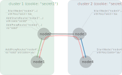

## Demo proxy connection

This example demonstrates how to connect two nodes that belong to two different clusters by using the proxy feature and making this connection end-to-end encrypted.



Here is output of this example

```
❯❯❯❯ go run .
Starting node: node1 (cluster 1) ...OK
Starting node: node2 (cluster 1) with Proxy.Enabled = true ...OK
Starting node: node3 (cluster 2) with Proxy.Enabled = true ...OK
Starting node: node4 with Proxy.Cookie = "abc" (cluster 2) ...OK
Add static route on node2 to node3 with custom cookie to get access to the cluster 2...OK
Add proxy route to node4 via node2 on node1 with proxy cookie = "abc" and enabled encryption... OK
Add proxy route to node4 via node3 on node2... OK
Connect node1 to node4... OK
Peers on node1 [node2@localhost node4@localhost]
Peers on node2 [node1@localhost node3@localhost]
Peers on node3 [node4@localhost node2@localhost]
Peers on node4 [node3@localhost node1@localhost]
```

